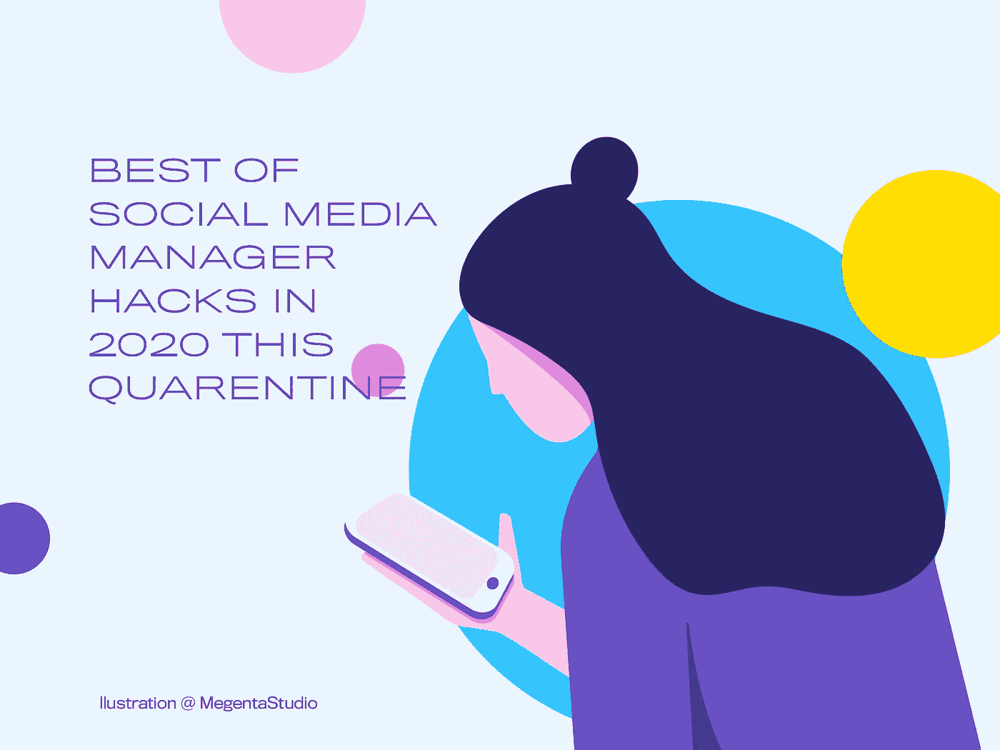

# 隔离区 2020 中的社交媒体管理器工具。

> 原文：<https://medium.com/geekculture/social-media-manager-tools-in-this-quarantine-2020-bbee53ad4d17?source=collection_archive---------1----------------------->

## 以下是与你们分享的东西*(其中一些你们可能已经知道了)*我发现高效轻松地工作很有趣&。

请查看以下链接，了解最佳社交媒体规划和分析应用及文档，以便我们处理多个社交媒体平台，更好地向客户展示技术上的完美。我最喜欢的是后来，Canva，李标签，露营地，变焦，谷歌表，Smarthash，Postme，Snapseed & Lightroom 其中一些感觉昂贵，但值得顶级博主的钱，也值得商业时尚帐户有效地交付工作。

> 专业提示:你在这篇文章中找到的从我的最爱到其他应用程序的所有链接都可以在手机和桌面上使用。(除了少数照片编辑应用和标签应用)

# 虚拟讨论想法&在隔离区展示想法

虽然在这种隔离或新的正常生活方式中，你需要一个工具来展示或与你的队友进行头脑风暴，但老年人和客户是最好的工作工具。

[**缩放视频调用**](https://zoom.us)

[**谷歌见面**](https://meet.google.com)

[**谷歌双雄**](https://duo.google.com/intl/en_in/about/)

[**通过 WeTransfer 粘贴**](https://paste.bywetransfer.com)

[**Slidelab.io**](https://slidelab.io)

[**谷歌幻灯片**](https://www.google.com/slides/about/)

[**谷歌工作表**](https://www.google.com/sheets/about/)

## 思考与设计

如果你不知道像 Adobe Photoshop 或 After-Effects 这样的专业应用程序来设计和制作你的社交媒体帖子？没问题。这些对他们来说是最好的选择&易于使用，设计，动画也可以直接通过应用程序发布。

[**Canva**](https://www.canva.com/create/album-covers/)[**Over**](https://www.madewithover.com/features)[**Crello**](https://crello.com)[**pic monkey**](https://www.picmonkey.com)[**马达**](https://www.fotor.com)

## 规划和分析应用

规划你的品牌日历是社交媒体经理和他的团队最大的任务。因此，将使这更容易和完善以下应用程序。我最喜欢的是稍后的 dose all in 一个应用程序为您的调度分析报告。

[**thepreviewapp.com**](https://thepreviewapp.com)

[**later.com**](https://later.com)

[**www.planoly.com**](https://www.planoly.com)

[**skedsocial.com**](https://skedsocial.com/features/social-media-calendar/)

[**buffer.com**](https://buffer.com/publish)

[**postcron.com**](https://postcron.com)

[**www.plannthat.com**](https://www.plannthat.com)

[**sproutsocial.com**](https://sproutsocial.com)

## instagram 应用的#标签改进器

你在使用#标签的时候卡住了吗？？因此，这些应用程序链接可以帮助您快速解决问题，了解适合您帐户的完整标签。

#标签是当今社交媒体世界中最重要的。哪个标签能让你更容易更快地找到寻找物品的人？

[www.leetags.com](https://www.leetags.com/en/#faq)

[www.smarthashapp.com](https://www.smarthashapp.com)

# 用这些应用程序创建你的尽可能多的最佳生物链接

你是不是每次在你的页面上放入吸引人的内容时都要替换简历中的链接？下面的应用程序是你的天堂。以有组织的方式用这些应用程序创建你的尽可能多的最佳生物链接。

用这些应用程序创建你的尽可能多的最佳生物链接。

[露营地.生物](https://campsite.bio/features)

later.com

[many.link](https://many.link/?ref=producthunt)

[linktr.ee](https://linktr.ee/?ref=producthunt)

# 图像编辑

图像编辑，添加过滤器，去除背景，让你紧张，而至关重要的广告期限或耗时。因此，停下来使用这些应用程序，让你的生活比你想象的更容易像专业人士一样交付工作。

[**【快照种子】**](https://apps.apple.com/us/app/snapseed/id439438619)

[**VSCO**](https://vsco.co)

[picsart.com](https://picsart.com/explore)

**Adobe Lightroom 照片编辑器**

**[**图片在线编辑—Pixlr.com**](https://pixlr.com)**

**[www.polarr.com](https://www.polarr.com)**

# **视频或动画编辑器应用程序**

**为社交媒体账户工作时，视频编辑也是一项大任务。**

**Instagram 应用程序**

**过度衰退**

**Instagram 的 Hyperlapse 可以帮助您捕捉那些长时间的过程或事件，并创建符合 Instagram 视频标准的延时。**

**回旋镖**

**回旋镖是 Instagram 上另一种非常受欢迎的视频，它基本上是向前和向后播放的几秒钟视频。**

**[**nixes.io**](https://nixes.io/disflow/)**

**[**plotaverseapps.com**](https://plotaverseapps.com)**

**[**clip omatic | Apalon**](https://www.apalon.com/clipomatic.html)**

**[**https://flixel.com/products/ios/cinemagraph-pro**](https://flixel.com/products/ios/cinemagraph-pro/)**

# **缩短链接**

**PrettyLink 是一个 Wordpress 插件，允许你从自己的 URL 创建短链接，而不是 tinyurl.com 或 bit.ly**

**[prettylinks.com](https://prettylinks.com)**

**bitly.com**

**我相信以上这些链接和信息对你来说是有用的，让你过上自由职业者的工作生活，在隔离期更快地工作和准时交货。也和你的家人呆在一起，越来越近，生活越来越充实，如果你不是一个人呆着的话。**

**希望你喜欢这个✌️.**