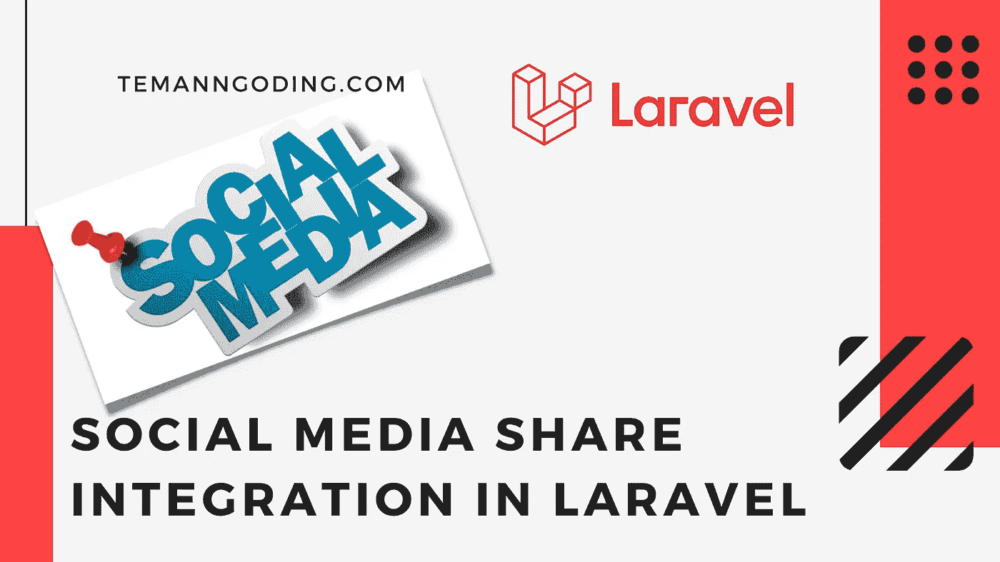
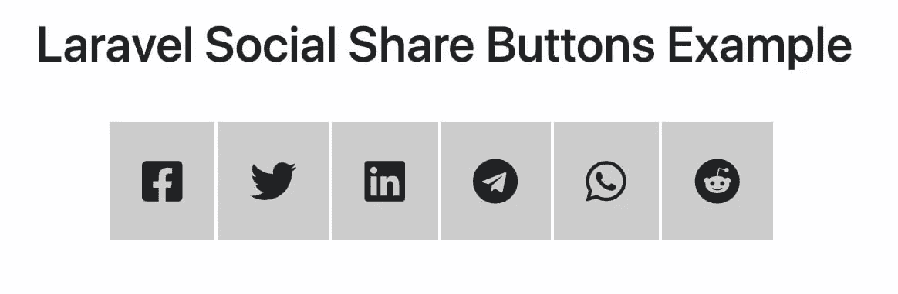

# Laravel 的社交媒体共享整合

> 原文：<https://medium.com/geekculture/social-media-share-integration-in-laravel-e61675f761b9?source=collection_archive---------4----------------------->



你好，朋友们你们好吗，希望你们永远健康成功。回到 mantan 程序员，这一次我们将讨论如何将社交媒体共享与 Laravel 集成。

我们将使用[jorenvanhocht/laravel-share](https://packagist.org/packages/jorenvanhocht/laravel-share)包在每个页面上实现社交媒体共享。我们将从每个页面创建一个按钮，用于在我们激活的每个社交媒体上共享内容。

社交媒体非常有助于增加网站访问者的数量，而且这是一种免费的推广。为了让这个特性工作，我们必须安装[jorenvanhocht/laravel-share](https://packagist.org/packages/jorenvanhocht/laravel-share)包，你可以使用 composer 下载它。

这是一个基于 PHP 的库，允许你生成各种社会共享链接。将此包安装到您的项目中后，您将能够为脸书、Twitter、Linkedin、WhatsApp、Reddit 和 Telegram 创建社交共享链接。

按照以下步骤整合社交媒体共享:

*   下载 Laravel 应用程序
*   添加 laravel 共享包
*   添加控制器
*   添加路线
*   发表看法
*   启动应用程序

您可以在此了解更多教程:

[Paypal 支付网关与 Laravel 的整合](https://temanngoding.com/integrasi-paypal-payment-gateway-dengan-laravel/)

[Laravel 中的错误处理](https://temanngoding.com/error-handling-di-laravel/)

[使用 Laravel 创建评分和评论](https://temanngoding.com/membuat-rating-dan-ulasan-dengan-laravel/)

# 下载 Laravel 应用程序

我们首先使用 composer 创建新的 laravel 项目。

```
composer create-project --prefer-dist laravel/laravel laravel-socmedcd laravel-socmed
```

# 添加 laravel 共享包

在您的屏幕中，打开终端屏幕，然后键入建议的命令，之后按 enter 键开始安装 laravel 共享库。

```
composer require jorenvanhocht/laravel-share
```

登记股份

确保在 **config/app.php** 文件中注册我们已经安装的库包。

```
<?php
  return [
    'providers' => [
        ...
        ...        
        Jorenvh\Share\Providers\ShareServiceProvider::class,
    ];
    'aliases' => [
        ...
        ...                
        'Share' => Jorenvh\Share\ShareFacade::class,
    ];
  ];
```

并重新打开终端输入该命令。

```
php artisan vendor:publish --provider="Jorenvh\Share\Providers\ShareServiceProvider"
```

# 添加控制器

使用 php artisan 创建一个控制器文件，以输入媒体共享代码。这是我们将要创建的主要函数。

```
php artisan make:controller SocialShareButtonsController
```

如下调整代码

**app/Http/Controllers/socialsharebuttonscontroller . PHP**文件。

```
<?php
namespace App\Http\Controllers;
use Illuminate\Http\Request;
class SocialShareButtonsController extends Controller
{
    public function ShareWidget()
    {
        $shareComponent = \Share::page(
            'https://www.positronx.io/create-autocomplete-search-in-laravel-with-typeahead-js/',
            'Your share text comes here',
        )
        ->facebook()
        ->twitter()
        ->linkedin()
        ->telegram()
        ->whatsapp()        
        ->reddit();

        return view('posts', compact('shareComponent'));
    }

}
```

# 添加路线

您需要在 route/web.php 中添加一个路由。这将把视图与我们创建的控制器连接起来。

```
<?php
use Illuminate\Support\Facades\Route;
use App\Http\Controllers\SocialShareButtonsController;
/*
|--------------------------------------------------------------------------
| Web Routes
|--------------------------------------------------------------------------
|
*/
Route::get('/social-media-share', [SocialShareButtonsController::class,'ShareWidget']);
```

# 发表看法

现在我们将创建一个视图来显示 resources/views 中的 share 按钮。把它命名为**post.blade.php**。导入 bootstrap 并创建几行 css。

**resources/views/post . blade . PHP**文件。

```
<!DOCTYPE html>
<html lang="{{ str_replace('_', '-', app()->getLocale()) }}">
    <head>
        <meta charset="utf-8">
        <meta name="viewport" content="width=device-width, initial-scale=1">
        <title>Implement Social Share Button in Laravel</title>

        <link href="https://cdn.jsdelivr.net/npm/bootstrap@5.0.1/dist/css/bootstrap.min.css" rel="stylesheet">
        <link rel="stylesheet" href="https://cdnjs.cloudflare.com/ajax/libs/font-awesome/5.15.3/css/all.min.css"/>
        <style>
            div#social-links {
                margin: 0 auto;
                max-width: 500px;
            }
            div#social-links ul li {
                display: inline-block;
            }          
            div#social-links ul li a {
                padding: 20px;
                border: 1px solid #ccc;
                margin: 1px;
                font-size: 30px;
                color: #222;
                background-color: #ccc;
            }
        </style>
    </head>
    <body>
        <div class="container mt-4">
            <h2 class="mb-5 text-center">Laravel Social Share Buttons Example</h2>
            {!! $shareComponent !!}
        </div>
    </body>
</html>
```

# 启动应用程序

创建一些文件后，下一步是使用终端运行应用程序。

```
php artisan serve[http://127.0.0.1:8000/social-media-share](http://127.0.0.1:8000/social-media-share)
```



这就是我这次能做的教程，希望有用。

谢谢。