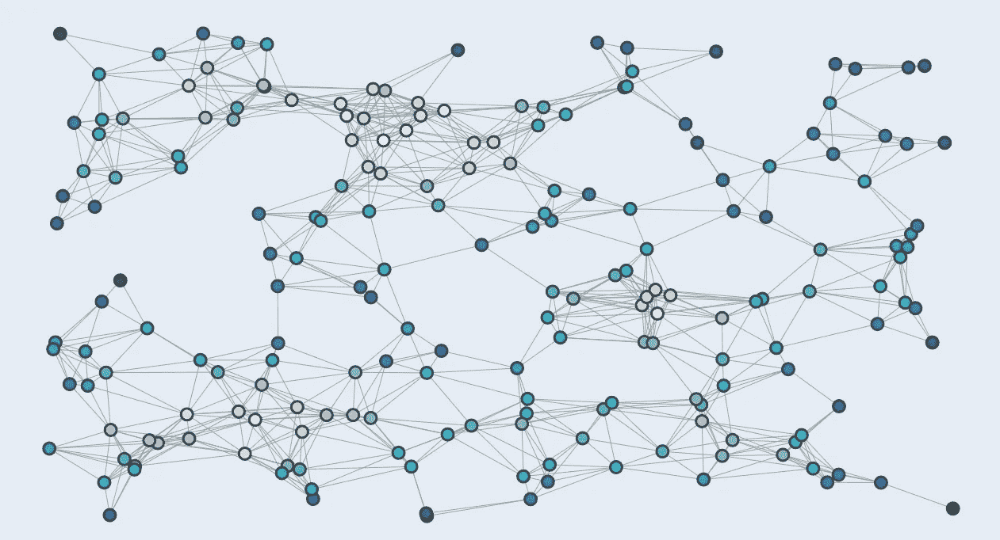

# 社交网络分析开发数字营销策略

> 原文：<https://medium.com/geekculture/social-network-analysis-to-develop-digital-marketing-strategies-11261973f326?source=collection_archive---------19----------------------->

A sample social network

## 利用从社交网络分析中获得的见解，制定您的数字营销策略

数字营销策略的一个重要部分是[社交媒体营销](https://www.linkedin.com/pulse/how-social-media-fits-digital-marketing-jessica-turner/)。它是众多数字营销工具中的最新成员，并且随着社交网络领域的新进入者不断发展。