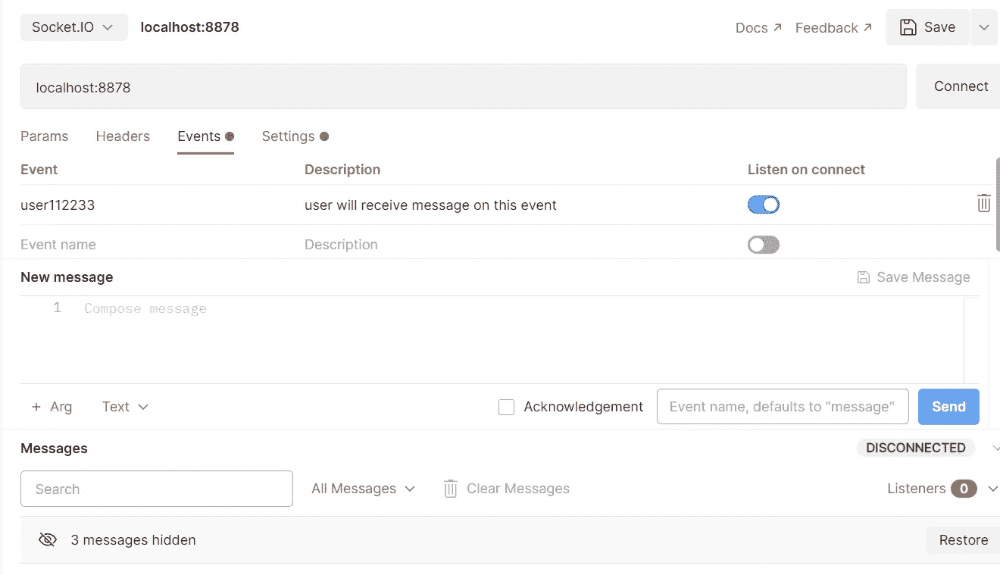
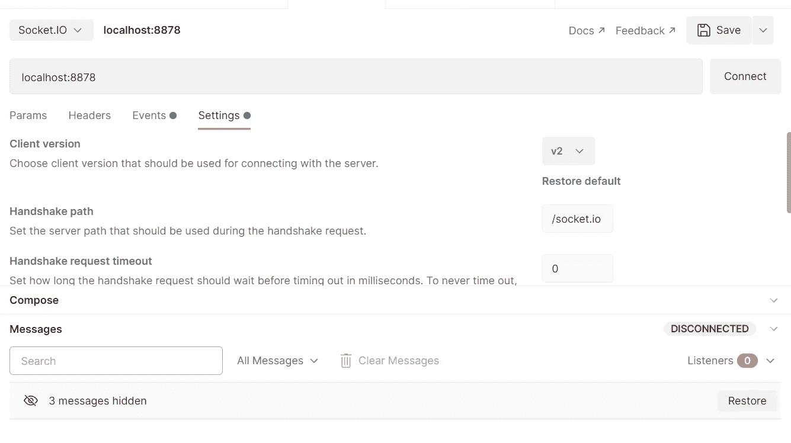
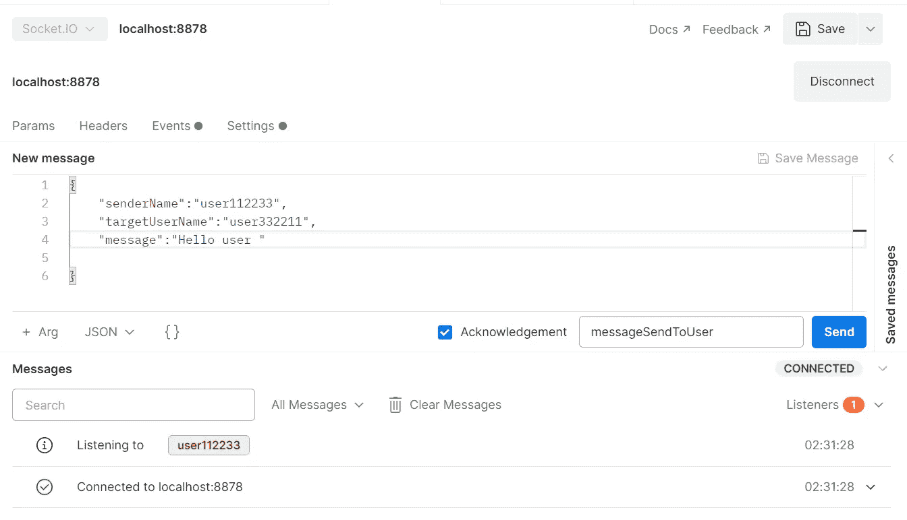
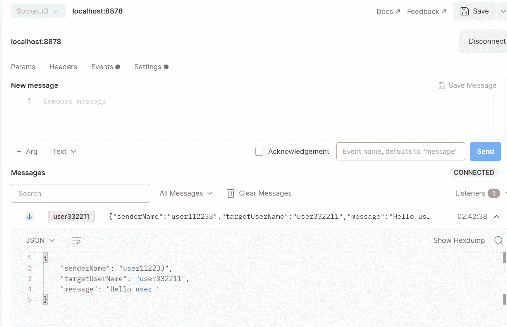

# 带 Springboot 应用程序的套接字 IO

> 原文：<https://medium.com/geekculture/socket-io-with-springboot-application-5a59358f7d48?source=collection_archive---------3----------------------->

插座。IO 支持基于事件的实时双向通信。

Photo by [Remi Godet](https://unsplash.com/@remgodet?utm_source=medium&utm_medium=referral) on [Unsplash](https://unsplash.com?utm_source=medium&utm_medium=referral)

如果你打算用 springBoot 或 java 搜索 socket IO 集成，很难找到任何可以帮助你集成的资源。

在这里，我试图帮助你在 netty socket IO 的帮助下将 springBoot 应用程序与 Socket IO 集成。

我将使用 postman 来测试套接字端点。

**注意** :-在你的 IDE 中启用 Lombok。

首先，我们将添加

<dependency><groupid>com . corundumstudio . socket io</groupid><artifactid>netty-socket io</artifactid><version>1 . 7 . 16</version></dependency>

添加依赖项后，pom 文件将看起来像这样

Pom file

设置完 pom 文件后，我们将设置配置文件。

Photo by [Ferenc Almasi](https://unsplash.com/@flowforfrank?utm_source=medium&utm_medium=referral) on [Unsplash](https://unsplash.com?utm_source=medium&utm_medium=referral)

现在我们可以创建一个控制器来接收和发送消息给用户。

现在我们准备测试套接字 IO。

# **如何为测试而测试**

我们设置了两个用户。

发件人用户名:- **用户 112233**

目标用户名:- **用户 332211**

套接字 URL:-[**http://localhost:8878**](http://localhost:8878)

套接字 IO 版本:- **v2**

设置一号用户进行交流。

确保我们必须使用版本 2。

一旦创建了与套接字的连接。

套接字 IO 将为每个用户创建一个唯一的会话 id

Spring boot console

我们设置将接收消息的目标用户。

只需要点击发送按钮，然后目标用户将收到消息

现在目标用户收到了消息

Photo by [Austin Distel](https://unsplash.com/@austindistel?utm_source=medium&utm_medium=referral) on [Unsplash](https://unsplash.com?utm_source=medium&utm_medium=referral)

您可以将此种子项目用于您的应用程序
[https://github.com/smadil997/spring-netty-socketio-seed](https://github.com/smadil997/spring-netty-socketio-seed)