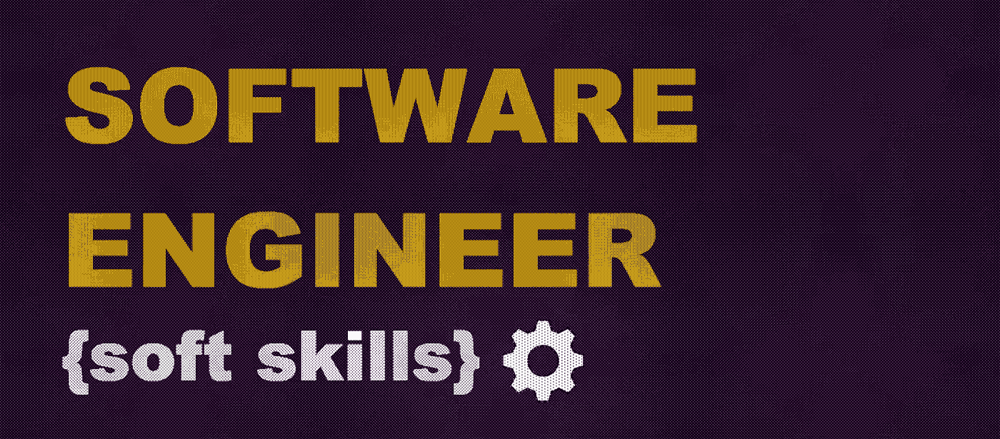

# 软件工程师的软技能第 1 部分:沟通

> 原文：<https://medium.com/geekculture/soft-skills-for-software-engineers-part-1-communications-468f0e1f546e?source=collection_archive---------16----------------------->

## 如果你想成为一名软件工程师，你需要掌握技术和编码技能。如果你想成为一名伟大的软件工程师并继续前进，你需要增加软技能。

不管我们的职业是什么，我们经常问自己——如果我们在软件开发和 IT 领域工作，我们需要发展什么才能变得更好。几周前，我们在公司的一个软件开发团队中问了同样的问题。答案之一是——软技能。因此，我们试图了解哪些是必要的，并从不同来源收集基本信息。我们的目标是为每一项基本技能建立一个基础，并为发展这一方向提供一些有用的链接和建议。让我们从通信开始，因为通信无处不在。

# 通讯技能

有效的沟通可以在一个普通的软件工程师和一个高水平的摇滚明星之间产生巨大的差异。编程不仅仅是与服务器、客户机、API 和 IDE 交流。与你的队友和同事保持一致的确很重要。当你考虑到我们今天的远程工作因素时，通信会变得非常具有挑战性。沟通可以包括询问人们希望如何与他们交谈，解释你自己的界限，提供和接受反馈。永远记住沟通是双向的，所以如果用简短的话来概括:

*   倾听——在你开始给出你对开发过程的观点之前，倾听你的队友，并努力达成共识——这是找到最佳解决方案的关键。当你倾听时，与那些只会说话的人相比，你获得了不公平的优势。你可以学到东西，扩展你的视野，拓宽你的世界观。它还可以帮助您对任务和需求进行排序。
*   不要打断——打断通常发生在软件工程师知道一些他觉得不能等到别人讲完的事情的时候。就等着吧。重要的是要等到对方说完。
*   说话清晰——自信、清晰、坚定地说，你的沟通能力是一个方便的工具。所以，用吧！

## **提问并回答问题**

知道如何以正确的方式提出正确的问题是软件工程工作流程中的关键技能之一。一个结构良好的问题会返回一个有用而直接的答案。更有甚者，有时一个好问题已经包含了答案的一半。如果你不和其他人交流，你迟早会独自面对复杂甚至不可能完成的任务。这关系到你所有的潜在交流——队友、客户、其他团队的工程师等等。不管你觉得自己有多专业，总会有一个问题是你一个人解决不了的。错过一些知识是可以的。寻求帮助是可以的。当有人向你寻求帮助时，这是可以的。错了也没关系。没关系，所以不要犹豫去做！团队合作使得处理复杂问题变得更加容易。

*有用的链接和如何推进技能:*

*   如果你需要帮助，尽管开口。如果你被证明是错的，那么你只是学到了新的东西，下一次，你将是正确的。
*   交流是双向的。所以听，积极地听！最好的沟通者花在听和说上的时间一样多。
*   忘掉害怕听起来不聪明的恐惧——提问是为了获得理解。
*   使用一个简单而有效的算法来自 [*这篇文章*](https://betterprogramming.pub/4-ways-to-ask-better-questions-as-a-software-engineer-a342ffc251a1)
*   [*开发者提问的艺术*](https://blog.lelonek.me/the-art-of-asking-questions-for-developers-cd88351b9e87)
*   [*作为初级开发者如何提问*](/@gillicarmon/how-to-ask-questions-as-a-junior-developer-1f0c724ac902)
*   [*作为 Jr. Dev 如何提问*](/the-marcy-lab-school/how-to-ask-questions-as-a-jr-dev-236207de3d55)
*   [*如何提出有效的问题:开发者实用指南*](https://www.freecodecamp.org/news/asking-effective-questions-a-practical-guide-for-developers/)

## **提供和接收反馈**

反馈是为数不多的工具之一，可以让你向同事传达自己的期望，并帮助形成增长点。反过来，来自其他人的反馈为思考提供了材料和信息。一个伟大的软件工程师应该支持同事的想法，支持他们的论点，给出积极的或建设性的反馈——并接受它。没有人喜欢被批评，但这对我们所有人来说都是不可避免的。接受建设性的批评是一个性格方面，在 IT 领域，如软件开发，需要广泛而深入的知识。接受建设性的批评是所有员工成长的关键，也是团队和整个公司内部流程的关键。

*有用的链接和如何推进技能:*

*   根据有用链接中的技术和信息，与经理和团队进行一对一的练习
*   演讲者俱乐部、技术讲座等。每次演讲结束后都有反馈
*   和队友一起做一些 [*练习*](https://softskillspills.com/giving-feedback/)
*   [*如何在困境中提供建设性的反馈*](https://medium.dave-bailey.com/the-essential-guide-to-difficult-conversations-41f736e63ccf)
*   [*三种扯淡的反馈——以及如何应对它们*](/signal-v-noise/the-3-types-of-bullshit-feedback-and-what-to-do-about-them-5de483530c3f)
*   [*提高反馈技巧的练习*](https://softskillspills.com/giving-feedback/)

## **提出顾虑并说服**

当然，你要记住，我们总是以客户为中心，总是倾听客户的需求。毕竟，我们不会关闭票证—我们解决客户的问题，让他们的工作和生活变得更加无障碍，尤其是当我们 95%的客户都是公司内部的其他工程和运营支持团队时。然而，在追求以客户为中心的过程中，不要忘记，作为技术专家，你必须警告客户、产品所有者和项目经理特定技术实现的潜在后果。表达你的担忧、信念和可能的异议是很正常的——这改善了制定需求、架构的过程，使其更加周到和详细。这不仅仅是与客户的交流，也是与其他软件工程师的技术讨论。你或你的同事可能知道或看到一些事情，这些事情可能会阻止将来项目实现中的一些困难——所以，告诉他们吧。然而，重要的是要记住，恐惧和反对必须有事实、证明和证据的支持，最好是有替代方案。

*有用的链接和如何推进技能:*

*   永远记住——缺陷发现得越早，缺陷的代价就越小。为了我们的公司，我们的项目，为了我们，为了我们的工作。
*   [*如何在困境中提供建设性的反馈*](https://medium.dave-bailey.com/the-essential-guide-to-difficult-conversations-41f736e63ccf)

## **展示和说明**

作为一名软件工程师，在决定一种编码方法的优缺点时，您经常需要与其他团队成员交谈。在你职业生涯的后期，你将不得不引导你的团队走向一个正确的解决方案，或者为客户提供解决方案。所以，是的——无论你是选择通过引人注目和情绪化的演示、写得很好的白皮书，还是通过一系列图表来说服，你都需要演示技巧，这可能不总是与使用 PowerPoint 幻灯片有关。它可以是一个简单的谈话，向听众有效地交流和解释一些话题。要简洁，要完整，要有说服力！

*有用的链接和如何推进技能:*

*   参加[*等课程和培训演讲技巧:掌握自信的演讲*](https://rakuten.udemy.com/course/presentations-mastery/)
*   向有经验的同事寻求帮助、反馈和建议
*   像内部客户向外部客户演示一样，向内部客户、产品负责人和项目经理演示工具/应用/项目。
*   在团队/公司内部会议上发言，如技术讲座、演讲俱乐部等
*   在专业团体和会议上的演讲
*   [*作为软件工程师为什么需要演示技巧*](https://dev.to/gibbets/why-you-need-presentation-skills-as-a-software-engineer-249e)
*   [*科技讲座——你确实有话要说！*](/upday-devs/tech-talks-you-do-have-something-to-say-a1a0ae23fa0#.5te5buwmd)
*   [*演讲技巧课程:掌握自信的演讲*](https://www.udemy.com/course/presentations-mastery/)

## 作为总结

这里列出的与沟通相关的技能并不是“灵丹妙药”。当然，它可以根据公司、项目、经验、关于过程的知识等而改变。但是有一点是不变的——软技能，尤其是沟通，是软件工程师工作中不可或缺的一部分，它们需要每天开发。因此， [*在下一部分*](/geekculture/soft-skills-for-software-engineers-part-2-get-things-done-cb41a49b9958) ，我们将分析时间管理、计划和完成事情的方法…