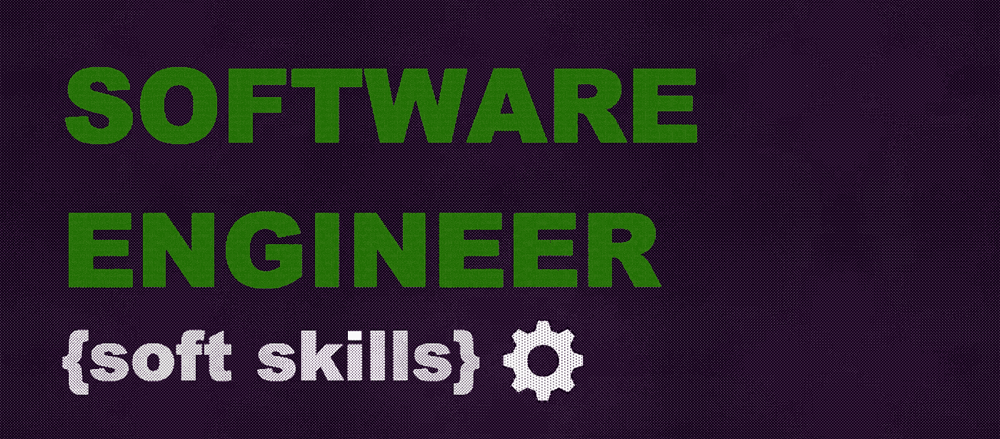

# 软件工程师的软技能—第 2 部分:把事情做好

> 原文：<https://medium.com/geekculture/soft-skills-for-software-engineers-part-2-get-things-done-cb41a49b9958?source=collection_archive---------36----------------------->

## 如果你想成为一名软件工程师，你需要掌握技术和编码技能。如果你想成为一名伟大的软件工程师并继续前进，你需要增加软技能。

在文章 的第一部分 [***中，我们开始讨论软技能对于软件工程师的重要性，并重点讨论了沟通、其作用、意义和泵送方法。如果你还没有读过，我建议你读一读。***](/geekculture/soft-skills-for-software-engineers-part-1-communications-468f0e1f546e)

# 把事情做完

这一部分将着眼于大多数软件工程师解决各种客户问题的工作。客户期望从我们这里得到最好的结果——有时他们称之为“一切都需要正确、快速地工作”。因此，在我们的团队内部，我们试图收集我们需要做的行动，以交付最佳结果，并将其称为一个伟大的 [*知名框架*](https://hamberg.no/gtd/) *—* 完成事情。因此，我们的行动清单和实际做法与最初的 [*大卫·艾伦的框架*](https://gettingthingsdone.com/what-is-gtd/) *有许多共同之处。难怪，因为我们受到了它的启发。但毕竟，这篇文章是软件开发的实用方法和行动，有助于在我们的坐标系中向客户交付结果。因此，让我们回顾一下我们团队试图遵循和发展的这种方法的组成部分。*

## 收集要求

在开发新功能的过程中，作为一名软件工程师，您经常需要选择是让它更快、更高效，还是更易维护、更可靠、更安全。为了做出更好的决策，您需要从所有客户和利益相关者那里收集详细的需求。您需要让他们参与到这个需求收集过程中，提出问题，并组织一些文档来帮助您了解这个特定情况下的更好的解决方案，并确保您计划做正确的事情。你可以说这不是软件工程师的工作；这是项目/产品经理的任务。你会是正确的，但不完全是因为作为一名技术专家，你需要明白你到底需要做什么。所以，那也是你的职责范围，但是，是的，也许从一个稍微不同的角度来看。客户模糊的愿望，如“一切都需要正确和快速地工作”，应该转化为清晰的需求列表。因此，在设计和开发过程中，就有争议的问题达成一致将更加容易。当然，同样，你不是产品或项目经理，但你需要清楚地了解你的客户想要什么，以提供最好和最有效的结果。

*有用的链接和如何推进技能:*

*   在与客户、产品负责人、项目经理开会时做笔记，并将其转化为你的初步行动计划；
*   客户试图解决什么问题？客户试图使用请求的功能执行什么任务？
*   不要犹豫地说，“我没有足够的关于你所要求的特性的信息；请提供更多细节。”
*   分享您的想法，并向内部客户提出不同的可能解决方案和选项，这是了解他们思维方式的关键之一。
*   [*如何从一开始就挑选合适的软件架构*](/swlh/how-to-use-non-functional-requirements-analysis-to-choose-the-right-software-architecture-eab7225ba8d2)
*   [*需求工程—简介*](/omarelgabrys-blog/requirements-engineering-introduction-part-1-6d49001526d3)
*   [*软件需求收集技巧:成功的公式*](https://praxent.com/blog/software-requirements-gathering-formula-success)
*   [*开发人员参加需求聚会的理想心态是什么？*](https://softwareengineering.stackexchange.com/questions/269506/what-is-the-ideal-mindset-for-a-developer-participating-in-a-requirements-gather)

## 时间管理和规划

> 我没有时间—我需要写代码！

多少次我们发现自己在思考或从同事那里听到这些话。当你有很多事情要做的时候，知道如何管理你的时间是至关重要的。但是时间管理不是关于时间的。时间管理是关于任务和优先级的。如何管理你的企业，使其在每天 8 小时、每周 40 小时内保持高效？如何在忙碌的时候保持心流状态，保持工作生活平衡？你花多少时间计划任务和项目？你有多少时间编码？你有时间和你的队友一起提出新的想法或者讨论现有的想法吗？

最有效地管理你的时间可以让你专注于重要的事情，更有效地完成任务，专注于主要和长期的目标，而不是浪费时间争论次要的事情。尤其是考虑到在压力下工作并按时完成任务几乎是一个伟大软件工程师的生活。客户通常希望准确估计工作何时完成。因此，你必须有一个时间管理策略。

*有用的链接和如何推进技能:*

*   使用任务管理器: [*观念*](https://www.notion.so/product?utm_source=google&utm_campaign=2075789710&utm_medium=80211061601&utm_content=500427479647&utm_term=notion&targetid=kwd-312974742&gclid=Cj0KCQjw2tCGBhCLARIsABJGmZ4anwuuObqpIfkO3LPSmavxC-eGB7CwrvBc4z9-7p0S9iLIOrHVt5oaAiXaEALw_wcB) 、 [*Todoist*](https://todoist.com/?gclid=Cj0KCQjw2tCGBhCLARIsABJGmZ79GHilOYw9NiADxdivNijXa1Kg6uchCJ3FrTSUIrFCwJGA0SxzqLIaAtPeEALw_wcB) 、 [*特雷罗*](https://trello.com/?&aceid=&adposition=&adgroup=105703214328&campaign=9843285532&creative=498216429246&device=c&keyword=trello&matchtype=e&network=g&placement=&ds_kids=p53016490704&ds_e=GOOGLE&ds_eid=700000001557344&ds_e1=GOOGLE&gclid=Cj0KCQjw2tCGBhCLARIsABJGmZ4b6Z9YnSvA_C8SDMcJRYiDZ3RVZPWbLM9KoScvAcBwfaA3Wik9_cQaApgvEALw_wcB&gclsrc=aw.ds) 、【吉拉】/合流(如果你的公司用于业务)等。甚至仅仅是 [*Evernote*](https://evernote.com/) 也可以成为你积累任务的家常便饭。
*   使用不同的技巧如*[*吃青蛙*](https://todoist.com/productivity-methods/eat-the-frog)[*【必须，应该，想要】*](https://sourcesofinsight.com/day-9-get-a-quick-handle-on-your-day-must-should-and-could/)[*艾森豪威尔矩阵*](https://www.eisenhower.me/eisenhower-matrix/)[*笛卡尔正方形*](https://mwe100.com/lifestyle/descartes-square-a-technique-for-how-to-making-decisions-quickly) 等。*
*   *如果你有时间制定一个计划是最好的。为了明天，为了下周，为了下个月。当你有一个计划时，你总是知道你的下一个任务和你的大目标。*
*   *[*21 种生产力方法:哪一种适合你？*](https://www.any.do/blog/productivity-methods-list/)*
*   *[*TED 视频|拖延症大师的内心*](https://www.youtube.com/watch?v=arj7oStGLkU)*
*   *[*TED 视频|时间管理的哲学*](https://www.ted.com/talks/brad_aeon_the_philosophy_of_time_management)*
*   *[*TED 视频|如何更有效地管理自己的时间*](https://www.ted.com/talks/brian_christian_how_to_manage_your_time_more_effectively_according_to_machines)*

## *判断*

*是的，使用估计是一个广泛的主题，值得单独写一篇大文章。简而言之——是的，在软件开发中很难进行正确和严格的评估。是的，大多数工程师都不太擅长。是的，擅长这个会让你脱颖而出。更重要的是——如果特性开发时间与您的估计相符，您真的会感觉更好、更有信心。*

*说“太复杂了，无法估计”是一个简单的方法，可以避免问一些困难的问题，比如为什么估计很难，以及如何做得更好。评估不会是完美的，但是这并不意味着评估软件项目中的任务是没有意义的。评估有助于团队沟通，鼓励敏捷过程，并使工作流对所有涉众来说更加可预测、公平和透明。*

**有用的链接和如何推进技能:**

*   *永远记住——你没有每周 5 天 40 小时的时间来编码！会议、代码审查、切换上下文、测试、询问建议、依赖其他团队——这些都必须包含在你的评估中。*
*   *任何开发任务都必须进行分析和评估。可能会有困难，盲点等。，但是你要做一个初步分析。*
*   *您需要在提供 ETA 之前进行研究——这很正常。慢慢来。*
*   *[*为什么开发商要喜欢估算*](https://stackoverflow.blog/2019/10/23/why-devs-should-like-estimates/)*
*   *[*做出更好软件开发评估的 4 个步骤*](/swlh/estimates-in-software-development-projects-b221e9dc4431)*
*   *[*为什么要做软件估算*](https://www.mutuallyhuman.com/blog/why-you-should-do-software-estimates/)*
*   *[*估算软件工程工作量*](https://www.altexsoft.com/whitepapers/estimating-software-engineering-effort-project-and-product-development-approach/)*
*   *[*为什么软件开发人员在估算时间时出错(以及如何修复)*](https://www.7pace.com/blog/why-software-developers-suck-at-estimating-time-and-how-to-fix-it)*

## *分解*

*分解的一个正式术语是——将事物分解成它的组成部分，这些组成部分又可以分解成更小的部分，以此类推，直到你分解成最简单的单元。受理解事物如何工作的需要的驱动，开发人员工具集的一个重要特性是将事物简化为最小的组件。小项目更容易预测、理解和构建。一旦你有了一组最小的组件，它们就可以被组装成原来的东西或者全新的东西。简而言之:如果某件事看起来很大或很复杂——把它分解成小而精确的部分。那总是管用的！*

**有用的链接和如何提高技能:**

*   *分解到每个子任务的估计不超过一周/天的情况，如果可能的话甚至更少。简单的任务总是更容易处理。*
*   *为所有超过 5–7 周/天的重大问题和用户案例编写逐步计划和小型路线图(每个步骤是一个或几个简单的子任务)——因为它的价值超过标准 Sprint 规模的一半。*
*   *在与队友讨论您的分解计划时进行练习。快速回顾和新鲜的外观总是有建设性的。*
*   *学习并尝试使用不同的 [*任务分解方法*](http://www.taskmanagementguide.com/task-decomposition/)*
*   *[*为什么分解在开发软件中很重要*](https://agilevelocity.com/why-decomposition-matters/)*
*   *[*用户故事中的任务应该有多详细？*](https://techbeacon.com/app-dev-testing/how-detailed-should-tasks-within-user-story-be-agile-teams)*

## *问题检测和解决*

*这听起来可能很奇怪，但是软件工程师的工作就是不断地解决和修复问题。它从现有应用程序、工具和项目中的错误开始，当客户不知道他们想要什么，但他们对一些流程有问题并试图使用软件开发来解决它们时结束。所以，软件工程师解决问题，这就是为什么他们需要有创造力，积极主动，善于规划，以及其他比这里提到的更多的东西——因为客户等待一些解决方案。不，客户在等待适合他们流程和业务的最佳解决方案。解决问题是一个伟大的软件工程师必须具备的关键技能，因为这是一种工作意识。*

**有用的链接和如何推进技能:**

*   *创建一个通用且简单明了的操作手册，描述为检测问题根源必须自上而下完成或检查的步骤。*
*   *[*如何培养自己的解决问题的能力*](https://levelup.gitconnected.com/how-to-develop-your-problem-solving-skills-7b06fa230e5a)*
*   *[*伟大软件开发人员的 5 种解决问题的技巧*](https://www.coderhood.com/5-problem-solving-skills-great-software-developers/)*
*   *[*如何像程序员一样思考——解决问题的经验教训*](/free-code-camp/how-to-think-like-a-programmer-lessons-in-problem-solving-d1d8bf1de7d2)*
*   *[*3 分钟解决问题策略*](https://briaeliza.medium.com/this-problem-solving-strategy-takes-3-minutes-a-pen-and-paper-and-will-rapidly-change-your-life-976070ac305b)*
*   *[*解决任何软件问题的四个步骤*](https://www.oreilly.com/content/4-steps-to-solving-any-software-problem/)*

## *清除文档*

*文档是任何将要开发的软件项目的起点和终点。编写文档是软件工程师必须具备的低调技能之一，但 99%的人不喜欢它。但是在这个领域有足够丰富经验的人清楚地知道创建文档和项目是多么重要，甚至在开发阶段开始之前，直到项目的增强。花额外的时间来写你所做的工作的适当的文档将会在将来为你的客户、你的队友和你自己节省大量的时间。*

**有用的链接和如何推进技能:**

*   *记住:自我文档化的代码不能完全取代文档。可以让它变得更简单—是的，完全替换—肯定不行*
*   *报名参加 Google 的短期课程: [*技术写作| Google 开发者*](https://developers.google.com/tech-writing)*
*   *观看 [*10 分钟视频*](https://www.youtube.com/watch?v=R6zeikbTgVc) 并检查 [*该策略编写有效文档*](https://bethaitman.com/posts/tld-2019/)*
*   *使用一些在你的团队/部门/公司中被接受为标准的模式、模板，并毫不犹豫地改进它。*
*   *[*开发者该不该写文档？是的，这就是为什么*](https://makemeaprogrammer.com/should-developers-write-documentation-yes-and-heres-why/)*
*   *[*如何写好软件技术文档*](/@VincentOliveira/how-to-write-good-software-technical-documentation-41880a0e7814)*
*   *[*为什么程序员不写文档*](https://kislayverma.com/programming/why-programmers-dont-write-documentation/)*
*   *[*软件开发中的技术文档:类型、最佳实践和工具*](https://www.altexsoft.com/blog/business/technical-documentation-in-software-development-types-best-practices-and-tools/)*

## *作为总结*

*这些技巧和方法并不是试图重写令人惊叹的现有的“把事情做好”框架。这就是我们如何看待处理日常任务的步骤和行动，以及如何作为软件工程师在专业发展中取得优异成绩，并为客户提供最大利益。我们希望你能找到一些有助于成长的实用建议和解决方案。因此，在下一部分，我们将分析另一个复杂的项目——心态及其构成因素…*