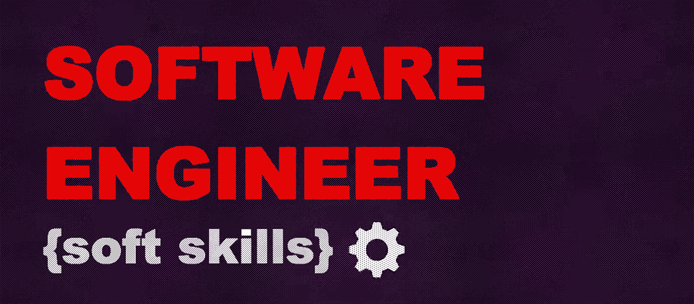

# 软件工程师的软技能—第 3 部分:有效的心态

> 原文：<https://medium.com/geekculture/soft-skills-for-software-engineers-part-3-effective-mindset-d9072d6ae7f9?source=collection_archive---------14----------------------->

## 如果你想成为一名软件工程师，你需要掌握技术和编码技能。如果你想成为一名伟大的软件工程师并继续前进，你需要增加软技能。

在 [***第一篇***](/geekculture/soft-skills-for-software-engineers-part-1-communications-468f0e1f546e) 和 [***第二篇***](/geekculture/soft-skills-for-software-engineers-part-2-get-things-done-cb41a49b9958)*的部分文章中，我们讨论了软技能对于软件工程师的重要性。我们关注沟通和“把事情做好”的技能组合:它们在日常工作中的角色、重要性和泵送方法。如果你还没有读过，我建议你读一读。所以，让我们来看看我们收集的最后一套软技能，名为有效心态。*

# *有效的心态*

*什么是心态？我们对它有许多不同的定义，所有的定义都认为心态是信念、观点和判断的集合，它们形成了你对世界和自己的理解。这是你自己的哲学。这是真的，但这不仅仅是关于信仰——这也是我们一生中每天与世界互动的方式。*

> *你的信仰变成了你的想法。你的想法变成了你的语言。你的言语变成了你的行动。你的行为成为你的习惯。你的习惯成为你的价值观。你的价值观成为你的命运。圣雄甘地*

*但是回到软件开发——在 IT 领域，有效的心态包括什么？我们试图回答下面的问题。*

## *以客户为中心，面向业务*

*当你整天盯着一行行代码时，很容易忘记一个工具/应用的根本目标。退后一步，缩小视野，思考企业的根本目标。如果软件工程师清楚地理解他为什么做他正在做的事情，他将能够选择正确的方法和解决方案，及时提示任务可以不同地执行。这是做出优秀产品的必由之路。如果你不仅仅停留在代码上，还能提供自己不同的智能解决方案，你会走得更远。试着去理解，试着去感受顾客的需求——这会让你更上一层楼！*

**有用的链接和如何提高技能:**

*   *始终思考您和客户想要解决的问题，而不仅仅是特定的任务。*
*   *了解你的公司是如何以及为什么成功的。商业模式是什么？你的团队如何适应这一切？作为一个团队，你能为客户和企业带来什么价值？*
*   *不要像所有人一样不参加公司会议——这是高级新闻、目标和目的的来源。*
*   *参与用户运营任务，了解您的内部和外部客户是如何工作的，并使用您的应用程序/工具站在他们的立场上。*
*   *[*产品至上的软件工程师*](https://blog.pragmaticengineer.com/the-product-minded-engineer/)*
*   *[*商业知识对于开发者的重要性*](https://dev.to/manny42/the-importance-of-business-knowledge-for-developers-29nh)*
*   *[*理解以客户为中心对当今程序员意味着什么——简单程序员*](https://simpleprogrammer.com/customer-centric-programming/)*
*   *[*开发人员必须了解业务领域吗，或者规格说明书就足够了？*](https://softwareengineering.stackexchange.com/questions/142571/must-developers-understand-the-business-domain-or-should-the-specification-be-su)*

## *自主、独立和责任*

*自主和独立是任何软件工程师的基本素质。然而，我们想说我们这样说的确切意思是什么。独立自主并不意味着在没有任何帮助的情况下钻研问题，在没有任何人参与的情况下独自解决所有问题。独立性意味着开发人员明白需要做什么来解决问题。为了与 DBA 讨论数据库设计，安排一次与内部客户、产品所有者或不同团队的额外会议，为相关项目请求额外的授权，按项目计划一些后续步骤，等等。所有这些行动都不需要经理或领导的微观管理或监督。我们说独立就是这么想的。以及其他一些关于责任的话。责任也与我们犯错时的行为有关——因为每个人都会犯错，这很正常。要成长为一名软件工程师，你必须承认自己的错误，分析它们，勇往直前，而不是逃避它们。这是职业发展的关键！*

**有用的链接和如何推进技能:**

*   *把重点放在如何解决问题上，而不是如何不犯错误。*
*   *对某个项目的某部分工作承担责任和所有权，或在某个过程中担任领导，如知识共享、文档创建等。*
*   *[*WTF 反正就是自治？*](https://www.7pace.com/blog/autonomy-software-teams)*
*   *我如何成为一个更加自主和自给自足的程序员？*
*   *[*软件开发团队中的所有权和责任*](https://www.linkedin.com/pulse/ownership-responsibility-software-development-teams-kaspar-lyngsie/)*
*   *[*给予开发人员自主权，同时在分布式团队中维持秩序*](/@iicorporate/giving-developers-autonomy-while-still-maintaining-order-in-a-distributed-team-b8db9cf3fd2b)*

## *主动性和积极性*

> *保持饥饿。保持愚蠢。*

*这已经是史蒂夫·乔布斯的一句经典名言了，用简短的话非常精彩地描述了什么是积极主动。积极主动是管理你的工作和职业生涯的一项宝贵技能，不是随波逐流，而是独立设定理想的道路和轨迹。我们每个人都可以改变我们周围的过程，从小的改变开始，以全新的和以前没有使用过的方法在团队中发展、交流、传播知识而结束。你可以等到领导、项目经理或者客户给你一个任务，也可以自己定节奏，争取自主，发起任务，提出解决方案，产生想法，从而做自己感兴趣的事情。主动性是你应该提供你的能力和关注点，并确保一个产品不仅仅是做产品/规格设计者所设计的，而且是超越的。*

**有用的链接和如何推进技能:**

*   *忘记那些“这不是我的工作”，“这不是我的问题”。我们在一起。所以有些事情和你的职责没有直接关系，但是有时候需要你的帮助，如果可以的话承担相关的职能。这种方法可以帮助您的团队更快、更有效地完成任务，并让您成长。*
*   *不要害怕尝试和实验。你的项目或公司的技术堆栈中没有你感兴趣的技术？没问题！在你自己的时间里尝试和研究它。你可以把它展示给你的队友，并鼓励他们采用这项技术。*
*   *遵循文章中的一些技巧和建议: [*积极的软件开发人员——用同理心编码*](https://codingwithempathy.com/2016/04/26/the-proactive-software-developer/)*
*   *[*软件工程中的主动性——抱负与咨询*](https://www.aspirationandadvisory.com/blog/proactivity-in-software-engineering)*
*   *[*关于积极主动成为更好的软件工程师*](/@benglewis/on-being-proactive-and-being-a-better-software-engineer-dafa8624b627)*
*   *[*主动与被动*](https://www.codeproject.com/Articles/753903/Proactive-vs-Reactive)*

## *适应性和创造性*

*任何软件工程师都需要为变化做好准备，并能够快速做出决策，甚至有时在不稳定的情况下做出决策。正是头脑的灵活性和创造性、非标准思维是敏捷方法的主要原则。这一点与技术变革无关(但当然也很重要)——我们将在下面讨论它。更多的是客户方面的变化——他们可以改变需求、优先级、截止日期，这很正常。这也是一些全球性的变化，如新冠肺炎和快速适应其他条件下的远程工作。
当我们与人一起工作时，我们会被好奇心明显的人所吸引。尤其是那些对学习感兴趣的人，他们不怕失败，并能创造出许多新的想法。当我们从一个完全不同的角度处理问题时，最好的想法和解决方案出现的频率。在软件开发的各个层面上也是如此——创造性是解决 95%问题的关键之一。提高创造力的最佳解决方案之一是允许人们尝试新的东西，犯错误，减少诸如悲观主义、自我主义和框框思维等障碍，因为它们限制了我们的思维。*

**有用的链接和如何推进技能:**

*   *阅读小说、写作、艺术、手工——所有这些都是探索创造力潜力的方式。你探索的创造性形式越多，就越容易找到不同的方法来解决同一问题。*
*   *[*什么是软件工程中的创造力？*](https://brainbaking.com/post/2021/01/what-is-creativity-in-software-engineering/)*
*   *[*从盒子里面突破思维*](https://hbr.org/2007/12/breakthrough-thinking-from-inside-the-box)*
*   *[*为什么软件开发人员需要创造力*](https://www.madebymany.com/stories/why-software-developers-need-creativity)*
*   *[*作为创造性过程的软件开发*](https://www.method.com/insights/software-development-as-a-creative-process/)*
*   *[*大幅提升你创造力的 9 种方法*](https://www.inc.com/larry-kim/9-ways-to-dramatically-improve-your-creativity.html)*
*   *[*软件开发中的适应性必须以知情行动为动力*](https://www.split.io/blog/adaptability-informed-action-software-development/)*
*   *[*发展中的适应性*](https://www.3pillarglobal.com/insights/adaptability-in-software-development)*

## *持续学习和自我提高*

*在我们的一生中，我们不断地学习新的东西。软件开发也是如此——最好的软件工程师都是喜欢学习新事物的好奇的人。这种倾向促使他们不断改进和探索新的更好的工作方式。为了保持你的好奇心，试着跟上软件开发的最新趋势和最佳实践，尤其是在你的专业领域。持续学习使软件开发人员能够快速识别问题，轻松解决问题，学习新的框架、技术和语言，并为客户创造更多不同的、有价值的解决方案。所以，对新事物保持开放的态度，跟随行业趋势，吸收有用的信息，并尝试将其应用到你的工作中！*

**有用链接及如何推进技能:**

*   *阅读博客，听播客，看视频，参加你领域内的会议。积极参与不同的 IT 社区，尤其是在你所在的城市。*
*   *以听众和演讲者的身份参与公司内部的技术讨论。如果没有，试着组织一下。*
*   *使用新技术启动一些宠物项目。*
*   *[*作为软件开发人员如何每天学习新东西*](https://www.freecodecamp.org/news/learn-something-new-every-day-as-a-software-developer/)*
*   *[*学习如何学习:最重要的开发者技能*](https://www.freecodecamp.org/news/learning-how-to-learn-the-most-important-developer-skill-7bf62dfaf67d/)*
*   *[*学习如何学习*](/capital-one-tech/secret-to-succeeding-as-a-software-engineer-a0ac0cd6cd18)*

## *作为总结*

*因此，在这一系列的文章中，我们试图描述一系列的软技能，这些技能创造了软件开发人员和伟大的软件开发人员之间的差异。希望一些建议、提示、链接和材料能在日常工作流程和职业发展道路上对你有所帮助。*