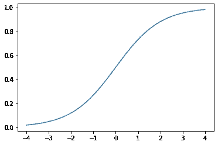

# Softmax 功能总结

> 原文：<https://medium.com/geekculture/softmax-function-summary-3c50cef3ffcf?source=collection_archive---------3----------------------->

*   softmax 函数是神经网络最后一层中的激活函数。
*   它是 sigmoid 函数的多类别等效函数，只要有两个以上的结果(例如非二进制)就可以使用。类别的概率总和必须为 1。
*   允许预测与二进制结果相比的 *n* 个可能结果的概率。