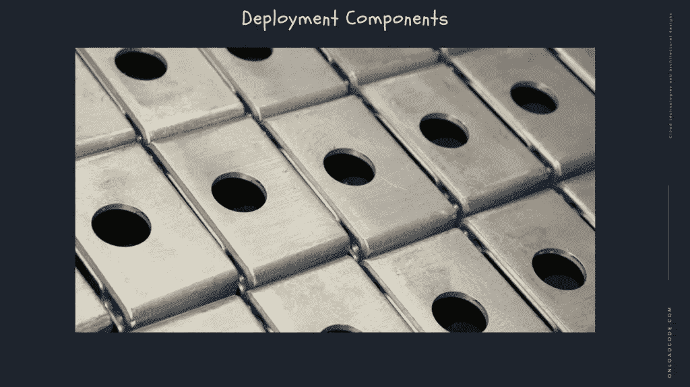

# 软件架构——边界剖析

> 原文：<https://medium.com/geekculture/software-architecture-boundary-anatomy-ae6b7b00b17?source=collection_archive---------32----------------------->

在本文中，我们正在讨论软件工程中的系统边界剖析。

T 这是 [**系统设计与软件架构**](https://onloadcode.com/category/architecture/) 系列的第十八篇文章。在本文中，我们将讨论软件工程中的**边界剖析。**

# 以前的文章

 [## 系统设计和架构介绍—加载代码

### 本文是系统设计和软件架构系列的第一篇文章。在本文中，我们…

jaya-maduka.medium.com](https://jaya-maduka.medium.com/introduction-to-system-design-and-architecture-onload-code-9cdfb14635e9)  [## 什么是软件架构？

### 在这篇文章中，我们正在讨论软件架构。

medium.com](/geekculture/what-is-software-architecture-91f74ec4365c) 

# 什么是系统边界解剖学？

系统的架构是由一组软件组件和分隔它们的边界定义的。这些限制有多种形式。在这一章中，我们将看看一些最常见的。跨越边界在运行时，跨越边界是通过调用边界一端的函数和另一端的函数来传递数据的函数。创建合适的边界横截面的策略是管理源代码依赖性。

*   为什么是源代码？
*   当一个源代码模块改变时，另一个源代码模块可能需要修改或重新安排，并重新应用。针对这种变化管理和构建防火墙是一种限制。

# 危险的巨石

最简单也是最常见的架构边界不是一个严格的物理表示。它是在单个处理器和单个地址空间内对功能和数据的严格分离。在前一章中，我称之为源代码级断开模式。从部署的角度来看，这只不过是一个可执行文件。这个文件可以静态链接到 C 或 C ++项目，它是一组附加在可执行容器文件上的 Java 类文件。事实上，当使用独石时，边界是不可见的，这意味着它们是不存在的，没有意义的。虽然在统计上与一个单一的功能单元相关联，但独立开发和棉花糖化用于最终组装的各种组件的能力是非常宝贵的。这是近几十年来面向对象开发成为如此重要的角色模型的原因之一。如果没有 OO 或类似的聚合物，架构师必须养成一个危险的习惯，即使用功能指标来实现最佳分解。许多架构师将指针广泛用于危险的任务，迫使他们放弃任何类型的组件划分。最直接的可能跨越边界是从低级客户端到高级服务的函数调用。运行时依赖和编译时依赖都是朝着更高级压缩的方向发展。

# 部署组件

架构边界最直接的物理表示是动态链接库，例如。NET DLL、Java 容器文件、Ruby gem 或 Unix 共享库。部署与编译无关。相反，本地进程 179 组件以二进制或类似的可部署形式提供。这是部署级别的部署方法。部署功能只是以一种方便的方式组装这些可部署的单元，比如一个 WAR 文件或目录。除了一个例外，部署级组件类似于整体。所有功能都在同一个处理器和地址空间上。管理组件及其依赖关系的策略是相似的。同样，在 monoliths 中，跨部署组件边界的通信只是主动调用，因此非常便宜。动态连接或运行时加载具有一次性成功的能力，但通过这些限制进行通信仍然很棘手。

# 线

线程既用于整体组件，也用于部署组件。线程不是架构边界或部署单元，而是组织实现时间表和顺序的一种方式。它们完全包含在一个组件中，也可以分布在许多组件中。

# 本地流程

更强的物理架构边界是本地过程。本地进程通常由命令行或类似的系统调用生成。

*   本地进程运行在同一个处理器上，或者运行在多个处理器上的同一个处理器上，但它位于不同的地址。内存保护通常会阻止此类进程共享内存，通常会使用共享内存分区。
*   在这种情况下，静态万用表不是一个选项。第 18 章边界剖析 180 通常，本地进程通过其他操作系统通信设施(如套接字、邮箱或消息队列)相互通信。
*   每个局部过程是静态连接的整体，或者它可以由动态连接的扩散组件组成。在前一种情况下，几个整体流程可能已经被组合和链接在一起。
*   第二，它们共享动态连接的扩散组件。将本地流程视为一种超级组件:该流程由低级组件组成，这些组件通过动态万用表管理它们的依赖关系。对于整体组件和二进制组件，本地进程之间的分离策略是相似的。源代码依赖关系跨边界指向相同的方向，并且总是指向更高级别的组件。
*   对于本地进程，这意味着高级进程的源代码不应包含物理地址或注册表视图项，如果它们是低级进程的话。
*   架构的目标是将较低级别的流程插入到较高级别的流程中。操作系统调用、数据编组和解码，以及用于跨本地进程边界通信的交互上下文切换。聊天应该需要始终小心限制。

# 服务

最强的限制是服务。服务是一个进程，通常以命令行或类似的系统调用开始。服务不依赖于它们的物理位置。两种通信服务可以在同一个物理处理器或多功能处理器上运行。服务假设所有的通信都发生在网络上。结论与活动呼叫相比，跨越服务限制的 181 通信非常慢。反转时间从十毫秒到几秒不等。总是注意尽可能不要说话。这一级别的通信必须处理高级别的延迟。否则，同样的规则也适用于应用于本地进程的服务。较低级别的服务必须需要“插入”到较高级别的服务中。较高级服务的源代码不应包含任何较低级服务的任何特定级别的物理知识(例如，URI)。

# 结论

感谢您阅读文章**边界剖析**作为**系统设计和架构**的重要组成部分。

*原载于 2021 年 7 月 4 日 https://onloadcode.com***。**