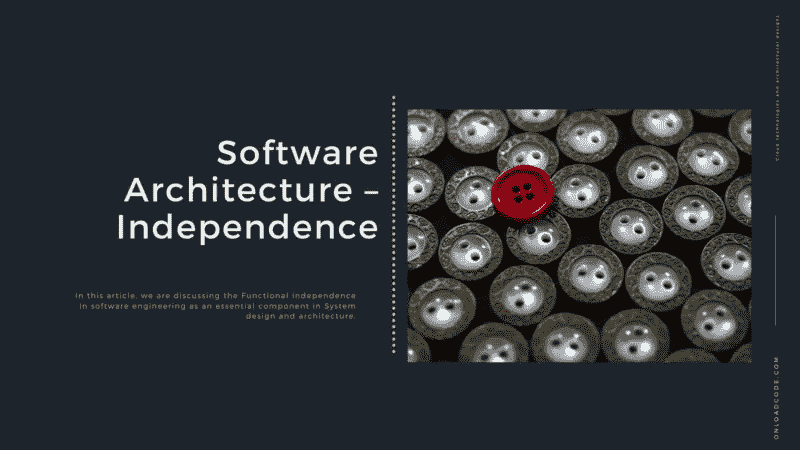
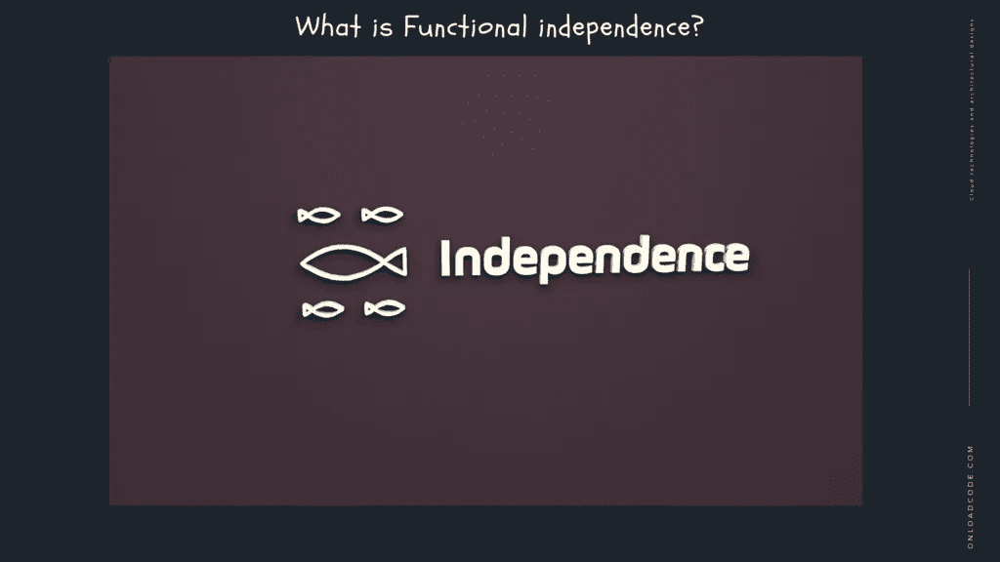

# 软件架构——独立性

> 原文：<https://medium.com/geekculture/software-architecture-independence-5f584ce0a89d?source=collection_archive---------45----------------------->

在本文中，我们正在讨论软件工程中的**功能独立性。**

T 他的是 [**系统设计与软件架构**](https://onloadcode.com/category/architecture/) 系列的第十六篇。在本文中，我们正在讨论软件工程中的**功能独立性。**

# 以前的文章

 [## 系统设计和架构介绍—加载代码

### 本文是系统设计和软件架构系列的第一篇文章。在本文中，我们…

jaya-maduka.medium.com](https://jaya-maduka.medium.com/introduction-to-system-design-and-architecture-onload-code-9cdfb14635e9)  [## 什么是软件架构？

### 在这篇文章中，我们正在讨论软件架构。

medium.com](/geekculture/what-is-software-architecture-91f74ec4365c) 

# 什么是功能独立？

软件工程中的功能独立性是指当一个模块专注于单个任务时。它可以在很少与其他模块交互的情况下执行。

在软件工程中，如果一个模块在功能上独立于另一个模块，就意味着它具有高共存性和低连通性。

当一个模块(比如一个包或类)处理一个特定的和有限的功能范围时，功能独立性就发生了。这些模块只提供该功能的接口。通过限制它们的功能，模块需要其他模块的支持来执行它们的功能。

模块的功能独立性能够通过使用两个概念来判断:

*   它们是相关性和连接性:相关性是一个模块只执行一个功能的程度。连通性是一个模块需要其他模块执行其功能的时间量。

# 软件独立性的重要性

主动独立的目标是最小化接触，最大化共存。

由于它有许多功能独立的模块，这使得软件系统具有弹性。它在功能上是独立的，因为功能上独立的模块依赖于其他模块。此外，这也使得它们不容易被修改。

功能独立性使得模块易于开发和测试。改变它们执行功能的方式将会影响整个软件。

功能独立性是隐藏信息和使用模块化的一个目标。好的信息是无法隐藏的，除非软件被分解成模块。除非软件被分解成模块，否则永远不会有功能独立的模块。如果软件的其他模块没有隐藏任何信息，那么每个模块总是依赖于其他模块来执行其功能。并且对软件的任何改变都需要在软件的其他地方进行改变来处理它们。功能独立性对于好的软件设计是必不可少的。

# 主动独立的优势

职能独立有许多好处。主动独立的一些好处如下:

将整个功能划分为模块的一个小的子功能非常有用。所有模块开发完成后，进行集成，完成核心的主要功能。这就是为什么所有的模块都需要分配独立的功能。实现两个模块不需要任何工作。这种独立的模块易于维护。

*   **更少的误差传播和更高的灵敏度**

功能独立是好设计的关键，设计是软件质量的关键。所以我们可以尝试很多设计，让模块之间相互独立。不仅很容易理解一个模块是如何工作的，而且修改一个独立的模块也很容易。类似地，当系统故障通过代码追溯到设计时，独立的模块有助于隔离和纠正原因。

*   **隔离错误**

当一个模块主动独立时，它独立地执行它的功能，而不会与其他模块有太多的干扰。这降低了错误被传送到其他模块的可能性。这有助于轻松隔离和检测错误。

*   **能够重用模块**

功能独立的模块执行定义明确的特定功能。因此，在需要相同功能的不同程序中重用这些模块是很容易的。

*   **理解能力**

一个功能独立的模块是如此复杂，以至于不容易理解。隔离可以理解为这样的模块与其他模块的交互较少。

# 结论

感谢您阅读文章**独立性**作为**系统设计和架构**中的重要组成部分。

*原载于 2021 年 5 月 30 日 https://onloadcode.com***。**