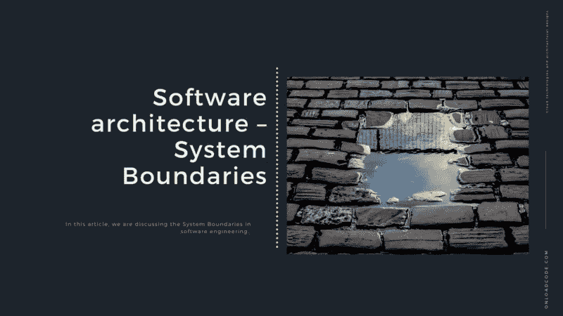
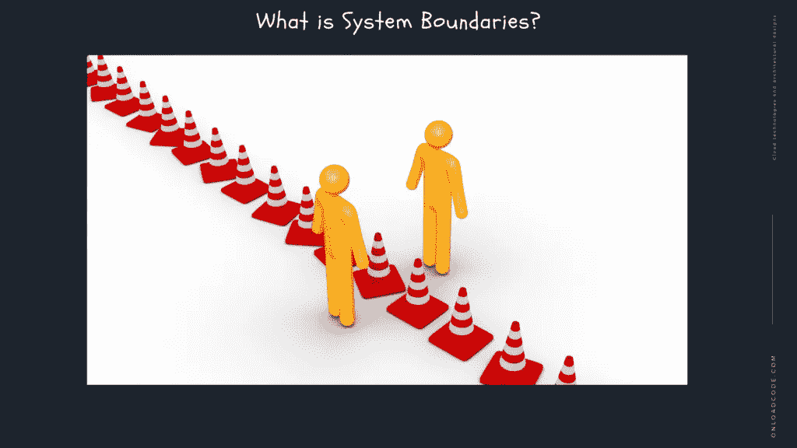
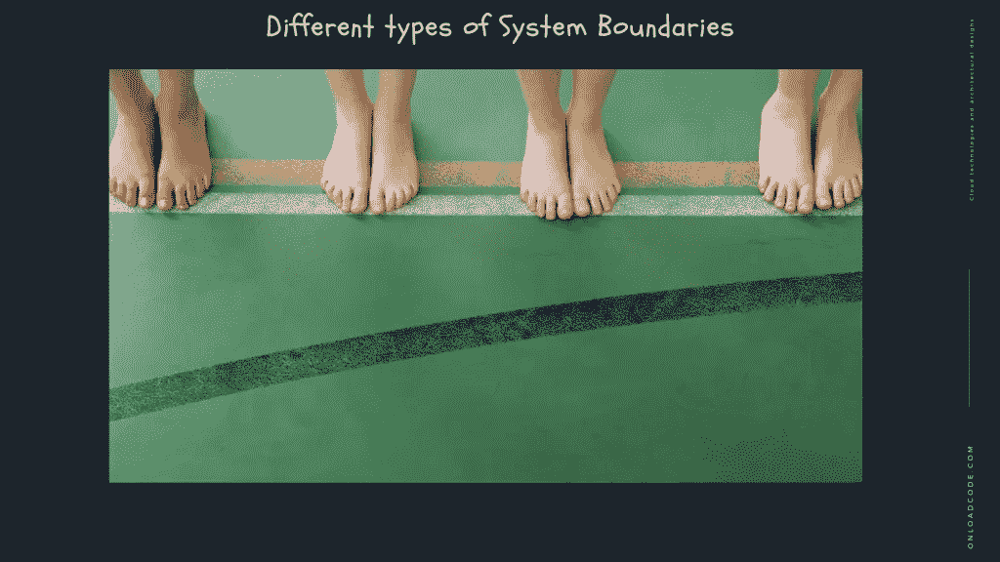
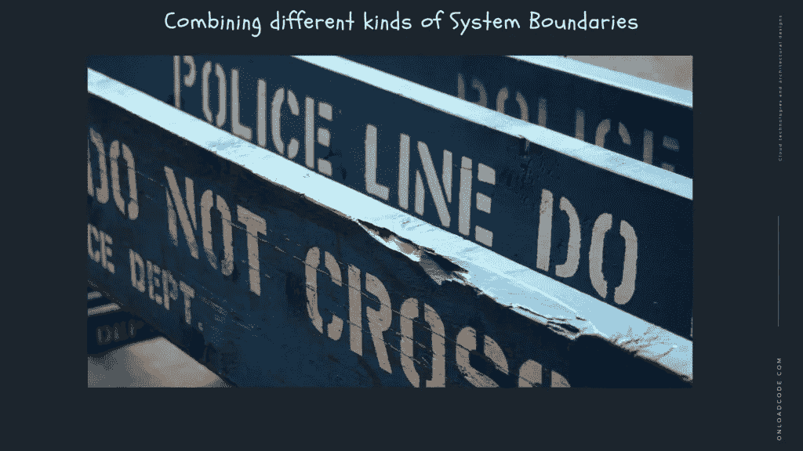

# 软件架构—系统边界

> 原文：<https://medium.com/geekculture/software-architecture-system-boundaries-54d604752149?source=collection_archive---------33----------------------->

在本文中，我们将讨论软件工程中的系统边界。

T 这是 [**系统设计与软件架构**](https://onloadcode.com/category/architecture/) 系列的第 17 篇文章。在本文中，我们将讨论软件工程中的**系统边界。**

# 以前的文章

 [## 系统设计和架构介绍—加载代码

### 本文是系统设计和软件架构系列的第一篇文章。在本文中，我们…

jaya-maduka.medium.com](https://jaya-maduka.medium.com/introduction-to-system-design-and-architecture-onload-code-9cdfb14635e9)  [## 什么是软件架构？

### 在这篇文章中，我们正在讨论软件架构。

medium.com](/geekculture/what-is-software-architecture-91f74ec4365c) 

# 什么是系统边界？

系统边界是一条概念线，它把你想研究的系统和其他所有东西区分开来。系统环境不是系统的一部分，但认为它们是由影响或能够影响系统的事物组成的是有用的。这里有一些称为域的特定区域的例子，可以看出系统的局限性以及它们是如何改变的。

系统越小，其边界越清晰。当与多个系统接口时，较大的系统可能有不同的限制。边界取决于它与其他与之交互的系统相比的观察点。

定义系统边界的复杂性和困难性的一个例子是 ATM(自动柜员机)。考虑以下候选系统限制:

*   物理机器本身
*   客户和机器
*   客户账户的机器和银行的本地数据库
*   机器和银行全国网络以及交易和账户余额的中央数据库
*   发布定期软件检查的机器和人员

分析以自动柜员机为中心的系统的“正确”界限是什么？不同的分析师可能选择不同的限制，并且当与想要构建系统的客户和系统的最终用户讨论时，这些限制可能不同。系统分析师和软件工程师开发的一项重要技能是确定要考虑的限制。

我们作为软件工程师开发的软件只是一个组织或团体的更大的信息系统的一部分。本模块侧重于软件开发和工程，但是为了有效地设计这样的软件，我们只需要能够将信息系统作为一个整体来理解，并将软件连接到它。

# 建筑主要靠边界

总之，系统的架构定义了系统的形状。更具体地说，系统的架构定义了系统如何划分为组件，这些组件如何排列，不同组件之间存在什么样的边界，以及组件如何跨越这些边界进行通信。基本上，这都是关于我们如何使用边界来分隔系统中我们不应该对彼此了解太多的部分。

这种类型的分离的目的是促进系统开发、部署和维护。尤其是维护部分非常重要，因为这通常是最危险和最昂贵的部分。通常，系统产品的第一个版本只是开始，大多数任务都发生在之后。将需要添加额外的要求，改变现有的功能。等等。足够的边界将提供这种类型的维护所需的灵活性。

# 不同类型的系统边界

当查看不同类型的边界时，我们可以通过创建水平或垂直分隔来比较边界。

水平切割在系统的不同技术领域之间创建了边界。这可以为 API、业务逻辑创建一个层，为与数据库的通信创建一个层。水平边界有助于组织系统源代码。但是，如果系统不同部分之间的边界也是不同组之间的边界，水平切割通常不是最佳选择。添加或修改功能通常需要在多层技术库存中进行更改。如果这些不同的层由不同的组管理，甚至像添加一个字段这样简单的事情都需要几个组之间的协调，这就增加了开发过程的复杂性。

另一方面，垂直切割在系统的不同功能区域之间创建了边界。例如，客户管理功能能够从订购功能中分离出来。垂直切片切割的一个特殊例子是微服务访问，其中各个小组中的每一个维护一个或多个微服务。此外，甚至一个功能区域也包含在跨越技术层的几个层的数据库中。这意味着更改可以发生在单个组中的单个功能域内，只有在更改也需要与其他活动域进行通信时，才需要与其他组进行协调。

如前所述，边界有利于群体规模，允许内部协调由几个小群体开发系统，内部沟通比高层的单个群体更有效。关于分组的一个有趣的想法是康威定律。这个“定律”指出，设计系统的组织必须创建一个具有适合组织通信结构的结构的系统。这样设计是有意义的:如果系统中某个部分的变化可以发生在一个团队中，那么这些变化就更容易设计和实现。康威定律背后的思想也意味着，如果组织内的团队结构与您正在开发的应用程序的架构不匹配，应用程序的构建可能会很困难。您可以通过配置您的应用程序(以及您的组)来利用边角规则，以便系统更改仅限于应用程序的一部分。实际上，垂直切片通常看起来是最好的方法

# 组合不同种类的系统边界

没有必要只选择一个边框。在你的架构的不同层次上，不同的边界是有用的。

例如，您可能有一个使用垂直平板电脑获得的微服务套件。然而，这些微服务中的每一个都可以具有使用水平切片来分离各种技术部分的分层架构，这可以通过具有跨原始级别边界或单独部署的能力的组件来实现。

# 界限是有代价的

虽然系统限制有很大的好处，但这些好处不是免费的。边界可能会对性能产生一些影响，但是最昂贵的影响是它们对开发工作的影响。通过提供灵活性和独立性，限制支持生产力，生产力必须需要开发和维护，它们的断开机制可以增加整个系统的复杂性，正如软件开发中经常出现的情况，而不是盲目地到处引入限制和抽象。此外，有必要在每个限制的收益和成本之间进行权衡。

如果你有五个团队在一个系统上工作，他们将受益于五个清晰分离的部分，它们有固定的接口将它们连接在一起。如果只有一个小团队在系统上工作，同样的架构会对生产力不利。不同团队成员的经验和知识对此也有贡献。

当有疑问时，保持简单。除非明确需要限制，否则在重型工程中，增加限制有时是一个机会。已经有很多关于具有许多抽象层的系统的可怕故事，其中一些很难弄清楚逻辑位于代码的基础上，或者任何新功能应该需要实现在哪里。这并不代表好的架构。

# 结论

感谢您阅读文章**系统边界**作为**系统设计和架构**中的重要组成部分。

*原载于 2021 年 6 月 17 日 https://onloadcode.com***。**