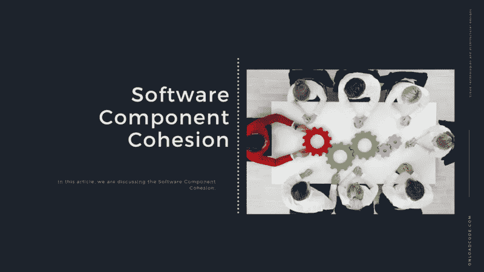

# 软件组件内聚性

> 原文：<https://medium.com/geekculture/software-component-cohesion-7919a4316e6e?source=collection_archive---------26----------------------->

## 在本文中，我们正在讨论**软件组件内聚性。**

T 这是 [**系统设计与软件架构**](https://onloadcode.com/category/architecture/) 系列的第十三篇文章。在本文中，我们正在讨论**软件组件内聚性。**

# 以前的文章

 [## 系统设计和架构介绍—加载代码

### 本文是系统设计和软件架构系列的第一篇文章。在本文中，我们…

jaya-maduka.medium.com](https://jaya-maduka.medium.com/introduction-to-system-design-and-architecture-onload-code-9cdfb14635e9) 

# 什么是软件组件内聚性？

组件内聚性原则帮助开发人员确定如何将类划分为组件。这些原则依赖于这样一个事实，即至少已经发现了一些类及其相互关系。因此，这些原则对分区持向下的观点。

# 重用/发布平等原则(REP)

REP 声明可重用颗粒，一个不小于发布颗粒的组件。我们重用的任何东西都应该需要发布和追求。对于一个开发人员来说，简单地写一个类并说它是可重用的是不现实的。只有在跟踪系统被激活并且重复用户得到通知、保护和支持后，它才能再次使用。

REP 给了我们第一个关于如何将我们的设计分成组件的提示。由于可重用性应该需要基于组件，所以可重用组件应该包括可重用类。因此，至少某些组件必须由可重用的类工具包组成。

虽然政治力量会影响我们软件的划分看起来令人不安，但软件并不是一个数学上干净的实体，它有能力根据数学上干净的规则来构建。软件是支持人类努力的人类产品。软件是人类创造的，也是人类使用的。如果需要重用软件，就必须对其进行分区，以方便人们使用。

此外，它不仅仅是重用的标准；我们还需要考虑谁在重用它。当然，容器类库是可重用的，它也是一个财务框架。但我们不希望它们成为同一个组件的一部分。因为许多想要重用容器类库的人对财务框架不感兴趣。因此，组件中的所有类都必须由相同的受众重用。一个组件由必需的类组成，我们不希望查看者发现其他的完全不合适。

# 通用重用原则(CRP)

这个原则帮助我们决定放置哪个类组件。CRP 说趋向于可重用的类属于同一个组件。

很少重用类隔离。一般来说，可重用类与作为可重用抽象一部分的其他类协作。据说这些类属于同一个组件。在这样一个组件中，我们希望看到有很多相互依赖的类。一个简单的例子是容器类及其关联的仿真器。因为这些类是紧密重新连接的，所以它们是可重用的。因此，它们必须需要相同的组件。

但是 CRP 只是告诉我们哪些类需要添加到组件中。它还告诉我们哪些类不应该包含在组件中。当一个组件使用另一个组件时，组件之间会产生依赖关系。该组件仅使用了所用组件中的一个类。但是，并没有削弱依赖性。所使用的组件仍然取决于所使用的组件。每次使用过的组件被释放时；使用过的组件必须需要重新验证和重新发布。即使使用的组件由于阶级差异而被释放，也是如此。这还不包括所使用的组件。

我们没有被告知需要一起上课。CRP 说彼此不密切相关的类不需要在同一个组件中。

# 共同封闭原则(CCP)

这是针对组件重新设计的单一责任原则。正如 SRP 所述，类别变更不应包含不同的原因。此外，CCP 指出，不应该需要不同的理由来改变一个组成部分。

在许多应用程序中，维护可重用性更重要。如果应用程序代码需要更改，您可能希望对一个组件进行更改，而不是将其分布在多个组件中。如果变化集中在单个组件上，我们只需要一个修改的组件。不依赖于已修改组件的其他组件不需要重新验证或替换。

CCP 敦促我们把所有可能因为同样的原因而改变的阶层聚集在一起。如果两个类在物理上或概念上紧密相关，如果它们在一起总是不同的，那么它们属于同一个组件。这最小化了软件发布、验证和再分发的作用。

这一原则与开放/封闭原则(OCP)密切相关。这是因为处理这个原则的词在 OCP 意义上是“关闭”。班级应该需要关闭现代化，但时间长。OCP 说它应该开放给。但正如我们所了解的，百分之百的关闭是不可能实现的。结束有时必须是战略性的。我们设计我们的系统，因为它们接近我们所经历的最常见的变化类型。

CCP 扩展了这一点，将那些对某种变化开放的类分组到相同的组件中。因此，当需求发生变化时，很有可能需要将变化限制在最小数量的组件上。

# 组件内聚力的类型:

*   功能共生:组件包含单个计算的所有基本元素。积极共存执行功能和作用。这是一个很好的情况。
*   顺序共生:一个元素返回一些数据，这些数据成为另一个元素的输入，即部件之间的数据流。它自然地出现在函数式编程语言中。
*   通信共生:两个元素操作相同的输入数据或贡献相同的输出数据。示例:更新数据库并将其发送到打印机。
*   程序共存:确保程序共存元素的执行顺序。动词仍然连接不良，难以重用。学生绩点计算，学生报告打印，累计绩点计算，累计绩点打印。
*   时间共生:元素通过它们的时间关联。与临时共存相关的模块必须在同一时间范围内执行所有功能。初始化系统所有部分的代码包含在这个共生关系中。在开始的时候会有很多不同的活动发生。
*   逻辑共生:元素是逻辑相关的，那些不是功能性的。例如，组件从磁带、磁盘和网络读取输入。这些函数的所有代码都在一个组件中。操作是相关的，但是功能差别很大。
*   随机共生:元素不相关。除了源代码的位置之外，元素没有概念上的关系。这是一种巧合，也是最糟糕的共生现象。打印下一行并反转单元素线程的文本。

# 结论

然而，组件内聚性的三个原则描述了一种更复杂的共存形式。当选择类作为组件分组时，必须考虑重用和开发的对立力量。

在这些力量和应用程序的需求之间进行平衡并不重要。此外，这种平衡几乎总是动态的。也就是说，今天合适的分区明年就不合适了。因此，随着项目的核心从开发转变为可重用性，组件的组成将随着时间的推移而演变。

感谢阅读文章**软件组件** **内聚**作为**系统设计和架构**中必不可少的组件。

*原载于 2021 年 4 月 18 日 https://onloadcode.com**[*。*](https://onloadcode.com/software-component-cohesion/)*