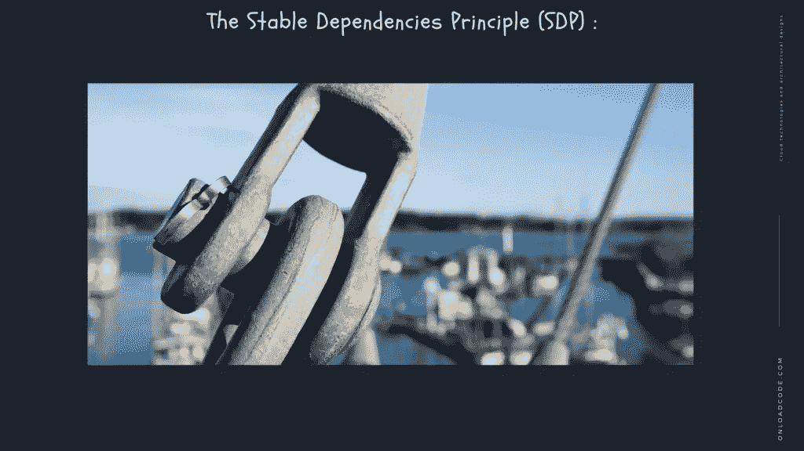

# 软件组件耦合

> 原文：<https://medium.com/geekculture/software-component-coupling-58dc196fdc8e?source=collection_archive---------45----------------------->

# 在本文中，我们将讨论软件组件耦合。

T 这是 [**系统设计与软件架构**](https://onloadcode.com/category/architecture/) 系列的第十四篇文章。在本文中，我们将讨论**软件组件耦合。**

# 以前的文章

 [## 系统设计和架构介绍—加载代码

### 本文是系统设计和软件架构系列的第一篇文章。在本文中，我们…

jaya-maduka.medium.com](https://jaya-maduka.medium.com/introduction-to-system-design-and-architecture-onload-code-9cdfb14635e9) 

# 什么是软件组件耦合？

软件工程的连接不同于一般意义上的共存。它是衡量两个组件连接紧密程度的指标。低接触往往与高共存相联系，反之亦然。低连通性通常是结构良好的计算机系统和良好设计的标志。此外，当与高对称性相结合时，它支持高可读性和可维护性的一般目的。

Robert c. Martin 给出了软件工程中组件耦合的另外三个原则。

# 非循环依赖原则(ADP):

晨后综合症:我们大多数人都经历过这种情况。有时我们工作一整天，拿些东西然后回家。第二天早上，当我们再次检查该功能时，我们发现它并不活跃。为什么没有功能？因为后来有人留在我们身后，改变了一些依赖于我们行动主义的东西！鲍勃叔叔称之为“晨后综合症”

“晨后综合症”发生在一个开发环境中，在这个环境中，许多开发人员修改来自同一个源的文件。在有几个开发商的相对较小的项目中，这不是一个大问题。但是随着项目规模和开发团队的增长。还有，早上可以做个美好的噩梦。团队花费数周时间试图创建项目的稳定版本并不罕见。取而代之的是，每个人都在不断地改变他们的代码，并试图让它和其他人所做的改变一起工作。这个问题有两种解决方案:

## 每周建筑

在中型项目中很常见。这很有效，在一周的前四天，所有的开发人员都忽略对方。他们都处理代码的单个副本，并不担心在集体的基础上整合他们的工作。然后在第五天，星期五，他们都结合他们所有的变化，并建立系统

**优势**:允许四个开发者在一个与世隔绝的世界里生活四天

**劣势**:周五支付大额合并罚款。

## 消除依赖循环:

“每周积累”案例问题的解决方案是消除依赖循环。使开发环境成为发布组件。这些组件成为一个工作单元，由一个开发人员或一组开发人员负责。当一个组件为开发人员工作时，他们会发布它供其他开发人员使用。他们给它一个版本号，并把它转移到其他组使用的目录中。然后他们继续改变他们个人领域的组成部分。其他人都使用发布版本。给定组件的新版本，其他组可以决定是否立即采用新版本。如果他们决定不这样做，他们只是使用旧版本。一旦团队决定他们准备好采用新的变更，他们就开始使用新的版本。

**优点**:

*   没有一个群体是受他人摆布的。
*   对一个组件的更改不一定会对其他组产生直接影响。
*   每个版本都可以决定何时调整自己的组件以适应新版本。
*   整合是以小增量进行的。
*   它作为一个非常简单且符合逻辑的过程被广泛使用。这是没有“周期”的。如果依赖结构中存在循环，我们必须面对“综合症后的早晨”

# 稳定依赖原则(SDP):

在一行中，这个原则被表述为“依赖于稳定的方向”。根据这一原理，易于修改的模块不依赖于难以修改的模块。

这种设计需要一些不稳定性来维持。我们期望蒸发的任何成分都不依赖于一种难以改性的成分。否则，挥发性成分也将难以改变。

**稳定性**:稳定性被定义为做出改变所需的工作量。具有大量依赖项的组件是非常稳定的，因为需要大量的工作来协调与任何依赖项组件的任何更改。

# 长期总结原则(SAP):

这个原则声明“一个组件必须需要抽象才能变得稳定。”就是稳定和抽象的关系。一个固定的组件必须抽象，它的稳定性并不妨碍它伸长。

由于一个不稳定组件的不稳定性，其内部的具体代码具有容易修改的能力。固定组件必须有一个接口和一个可以扩展的抽象类。

# 联轴器类型:

## 数据连接:

如果模块的相互依赖是基于它们仅通过传送数据来通信的事实。然后模块被称为连接数据。连接数据时，组件相互独立，通过数据进行通信。模块通信不包含 trump 数据。例如:消费者计费系统。

## 邮票连接

当戳记连接时，整个数据结构从一个模块转移到另一个模块。所以涉及到川普数据。由于效率因素，这是必要的——这个选择是由一个聪明的设计师做出的。它不是一个懒惰的程序员。

## 连接控件:

如果模块通过提供控制信息进行通信，它们被称为控制器连接器。如果参数显示完全不同的行为，有时会很糟糕。并且如果允许参数分解和重新激活功能性，则更好。示例:分类函数将比较函数作为参数。

## 外部连接:

在外部连接中，模块依赖于其他模块。此外，正在开发的软件的外部或特定硬件。外部协议、外部文件、设备格式等。

## 公共连接:

模块共享数据，如全局数据结构。全局数据变更意味着返回到访问该数据的所有模块，以评估变更的影响。因此，它也有缺点，例如难以重用模块，降低了控制数据访问和维护能力的能力。

## 内容连接:

当连接内容时，一个模块可以修改从一个模块到另一个模块的数据。或者控制流从一个模块转移到另一个模块。这是最糟糕的接触方式，应该避免。

# 结论

感谢阅读文章**软件组件** **耦合**作为**系统设计和架构**中必不可少的组件。

*原载于 2021 年 5 月 23 日 https://onloadcode.com**[*。*](https://onloadcode.com/software-component-coupling/)*