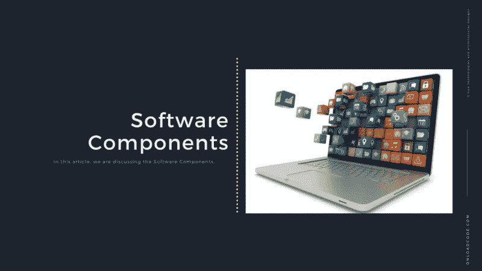
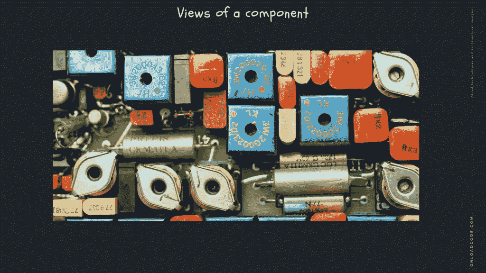
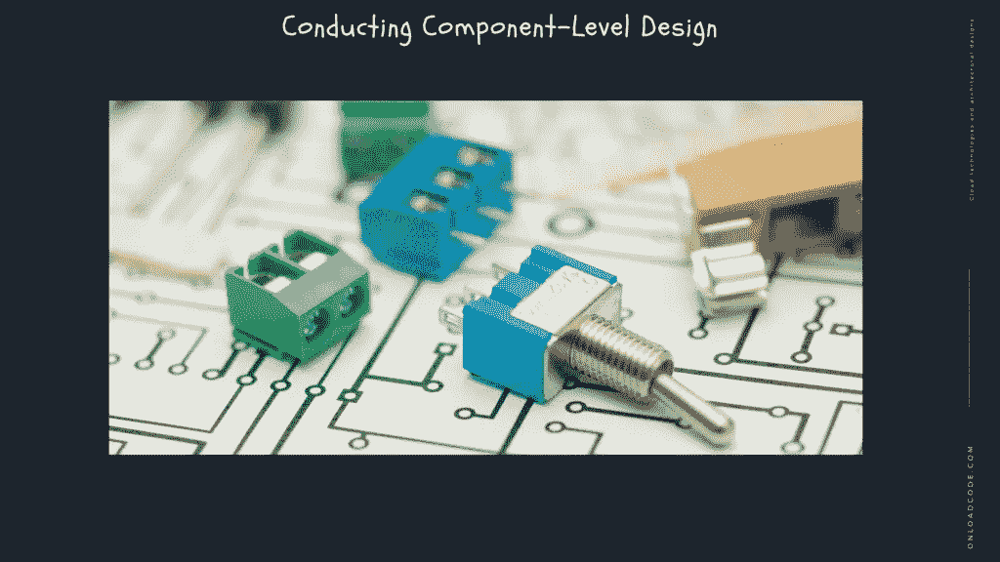

# 软件组件

> 原文：<https://medium.com/geekculture/software-components-5f0c741a6c99?source=collection_archive---------12----------------------->

## 在本文中，我们讨论的主题是[设计原则、](https://onloadcode.com/design-principles/)软件组件。

T 这是 [**系统设计与软件架构**](https://onloadcode.com/category/architecture/) 系列的第 12 篇文章。在本文中，我们将讨论**软件组件。**

# 以前的文章

 [## 系统设计和架构介绍—加载代码

### 本文是系统设计和软件架构系列的第一篇文章。在本文中，我们…

jaya-maduka.medium.com](https://jaya-maduka.medium.com/introduction-to-system-design-and-architecture-onload-code-9cdfb14635e9) 

# 什么是软件组件？

组件是一组明确定义的模块化、可移植、可替换和可重用的功能。

组件是旨在与其他组件交互的软件对象，集成了某个功能或一组功能。它有一个明确定义的接口，并符合体系结构中所有组件的一般推荐行为。

一个软件组件可以被定义为一个具有特定接口和清晰上下文依赖的组合单元。这是一个软件组件，可以独立部署，并受制于第三方组合。

# 组件的特性

*   复用性

组件通常被设计为在不同的时间在不同的应用程序中重复使用。但是，有些组件是为特定目的而设计的。

*   可代替的

部件可以自由地用其它类似的部件替换。

*   上下文不具体

这些组件被设计为在不同的环境和上下文中运行。

*   可膨胀的

组件可以从现有组件扩展来提供新的行为。

封闭组件

组件接口表示允许调用者使用其功能而不暴露关于内部进程或内部变量或状态的信息的接口。

*   自主的

这些组件的设计对其他组件的依赖性最小。

# 组件视图

一个组件可以有三种不同的想法——面向对象视图、传统视图和流程相关视图。

## 面向对象的视图

*   一个组件被认为是一个或多个协作类。对每个问题域类和基础设施类进行解释，以识别所有属性。以及与其实现相关的操作。它还包括定义类可以通信和协作的接口。

## 传统观点

*   它被认为是一个集成了功能元素或处理逻辑的程序模块。还必须提供一个接口和数据，允许它调用执行处理逻辑所需的内部数据结构和组件。

## 与流程相关的愿景

*   根据这种观点，与其从头开始创建单个组件。此外，该系统由现有组件构建而成。这些都保存在图书馆里。随着软件架构的开发，从库中选择组件并用于推广架构。
*   用户界面(UI)组件包括称为网格和控件的按钮，而实用程序组件公开了在其他组件中使用的一组特定功能。
*   其他常见组件是资源密集型的，经常无法访问，并且必须使用实时(JIT)访问来激活。
*   许多组件分布在互联网 web 应用程序中，如企业业务应用程序。和企业 Java Beans (EJB)。NET 组件，而 Korba 组件是不可见的。

# 进行组件级设计

*   确定与分析模型和架构模型中定义的问题域相对应的所有设计类。
*   标识与基础结构域对应的所有设计类。
*   描述尚未作为可重用组件获得的所有设计类，并指定消息描述。
*   确定每个组件的适当接口，并描述实现这些接口所需的数据类型和数据结构。
*   重复代码或 UML 活动图详细描述了每个操作中的处理流程。
*   描述连续数据源(数据库和文件)并确定管理它们所需的类。
*   开发和扩展一个类或元素的行为表示。这可以通过扩展为分析模型设计的 UML 状态图来实现。并检查与设计类相关的所有用例。
*   展开部署图以提供附加的激活细节。
*   通过使用类机会来指示击键或组件在系统中的位置。也命名特定的硬件和操作系统环境。
*   最终决策可以使用已建立的设计原则和指导方针。此外，经验丰富的设计师在确定最终设计模型之前，会考虑所有(或大部分)备选设计方案。

# 优势

*   易于部署—当新的兼容版本可用时。此外，很容易用其他组件或整个系统替换现有版本，而不会产生任何影响。
*   降低成本—这允许您通过使用第三方组件来增加开发和维护成本。
*   易于开发—使组件公共接口能够提供定义的功能，并且允许在不影响系统其他部分的情况下进行开发。
*   可重用性——使用可重用组件意味着它们可以用于跨多个应用程序或系统扩展开发和维护成本。
*   改变技术复杂性——组件改变了使用组件容器及其服务的复杂性。
*   可靠性—重用每个组件的可靠性增加了整个系统的可靠性，因为它增加了整个系统的可靠性。
*   系统维护和发展——易于修改和更新激活，而不影响系统的其他部分。
*   独立性——组件的独立性和灵活性。并行地独立开发不同组的组件。

# 稳定的依赖性

*   在任何软件系统中，在我们预期不稳定的组件之间有一个非常清晰的区分是很重要的——也就是说，我们预期最经常改变的组件。和低挥发性的、更重要的和稳定的组分。

因此，组件依赖图应该需要设计为保护稳定的高价值组件免受更不稳定的组件的影响。例如，我们不希望影响 UI 更改系统的高级策略或业务性能。

*   一件使修改一个软件组件变得困难的事情是如果有更多的组件基于它。这种组件本质上是稳定的。另外，如果它没有或很少依赖，它是独立的，容易分离，是一个单元测试。
*   如果一个组件是稳定的，就很难改变。如果很难改变，就很容易延伸。这就是所谓的静态总结原则，这个原则和开放/封闭原则是并行不悖的。并且声明这些组件只需要为扩展而打开，为修改而关闭。
*   另一方面，改变一个有许多依赖项和零或很少依赖项的组件是相对容易的。这种成分是不稳定的。所有的软件系统都需要不稳定的组件，这些组件能够很容易地被修改或替换为其他组件。

# 摘要

*   几乎所有的软件系统都是由称为组件的小构件组成的。坚持众所周知的最佳实践和软件组件设计原则是可靠的软件设计和架构的重要组成部分。
*   非常重要的一点是，在我们预期易变的组件——也就是说，我们经常预期要改变的组件——之间有一个非常清晰的区别。和挥发性较低的基本成分。
*   实践依赖逆原理。尤其是完全控制组件之间的连接。并确保要素之间的高度脱节。和信息极大地增加了系统的维护能力。
*   分量的两个主要特征是分量的振幅和稳定性。“完美”的组件极其灵活和稳定，因此很难改变。但它不容易扩展，不稳定，所以改变甚至更换其他组件并不复杂。
*   绘制软件系统的组件稳定性扩展图是一个有用的练习。

# 结论

感谢您阅读文章**软件组件**作为**系统设计和架构**中必不可少的组件。

*原载于 2021 年 4 月 14 日 https://onloadcode.com***。**