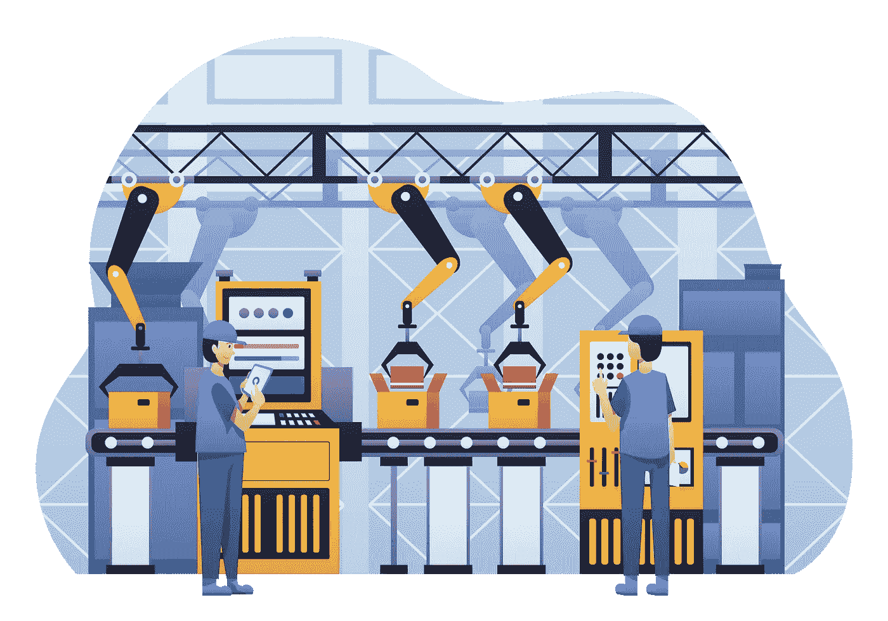
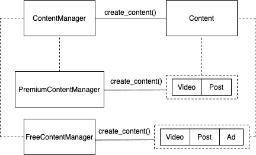

# 软件设计模式#1:工厂方法

> 原文：<https://medium.com/geekculture/software-design-pattern-1-factory-method-b9292ec65953?source=collection_archive---------26----------------------->

设计模式是可重用的模板，帮助我们使用最佳实践解决软件设计问题。通过这种方式，它们帮助我们使用更易于维护、理解、重用和测试的代码来构建应用程序。

# 逃离速度实验室

你可以在我们的网站上找到我们所有的文章、课程和教程:
[https://www . ev labs . io](https://www.evlabs.io/)



# 这个图案是干什么用的？

> 定义一个创建对象的接口，但是让子类决定实例化哪个类。工厂方法允许一个类将它使用的实例化推迟到子类。

我们来看一个例子。我们将创建一个新的社交网络，并将其命名为 FaceTube。这个社交网络有两个版本，一个**免费**，一个**付费**。在它的主页上，用户会看到一个内容无限的列表，可以有三种类型:**视频**、**帖子、**或**广告**。然而，付费版没有广告，只有视频和帖子，不像免费版有三种类型的内容。


现在，我们必须对应用程序中负责向用户提要填充内容的部分进行编程。但是填充的方式是不一样的，取决于用户是有免费版还是付费版。一种选择(不好的选择)是在*提要*代码中添加如下代码块。

```
**if** free_version:
    **if** condition1:
        next_item = Video()
    **elif** condition2:
        next_item = Post()
    **else**:
        next_item = Ad()**elif** paid_version:
    **if** condition1:
        next_item = Video()
    **else**:
        next_item = Post()**else**:
    **raise** NotImplementedError()
```

然而，这产生了一些问题:

*   应用程序不应该关心它将要显示的特定类型的内容，那是 **ContentManager** 的责任。
*   如果我们将应用程序逻辑和 ContentManager 逻辑混合在一起，我们将无法独立开发这两个部分。
*   因为它们是混合的，所以每次我们包含一个新的内容类型时，我们都必须测试这两个部分。
*   每当我们包含一个新类型的内容时，我们将不得不在所有实例化内容的地方改变应用程序逻辑。

解决方案:使用**工厂方法**实例化内容。

# 它是如何工作的？

在下图中，我们可以看到这种模式的基本操作:



应用程序将与一个名为 **ContentManager** 的抽象类联系，而不会关心它创建的内容类型。无论你是为免费还是付费版本创建内容，应用程序都不会知道这些细节。

我们还将有一个名为**内容**的抽象类，它将代表应用程序中显示的任何类型的内容。该内容将使用 ContentManager 的工厂方法***create _ content()***创建。

在这里，您可以看到应用程序将在 Python 中接触到的抽象类:

```
**from** **abc** **import** ABC, abstractmethod**class** **ContentManager**(ABC):
    **def** __init__(self):
        self.content_list = []
        self._load_content() **def** _load_content(self):
        content = self.create_content()
        self.content_list.append(content) @abstractmethod
    **def** create_content(self):
        **raise** NotImplementedError() **class** **Content**(ABC):
    **def** __init__(self):
        **pass**
```

如您所见， **ContentManager** 负责创建和组织内容，但是将内容类型的选择委托给它的子类。 **create_content()** 方法是用于创建不同类型内容的**工厂方法**，并且 **ContentManager** 子类负责为此方法选择内容创建策略。

我们现在将为免费和付费版本创建两种类型的 ContentManager:

```
**class** **FreeContentManager**(ContentManager):
    **def** create_content(self):
        **if** condition1:
            **return** Post()
        **elif** condition2:
            **return** Video()
        **else**:
            **return** Ad()

**class** **PaidContentManager**(ContentManager):
    **def** create_content(self):
        **if** condition:
            **return** Post()
        **else**:
            **return** Video()

**class** **Post**(Content):
    **...**

**class** **Video**(Content):
    **...****class** **Ad**(Content):
    **...**
```

正如你所看到的，每个子类都将按照不同的策略创建内容，而不会影响应用程序的执行。对于应用程序，只有创建**内容**的**内容管理器**接口。其余的是我们封装在子类中的细节。

当应用程序启动时，只需检查用户正在使用的版本，并创建适当的 ContentManager:

```
**if** version == ‘paid’:
 content_manager = PaidContentManager()
**elif** version == ‘free’:
 content_manager = FreeContentManager()
**else**:
 **raise** NotImplementedError()
```

通过这种方式，每个版本的应用程序都将使用自己的内容管理策略。

# 利益

*   我们将创建什么内容的选择委托给 ContentManager 子类。
*   我们可以设计用户提要逻辑，而不用担心应用程序可能拥有的所有内容类型。
*   我们避免在应用程序的许多不同部分重复内容创建代码。
*   我们避免在 *feed* 逻辑中包含与其无关的细节。