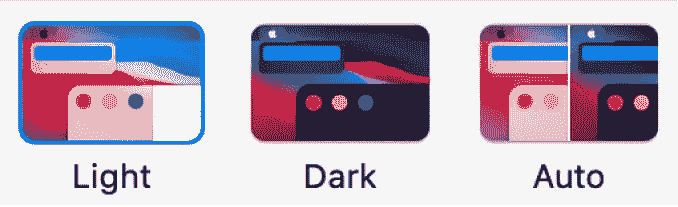
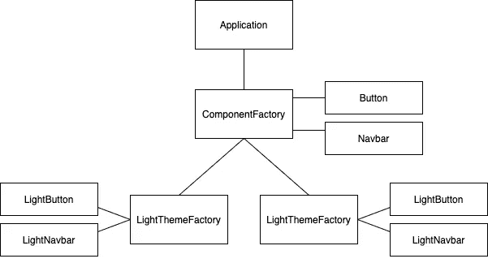

# 软件设计模式#2:抽象工厂

> 原文：<https://medium.com/geekculture/software-design-pattern-2-abstract-factory-1700fefa700d?source=collection_archive---------17----------------------->

设计模式是可重用的模板，帮助我们使用最佳实践解决软件设计问题。这样，它们允许我们使用更易于维护、理解和测试的代码来构建应用程序。

# 逃离速度实验室

你可以在我们的网站上找到我们所有的文章、课程和教程:
[https://www . ev labs . io](https://www.evlabs.io)


# 这个图案是用来做什么的？

> 它提供了一个接口来创建相关或依赖对象的系列，而无需指定它们的具体类。

例如，假设我们想要为 iOS 创建一个应用程序。iPhone 有两个不同的视觉方面:**亮模式**和**暗模式**。如果用户使用光模式，我们将不得不显示光视觉组件(按钮，导航栏等)，如果他们使用暗模式，暗组件。



但这意味着，每当我们在代码中创建一个可视元素时，我们都必须检查正在使用的可视模式，并选择正确的组件。这产生了三个问题:

*   如果引入第三种视觉模式，我们将不得不在创建组件的所有位置更改代码。
*   我们将应用程序逻辑与描述如何创建可视组件的逻辑混合在一起。
*   例如，我们可能会不小心把浅色的按钮和深色的导航条混在一起。

通过使用**抽象工厂**模式，我们将确保应用程序代码与可视组件的代码保持分离。也就是说，应用程序将简单地创建一个**按钮**或一个**导航栏**，工厂将根据所使用的视觉模式生产相应的组件。另一方面，使用的工厂将只生产一个视觉方面的元素，阻止我们混合它们。最后，如果出现第三种视觉模式，我们只需要更改代码行，在那里选择合适的工厂。

# 它是如何工作的？

下图描述了所涉及的类别:



Diagram of the Abstract factory pattern

应用程序将使用一个组件工厂，它将负责生成适当的按钮和导航栏，而应用程序不必担心细节。
为了实现这一点，我们创建了三个抽象类，它们是应用程序将与之联系的类，而不是它们的具体实现:

```
**class** **ComponentFactory**(ABC):
    @abstractmethod
    **def** create_button(self):
        **pass**        @abstractmethod
    **def** create_navbar(self):
        **pass****class** **Button**(ABC):
    @abstractmethod
    **def** render(self):
        **pass****class** **Navbar**(ABC):
    @abstractmethod
    **def** render(self):
        **pass**
```

工厂是一个可以创建某个家族的对象的类。抽象工厂是创建工厂的模板。由于我们的抽象工厂(ComponentFactory ),我们将能够创建两个不同的工厂，一个生产亮主题的元素，另一个生产暗主题的元素。

```
**class** **LightThemeFactory**(ComponentFactory):
    **def** create_button(self):
        **return** LightButton()     **def** create_navbar(self):
        **return** LightNavbar()**class** **LightButton**(Button):
    **def** render(self):
        **...****class** **LightNavbar**(Navbar):
    **def** render(self):
        ...**class** **DarkThemeFactory**(ComponentFactory):
    **def** create_button(self):
        **return** DarkButton()**def** create_navbar(self):
        **return** DarkNavbar()**class** **DarkButton**(Button):
    **def** render(self):
        **...****class** **DarkNavbar**(Navbar):
    **def** render(self):
        ...
```

如你所见，两家工厂都能够创建特定类型的按钮和导航栏，它们扩展了抽象类 **Button** 和 **Navbar** 。
这样，在启动应用程序时，我们只需创建适当的工厂:

```
**if** theme == "dark":
    component_factory = DarkThemeFactory()
**elif** theme == "light":
    component_factory = LightThemeFactory()
**else**:
    **raise** **NotImplementedError**(f"This visual mode doesn't exist")
```

要创建组件，我们只需:

```
button = componentfactory.create_button()
navbar = componentfactory.create_navbar()
```

# 利益

*   应用程序不关心组件细节。
*   它将对象的创建封装在一个类(工厂)中，而不是直接创建它们。
*   在应用程序执行时，只需更改几行代码就可以更改工厂。
*   该应用程序可以独立于其视觉外观进行测试。