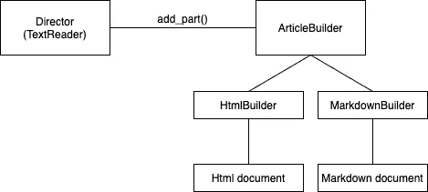

# 软件设计模式#3:构建器

> 原文：<https://medium.com/geekculture/software-design-pattern-3-builder-3bfff590ddbc?source=collection_archive---------17----------------------->

设计模式是可重用的模板，帮助我们使用最佳实践解决软件设计问题。通过这种方式，它们帮助我们使用更易于维护、理解、重用和测试的代码来构建应用程序。

# 逃离速度实验室

你可以在我们的网站上找到我们所有的文章、课程和教程:
[https://www . ev labs . io](https://www.evlabs.io/)


# 这个图案是干什么用的？

> 它允许我们把一个复杂物体的构造和它的表现分开。因此，相同的创建过程可以生成不同的表示。

让我们以本系列前几篇文章为例，即创建一个新的社交网络。我们希望给用户写文章并与在线出版物分享的可能性。这些文章可以包含一个**标题**，几块**文本**、**图片、**和**视频**。当然，这些元素遵循一定的顺序。

当一个用户在写一篇文章时，他想看看它在我们的网站和他们要发送的出版物上会是什么样子。但是我们的网站显然会显示 **HTML** 元素，在线出版物使用 **Markdown** 来显示他们的文章。

因此，我们的预览工具必须将文章(纯文本)转换为正确的格式，以查看它在目的地的外观。

为此，我们可以在预览工具的代码中将文章转换为适当的格式，但这会带来许多问题:

*   我们把文章草稿的阅读逻辑和文章的表现逻辑混合在一起。
*   每次我们想要包含一个新的格式(pdf，epub 等)时，我们都必须修改预览工具的逻辑，这使得它很难维护。
*   想象一下，一些出版物用双倍行距或不同的字体显示文章。实现所有这些变体将使预览工具的代码很难维护。

**解决方案**:使用*构建器*模式创建文章表示。

# 它是如何工作的？

在这个模式中，有三个参与者:总监**、建造者**、产品**和产品**。产品是将被创建的对象，在我们的例子中是正确格式的文章。构建器是描述如何以正确的格式创建文章的每个部分的对象。最后，导演是描述构建过程的对象，即文章的各部分及其顺序，*但不涉及文章最终格式的细节*。生成的图表如下所示:



在这个图中，TextReader 是控制器。它是预览工具的一部分，将一部分一部分地处理用户编写的纯文本，以格式化文章的形式构建表示。

```
**class** **TextReader**:

    **def** **__init__**(self) -> **None**:
        self._builder = **None**

    **def** **set_builder**(self, builder: ArticleBuilder) -> **None**:
        self._builder = builder

    **def** **read_article**(self) -> **None**:
        while next_block_available():
            article_block = read_next_block() **if** is_title(article_block):
                self._builder.add_title(article_block)
            **elif** is_image(article_block):
                self._builder.add_image(article_block)
            **elif** is_video(article_block):
                self._builder.add_video(article_block)
            **elif** is_text(article_block):
                self._builder.add_text(article_block)
            **else**:
                **raise** NotImplementedError("Unknown part of an article.")
```

如您所见，向导演传递了构建器的一个实例，该实例实现了 ArticleBuilder 接口。然后，在其 read_article()方法中，导演将处理用户正在编写的草稿的每个纯文本块，检查它是什么类型的内容，并将如何以正确的格式将它合并到文章中的细节委托给它的构建者。构建器必须实现以下接口:

```
**from** abc **import** ABC, abstractmethod
**from** typing **import** String **class** **ArticleBuilder**(ABC): 

    **@property**
    **@abstractmethod**
    **def article**(self) -> **None**:
        **pass**    

    **@abstractmethod**
    **def** **add_title**(self, title: String) -> **None**:
        **pass**

    **@abstractmethod**
    **def** **add_image**(self, href: String) -> **None**:
        **pass** **@abstractmethod**
    **def** **add_video**(self, file: String) -> **None**:
        **pass**  **@abstractmethod**
    **def** **add_text**(self, text: String) -> **None**:
        **pass**
```

director 将与这个通用接口交互，实现它的子类负责将纯文本翻译成适当的格式。正如我们所说，我们要将文章转换成两种格式， **HTML** 和 **Markdown** ，所以我们需要两个不同的*构建器*。

```
**class** **HtmlBuilder**(ArticleBuilder):

    **def** **__init__**(self) -> **None**:
        self.article = ""     **@property**
    **def** **article**(self) -> **String**:
        **return** self.article **def** **add_title**(self, title: String) -> **None**:
        self.article += f"<h1>{title}</h1>"

    **def** **add_image**(self, href: String) -> **None**:
        self.article += f"" **def** **add_video**(self, file: String) -> **None**:
        self.article += f"<video><source src={file}></video>"     **def** **add_text**(self, text: String) -> **None**:
        self.article += f"<p>{text}</p>" **class** **MarkdownBuilder**(ArticleBuilder):

    **def** **__init__**(self) -> **None**:
        self.article = ""

    **@property**
    **def** **article**(self) -> **String**:
        **return** self.article **def** **add_title**(self, title: String) -> **None**:
        self.article += f"#{title}"

    **def** **add_image**(self, href: String) -> **None**:
        self.article += f"" **def** **add_video**(self, file: String) -> **None**:
        self.article += f"[]" **def** **add_text**(self, text: String) -> **None**:
        self.article += text
```

完成后，剩下的工作就是在预览代码中创建导演，将合适的生成器传递给导演，并以期望的格式获得文章:

```
**if** __name__ == "__main__":
    article_reader = TextReader()

    # Convierte el artículo a formato HTML.
    html_builder = HtmlBuilder()
    article_reader.set_builder(html_builder)
    article_reader.read_article()
    html_article = html_builder.article

    # Convierte el artículo a formato Markdown.
    markdown_builder = MarkdownBuilder()
    article_reader.set_builder(markdown_builder)
    markdown_builder.read_article()
    markdown_article = markdown_builder.article
```

# 利益

*   减少耦合。 *builder* 对象为导演提供了一个构建文章的公共接口。
*   考虑到 ArticleBuilder 类的公共接口，它允许我们改变文章的内部表示。
*   文章构建和表示逻辑保持独立。ArticleBuilder 的特定子类将负责表示的细节。
*   它有助于创建具有相互依赖部分的复杂对象。只有当对象的表示完成时，管理器才能获得该对象。