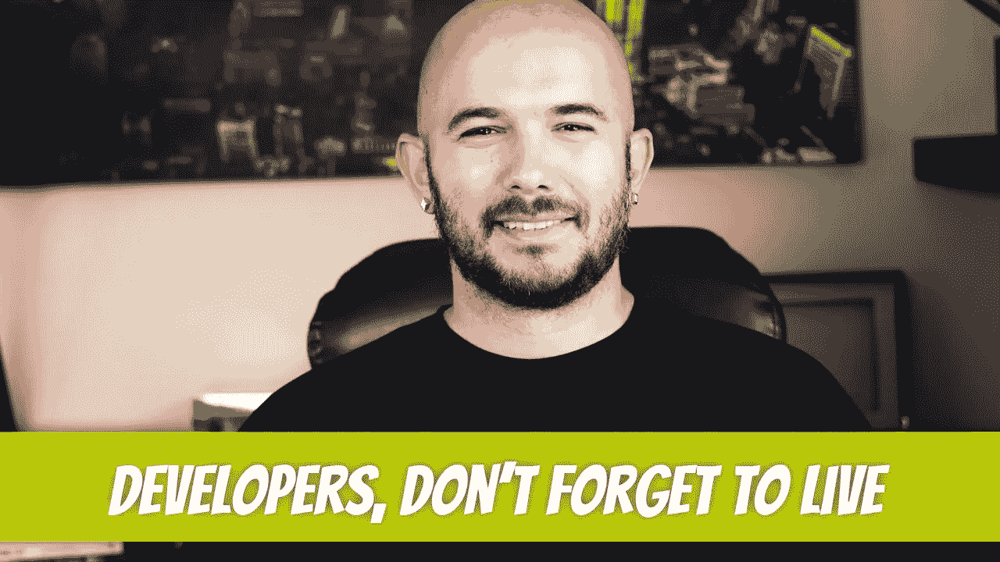

# 软件开发者，别忘了活着

> 原文：<https://medium.com/geekculture/software-developers-dont-forget-to-live-329afd6e45b?source=collection_archive---------8----------------------->

当你 35 岁的时候，你不想再从事专业的代码编写工作，这不是谎言。当我 20 出头的时候，我认为我会永远写代码。没有什么比每天花 8-12 个小时写代码或学习开发更有吸引力的了。那些是激动人心的时刻；我相信你正在经历同样的事情，或者你已经经历过了。如果你做的时间足够长，你…