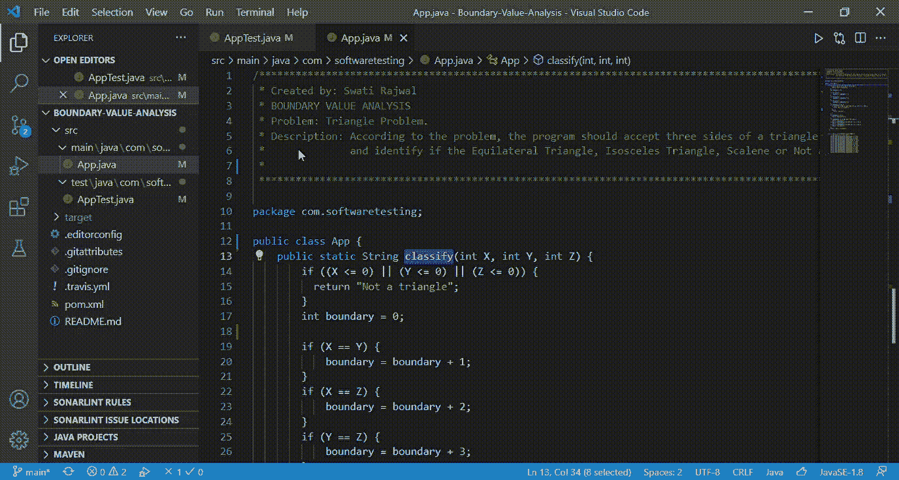
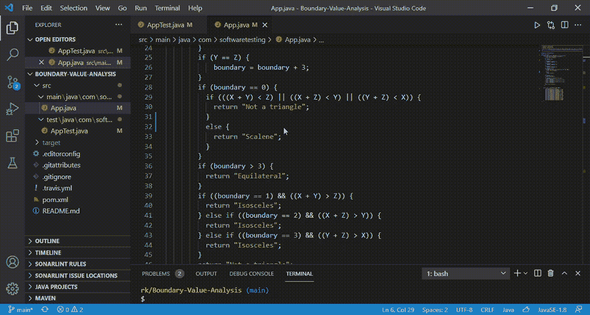

# 软件测试:使用边界值检查的边界值分析

> 原文：<https://medium.com/geekculture/software-testing-boundary-value-analysis-using-boundary-value-checking-58febd474188?source=collection_archive---------16----------------------->

边界值分析(BVA)是一种用于黑盒测试(也称为动态测试)的技术。作为一个软件测试人员，你总是希望最大化发现错误的概率。用边界输入值设计的测试用例有很高的机会发现错误。这就是为什么 BVA 是测试软件的好选择。

## 问题陈述

让我们考虑一下三角形问题。据此，软件程序应该接受三角形的三条边。然后，程序识别三角形是等边三角形、等腰三角形、不等边三角形还是非三角形。我们可以假设这三条边是 X、Y 和 z。每条边可以有一个在[1，10]范围内的值。

## 边界值分析(BVA)

它是一种覆盖测试用例中给定输入的边界值以发现潜在错误的技术。在我们的例子中，边界检查可以分别在 1 和 10 处进行。随着我们的深入，这一点将会很清楚。使用 BVA 方法有许多方法来设计测试用例:

1.  边界值检查(BVC)
2.  鲁棒性测试方法
3.  最坏情况测试方法

为了简单起见，我们将考虑使用边界值检查(BVC)的 BVA。对于其他两种方法，我们将创建单独的教程。

## 情况

因为三个输入值可以在[1，10]的范围内，所以下列条件是可能的。

## 生成测试用例

根据 BVA-BVC，对于“n”个输入值的测试用例的总数是(4n+1)。因此，对于我们的例子，测试用例的数量将是(4*3 + 1)，即 13。

作为 BVC 的第一步，您应该为给定的输入值范围定义最大值和最小值。

Figure 1: Maximum and Minimum values as per the range [1,10] for all the three input sides

然后，您可以编写如下 13 个测试用例:

Figure 2: Test Cases for Triangle Problem using BVA-BVC approach

仔细观察，您会发现两个输入变量固定在一个标称值上，而另一个输入变量是变化的。到目前为止干得不错！你已经成功地按照 BVA-BVC 法案编写了测试用例。

现在让我们做一些更实际的事情。我们将首先用 java 编写问题语句，然后开发测试用例。如果你是 java 单元测试的新手，请参考这篇文章。本文将帮助您设置环境，以更简单的方式支持测试和调试 java 程序。

## 用 Java 编写测试用例

整个项目可以在[这个](https://github.com/semicolon123/Software-Testing/tree/main/Boundary-Value-Analysis) Github 资源库中找到。这里，我们将只讨论与当前讨论主题一致的关键代码片段。

如果你打开资源库中的 App.java 文件，你会发现一个非常简单的 java 代码，可以根据输入边来识别三角形的类型。在您的系统上运行代码，以确保它正常工作。

现在你必须开发 13 个测试用例，这 13 个测试用例我们在本教程前面已经确定了。所有的测试用例都可以在 AppTest.java 文件中找到。

让我们来看一个测试用例，即**testos celes 1**。它映射到上表中的测试用例 ID 1。代码应该如下所示:

```
.../
String type=null;@Test     //Test case ID 1public void **testIsosceles1**() {
type = App.**classify**(1, 5, 5);
**assertEquals**("Isosceles", type);}
/......
```

上面的代码将首先调用带有三个输入的“classify”方法。该函数将返回三角形的类型，并将值存储在变量“type”中。然后使用“assertEquals”方法，测试用例将比较预期输出和实际输出。

让我们看看如果预期输出与实际输出不匹配会发生什么。在下面的代码中，我给出了(5，5，5)作为输入，这会导致这个测试用例失败。这是因为对于(5，5，5)，实际输出将是“等边的”，这不是预期的结果(因为测试用例预期输出是“等腰的”)。最终，测试用例失败了，作为一名软件测试人员，您刚刚发现了您的第一个 bug！



Gif 1: Running a Test Case in Java

类似地，您应该能够编写剩余的 12 个测试用例。每次在 java 中添加新的测试用例时，都要注意添加@test 注释。在添加了所有必要的案例之后，程序通过了所有的测试案例。



Gif 2: Running the 13 Test Cases in Java for Triangle problem using BVA-BCA approach

## 结论

在这篇博客中，我们已经讨论了一个非常流行和基本的软件测试概念，即使用边界值检查的边界值分析。还要注意，您可以修改程序，从用户那里获取输入边(X，Y，Z ),然后测试输入是否满足条件。

我希望这篇文章对你有帮助。直到下一次！

## 参考

[1] Naresh Chauhan (2010) *软件测试原理与实践*，牛津大学出版社。