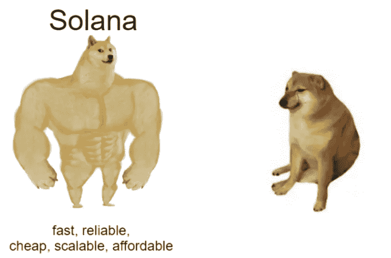
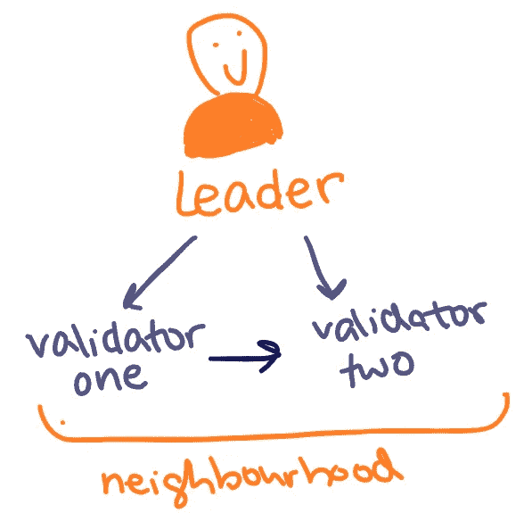
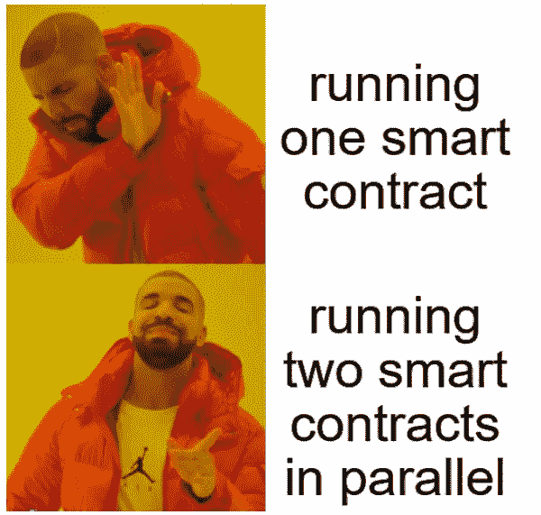
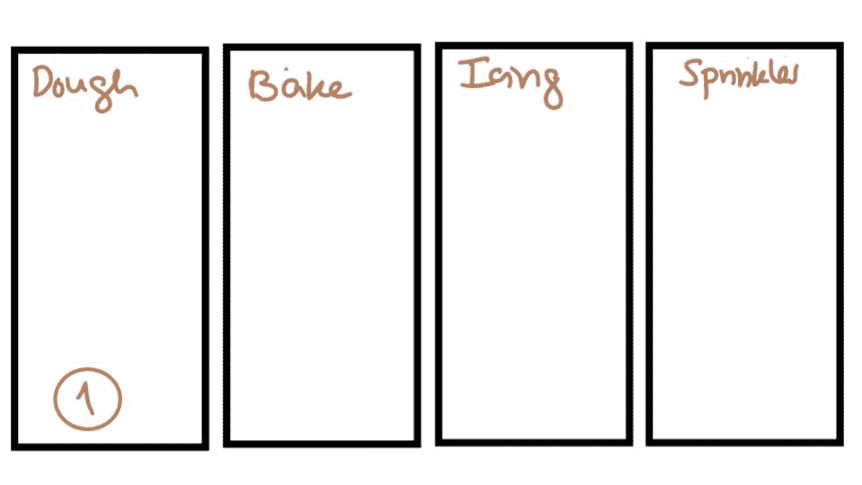
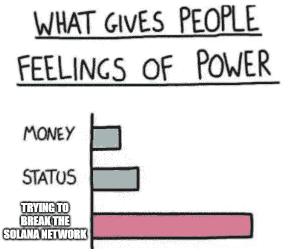

# 索拉纳解释说(用模因)

> 原文：<https://medium.com/geekculture/solana-explained-with-memes-824ef4059619?source=collection_archive---------8----------------------->

分散金融和“Web 3 ”(用户拥有自己的数据)的概念非常令人兴奋，但是是什么让区块链成为合适的基础呢？

Anatoly Yakavenko 是创新背后的人，这些创新使 Solana 与几乎所有其他区块链人不同。我不会告诉你这篇论文的技术细节，但是如果你感兴趣的话，你可以在这里阅读(它比以太坊和比特币白皮书要复杂得多)。

> 🚀*在深入 Solana 之前，本文假设对区块链和共识机制有一个基本的了解。如果你需要复习一下* [*这篇*](/@anyasingh/vending-machines-glass-boxes-and-google-documents-2dd16d098fe1) *文章。*

让我们想象一下完美的区块链:

从根本上说，理想的区块链应该是

*   快的
*   安全的
*   可攀登的
*   负担得起的
*   抵制审查

在区块链环境的当前气候下，很难找到一个符合所有标准的。Solana 声称自己是理想的区块链，拥有便宜的汽油费、高可扩展性和高速度，同时保持良好的安全性。

Solana 在峰值时每秒处理 65，000 个事务，阻塞时间为 400 毫秒——接近每秒 3 个阻塞！Solana 上的交易非常便宜，平均交易成本仅为 0.00025 美元(相比之下，以太坊网络上的平均交易成本约为 51.24 美元🤯).

就像以太坊一样，支持智能合约。开发者可以将他们的应用程序部署到 Solana，并利用它的特性。这也解决了区块链的三难困境:去中心化😅)、可伸缩性和安全性。

索拉纳给区块链世界带来了几项关键的创新。要了解 Solana，我们需要了解这 8 项关键创新及其工作原理:

1.  历史的证明
2.  BFT 塔
3.  涡轮
4.  湾流
5.  归档程序
6.  海平面
7.  管道铺设
8.  云破

# 历史的证明

分布式系统中最困难的问题之一是时间一致性。

分散式网络用集中计时解决方案解决了这个问题(Google 的 Spanner 使用同步原子钟将网络时钟同步到高精度并保持)。

问题出现在像区块链这样的系统中，因为网络中的节点不能信任外部时间源。区块链需要解决这个问题，因为没有时间来源，很难准确达成共识并更新每个人的账本。

但是，如果有一种方法可以信任编码在消息中的时间戳呢？这可以使分散式网络速度更快，因为时间上的一致不需要成为等式的一部分。

PoH 是一个可验证的延迟函数，它使用哈希算法 SHA-256 从输入中产生一个唯一的输出(这是因为没有人可以反转该算法来从输出中找到输入)。**可验证的延迟**让索拉纳区块链上的快速验证成为可能。

这样做的基础是:

*   在 Solana 上运行实际的函数需要时间
*   运行函数是产生输出的唯一方法
*   有了函数的已知输入和输出，检查输出的唯一方法是用输入再次执行函数(您已经有了)

这保证了当输出对输入有效时，产生该输出已经过了一段时间。这就是✨ ***魔术*** ✨背后索拉纳的历史证明！

其他数据在每个块上都是可见的，比如它包含的事务数量。当一个节点说它已经创建了一个新块来添加到分类帐时，它可以被其他节点验证。以下是一些你会经常看到被引用的术语:

**领导节点:**这是生成块的节点

**验证器:**验证器节点是每当块中有事务时执行验证并运行可验证延迟功能的节点。它将这些输出与领导者节点的输出进行比较。

## **TLDR；你是时间旅行者！**

你正在 300 年后的未来旅行。当你告诉人们你来自过去，他们会嘲笑你。你显然很生气，因为你说的是实话。但是你会有一个想法。你给他们看你钱包里 2000 年铸造的一美元钞票。分析之后，他们意识到你说的是实话，现在你们又是朋友了！

*   时间旅行者(你)是产生新块的领导节点
*   你说你来自过去相当于新生成的块
*   美钞就像是分类账中的参考散列
*   分析票据与验证器节点验证块是一样的

# BFT(拜占庭容错)

每个区块链都需要有一个容错系统。塔式 BFT(塔式拜占庭容错)确保即使 1/3 的节点停止工作，区块链仍将保持正常运行。

由于分类帐本身是一个可靠的网络时钟，我们可以在分类帐中对 PBFT 超时进行编码。

1.  投票从一定数量的哈希超时开始。验证器保证一旦投票给 PoH 散列，验证器就不会投票给任何不是该投票的子散列的 PoH 散列，至少不会投票给那个数目的散列。
2.  所有前任投票的超时加倍

一旦验证者投票支持计划“A ”,他承诺至少在两轮内不会投票支持任何不是从计划“A”派生出来的计划。每当将军们对 A 计划的衍生计划进行投票时，A 计划的权重就会增加一倍，这意味着它变得更加难以逆转。

验证者(在军队、将军的情况下)发送的每张选票都携带一系列可验证的信息，这些信息在每次投票时都会发生变化，这意味着如果信使发送的选票中缺少任何信息或序列完全错误，该选票就会被丢弃。

# 涡轮

增加网络中的节点数量是增加网络可扩展性的唯一方法。这意味着节点之间需要更多时间来移动数据。

让我们来看一个例子！假设一个领导者试图与 30，000 个验证者共享大约 32 MB 的数据(给予或接受 120，000 个事务)。领导者需要将数据发送到所有其他节点，这意味着领导者需要在每个验证器之间建立连接，以单独发送数据，对吗？

对吗？！？！

嗯，从理论上讲，是的，但这是没有效率的。想象一下，必须从互联网上的每一个来源证实来自研究论文的信息——这听起来很累*和*效率很低。

索拉纳提出了 Turbine，一种在网络中快速传输数据块的协议。使用 Turbine，领导者将块分成包，并将包移动到不同的验证器。这使得验证要添加到区块链的块更加容易！

每个验证器节点在一组验证器(称为邻域)内移动数据包。这个网络就像一棵邻居树，它允许索拉纳区块链在不损失太多效率的情况下增长到远远超过 1000 个验证器。

# 湾流:管理内存池

mempool 基本上是所有尚未处理的事务。湾流是索拉纳管理其内存池的方式。您可以将内存池想象成等待区块链的队伍。

Ethereum 的内存池大小(截至本文撰写时)为 195，000，这表明了等待矿工处理的事务数量(以字节为单位)。内存池的大小取决于块空间的供给和需求。需求增长得越多，网络上的事务就越多，在供应不变的情况下(挖掘器或验证器(在 Solana 的情况下))，内存池的大小也在增长(这意味着内存池的大小，或者在我们的情况下，行的大小可以变化……很多)

随着内存池大小的增加，处理一个事务所需的时间(平均)也增加了，这使得用户抱怨区块链的速度:“这个区块链太慢了！”

那么湾流是做什么的？

在索拉纳区块链中，每个验证者都知道即将到来的领导者的顺序。然后，Solana 的区块链不是让交易“排队”等待可用的验证器，而是将交易转发给即将到来的领导者，这允许他们提前执行交易，减少确认时间，并减少来自未确认交易池的验证器的内存压力。如果你感兴趣的话，可以去 https://solanabeach.io/了解更多😉。

钱包对引用特定块散列的交易进行签名。客户端(如钱包)选择一个最近的块散列，该散列已经被网络完全确认(你应该已经知道一个块如何在网络中被确认和最终确定——如果你没有再次阅读最后几个部分),它需要大约 800 ms 来提议一个块。提议的区块要么失败，要么在 32 个后续区块后得到确认。

一旦网络移过回滚点(并且引用的块散列已经过期)，现在就可以保证客户端的事务现在是无效的，并且永远不会在链上执行。

利用湾流给索拉纳带来两大优势:

1.  当内存池处于负载状态时，验证器能够提前处理事务，并丢弃失败的事务。
2.  领导者可以基于转发事务的验证者在网络树中的位置来区分执行事务的优先级。

# 海平面

普通以太坊虚拟机(EVM)有单线程处理的限制。他们基本上只能在给定时刻运行 1 个智能合约。Solana 拥有 Sealevel，可以让智能合约并行执行。

但是…..怎么会？

每个智能契约都可以读或写(或者两者都可以！)数据通过交易。Solana 智能合约描述了在运行时要读/写哪些数据。Solana 允许智能契约之间的并行处理，这些智能契约不会操纵(写入)相同的状态，从而避免了写入并发。

运行只读事务的智能合约也是并行运行的。索拉纳交易是由指令组成的。每个指令都有它调用的程序 ID、实际的程序指令，当然还有事务需要写入或读取的帐户。这使得 Sealevel 能够按照从账户中读取相同数据的交易或可以处理而没有太多重叠的交易进行分组和排序。

# 管道铺设

假设我们要运送节日饼干。

要完成这个过程，我们需要先做好曲奇，把曲奇放进烤箱，给曲奇上霜，然后依次加入糖粉(因为谁不爱吃糖粉)。烘烤必须在结霜前进行，洒水必须在结霜后进行。但是，所有这些单独的任务都是由单独的组件处理的。

为了最大化效率，您可能会创建一个阶段管道，以便您可以同时对它们进行处理(通过让它们对不同的 cookies 同时发生)。拥有无限数量的饼干(yum😋)流水线将始终以流水线中最慢阶段的速率完成加载。下面的动画很好地解释了这一点。

**TLDR；**流水线是一个需要通过多个步骤处理输入数据流的过程，每个步骤都有不同的硬件。

# 云破

许多区块链使用分片来扩展网络。这意味着区块链的数据库不断分裂，因此大量的交易分散在这些较小的链上(称为碎片)。

Cloud Break 是一种数据结构，可以同时读写数据库*。*

Solana 使用内存映射文件来处理同时发生的读取。

# 归档程序

正如您可能预测的那样，随着区块链使用量的增加，大量的数据将会不断产生。这意味着节点需要存储的分类帐越来越大。

如果网络中的每个节点都需要存储这么多数据，那么有限的一组能够负担得起并管理这种存储的参与者可以加入网络，这将使网络集中化。

索拉纳有一种叫做归档器的东西。

为了避免这种情况，并以分散的方式进行，Solana 创建了 PoRep，它使用 PoH 技术来快速验证复制证据。

负责存储分类帐的节点是归档器。他们不参与共识，对硬件的要求低于验证者和领导者。复制器是这样工作的:

归档程序向网络发出信号，表示它们有一定数量的字节空间可用于存储数据。通常，网络会将分类帐历史记录分成多个块，以便以一定的复制速率向归档程序发送分类帐历史记录。然后，归档程序从网络下载数据。

有时，网络会要求归档程序证明他们正在完成存储数据的工作，此时，归档程序应该完成 PoRep。为了奖励存档者，他们将得到 3%的通货膨胀率。

这 8 项创新让 Solana 不同于非常流行的以太坊网络！

总的来说，索拉纳是一个非常多才多艺的区块链，挑战以太坊区块链所能做到的极限。已经有数百个流行的 dApps 建立在 Solana 平台上，如 Serum、Metaplex、Chainlink、GenesysGo 和 Helium。实际上[有一个很酷的网站](https://break.solana.com/)，在那里你可以尝试打破索拉纳(如果你不能做到，你可能只能满足于打破以太坊的容量😅).

# 了解更多(+制作自己的模因)！

我制作了一个关于 Solana 如何工作的视频(从实际编写和部署智能合同的角度)，您可以在下面查看。

看看我在 Solana 上做的一个众筹平台:[https://solana-crowd-funding.vercel.app/](https://solana-crowd-funding.vercel.app/)

作为对你阅读完的感谢，[这里](https://epicenter.tv/guests/anatoly-yakovenko/)是 2 个非常有趣的播客片段，其中 Anatoly Yakavenko 讨论了 Solana 的潜力和他对 web3 未来的看法。

> *如果你对本文/我的理解有任何问题或发现错误，请联系我——我将不胜感激。自己制作索拉纳迷因* [***这里***](https://imgflip.com/memegenerator) *(本文所有迷因均在 imgflip 上制作)——随意给我发一些。*
> 
> *不然可以在*[*Twitter*](https://twitter.com/_anyasingh)*上抓我或者在*[*LinkedIn*](https://www.linkedin.com/in/anya-singh/)*上联系我；)*