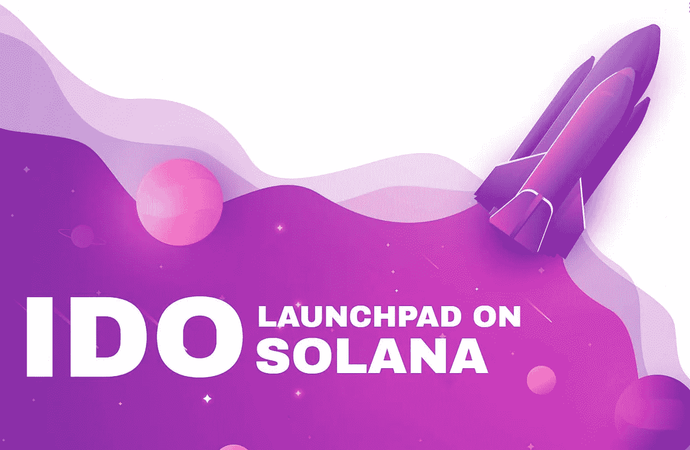

# Solana IDO Launchpad-密码领域的新革命

> 原文：<https://medium.com/geekculture/solana-ido-launchpad-the-new-revolution-in-the-crypto-space-b3bcb3e1a91?source=collection_archive---------11----------------------->

近年来，加密货币的发展非常巨大。它为取得巨大成功的各种开发平台铺平了道路。这项技术最初是一个小的技术概念，现在，它是数字金融的支柱，更准确地说，是分散式金融系统。过去，金融部门是在银行、金融机构和政府组织等第三方的帮助下运作的。这些第三方造成了大量的问题，如交易延迟、交易速度慢、扣除高交易成本，以及在银行进行任何查询都要花费大量时间。这些使得人们对第三方产生了不信任感，并寻求替代解决方案。

然后去中心化和加密货币的概念出现了。以前，加密货币的交易并没有得到足够的重视。但是，现在它完全改变了，加密货币的概念非常正常，许多商业部门都在使用它。该协议导致数字世界中大量令牌项目的启动。因此，为了支持这些业务，IDO launchpad 平台应运而生，并一直受益匪浅。因此，它现在正在各种各样的区块链网络上创建，其中最突出的是 Solana 上的 IDO launchpad。

# 什么是 Solana IDO Launchpad？

一个 [**索拉纳 IDO launchpad**](https://www.blockchainappfactory.com/ido-launchpad-on-solana?utm_source=Medium+Geek+Culture&utm_medium=7%2F4%2F22&utm_campaign=senpagapandian) 是在索拉纳区块链上开发的上市平台。IDO launchpad 帮助企业主在平台上为投资者列出他们的加密硬币或令牌。因此，它成为了一个众筹平台。投资者的优势在于，他们可以在实际销售之前购买这些上市的硬币和代币。从而允许投资者以较低的市场价格购买高市场价值的股票。

投资者将通过阅读他们的白皮书和分析项目的词汇学来检查商业项目。通过这种方式，投资者将对项目有一个概念，如果它满足他们的要求，他们将开始投资过程，并将获得 IDO 令牌或硬币的奖励。

IDO launchpad 可以在各种区块链网络上开发。索拉纳区块链是数字空间中最快的网络之一。这个区块链网络拥有高速处理能力和出色的可扩展性。因此，对于鼓励大量投资者和进入者的启动平台来说，这是一个完美的区块链。

**为什么在 Solana 上开发 IDO Launchpad 是个好主意？**

加密领域发射台的兴起使得每个人都更容易启动他们的新项目。过去，这相当困难，但现在一切都变了，所有的功劳都归于 IDO launchpad。这已经成为一种顶级的商业模式。和土地，以高度分散的方式为他们的项目筹集资金。因此，在索拉纳 T3 上采用 [**IDO Launchpad 开发作为商业模式对于商业平台和密码社区来说是完美的。**](https://www.blockchainappfactory.com/ido-launchpad-on-solana?utm_source=Medium+Geek+Culture&utm_medium=7%2F4%2F22&utm_campaign=senpagapandian)

**在索拉纳建造 IDO 发射台的好处**

*   索拉纳伊多发射台的交易费用相对来说很少。这是因为索拉纳区块链收费相当低。
*   Solana networks 上的 IDO launchpad 为平台提供了无缝的可扩展性。从而轻松快速地实现额外的新交易和用户。
*   Solana IDO launchpad 可以在没有任何延迟的情况下高速处理转换。这是因为索拉纳区块链能以最高速度处理 5000 TPS。
*   由于 IDO launchpad 是在索拉纳区块链上创建的，因此产生了巨大的用户潮。因此，确保 IDO launchpad 拥有更大的用户群。
*   Solana 网络上的 IDO launchpad 可在需要时提供多个区块链网络之间的互操作性。
*   Solana IDO launchpad 的主要好处是其内置属性使投资者能够获得长期回报。

**索拉纳 IDO 发射台的特点**

*   索拉纳区块链上的 IDO launchpad 遵循严格的了解您的客户(KYC)政策。因此，只有经过验证的投资者才被允许。
*   Solana IDO launchpad 在自动做市商(AMM)的帮助下执行自动流动性。因此，流动性保持流动。
*   Solana IDO launchpad 支持加密钱包的集成，也支持在 launchpad 内利用现有的加密钱包。
*   Solana network 上的 IDO launchpad 支持基于项目列表及其在 launchpad 上标记的令牌数量对令牌进行多级标记。
*   在商业项目开始销售后，投资者可以要求 IDO 代币之前，此启动台中列出的 IDO 代币将立即进行分类。
*   Solana IDO launchpad 内置了许多过滤器，允许用户根据自己的喜好进行搜索。这些过滤器包括，即将到来的，趋势，昂贵的，便宜的项目列表。

**Solana IDO Launchpad 作为白色标签解决方案**

索拉纳·区块链是数字空间中正在崛起的网络。它正在成为区块链以太坊的一个很好的竞争对手，目前已经成为第三好的区块链网络。多种多样的 IDO 发射台正在索拉纳区块链号上开发并运行良好。白色标签解决方案非常适合那些在没有任何广泛的先验知识的情况下进入数字空间的商业平台。白色标签解决方案允许企业主在数字市场上立即启动他们的 Solana IDO launchpad，该 launchpad 将充满特殊功能。这样，业务项目可以节省时间和金钱，并在索拉纳区块链获得一个顶级的 IDO launchpad。

**总结，**

索拉纳 T5 上的[T3【I do launch pad】是商务平台的完美选择。目前和未来，将会有大量的区块链网络进入和退出市场。目前，正是索拉纳·区块链的时代。每一个建立在这个区块链上的平台都在经历着巨大的受益特性。因此，有了 Solana IDO launchpad，需要解锁的好处是巨大的。因此，证明是一个完美的商业平台。](https://www.blockchainappfactory.com/ido-launchpad-on-solana?utm_source=Medium+Geek+Culture&utm_medium=7%2F4%2F22&utm_campaign=senpagapandian)