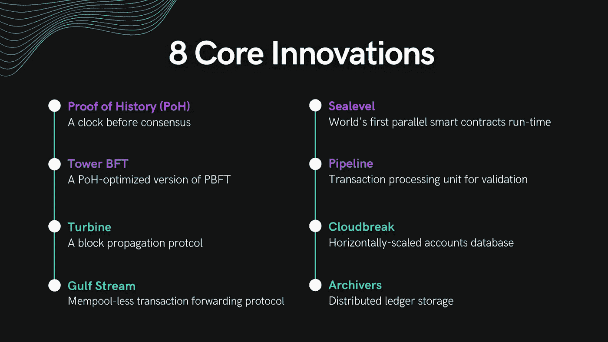
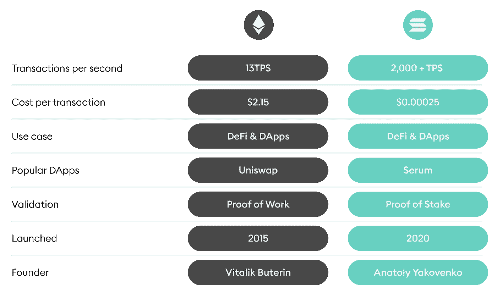

# 索拉纳 NFT 市场发展:什么使索拉纳成为 NFT 市场的最佳选择？

> 原文：<https://medium.com/geekculture/solana-nft-marketplace-development-1e7d3c98c244?source=collection_archive---------7----------------------->

不可替代的令牌(FTs)迅速成为加密市场的先锋，为全球带来用户。NFT 市场是唯一一个你可以创建、购买和出售 NFT 的网站，它的受欢迎程度与日俱增。NFT 市场的交易额超过了 3.56 亿英镑。许多著名的公司，币安和瓦齐克斯，已经通过提供他们自己的 NFT 市场进入了 NFT 行业。

最好的想法现在被认为是索拉纳 NFT 市场。它由许多生态系统支持，包括币安智能链、以太坊和波尔卡多特。即使几个区块链支持 NFT 市场的建设，这种理解给你理由建立自己的索拉纳。这个博客将深入到索拉纳 NFT 市场，并了解它是如何为您的加密业务的最佳选择。继续读。

# **什么是索拉纳 NFT 市场开发？**

> Solana 是一个去中心化的区块链网络，能够为全球创建用户友好的应用程序和网站。它速度极快，价格低廉，并且不受审查的影响。然而，网络将允许开放的应用程序自由运行，并且事务永远不会中断。

这个 NFT 市场平台在索拉纳区块链网络上运行，其独特的共识算法，允许以较低的天然气价格进行超快速交易。基于 Solana 网络的新市场，如 Digital Eyes 和 SolSea，已经推出，以跟上 NFT 薄荷糖数量的快速增长。

以太坊区块链以太网的速度已经降低，而交易成本却增加了。这为独特的 [**索拉纳为基础的 NFT 市场发展**](https://www.appdupe.com/nft-marketplace-development) 的繁荣铺平了道路。目前，位于以太坊的 NFT 市场是希望展示其技能和数字艺术珍品的数字制作人的首选。

## **是什么让 Solana 成为 NFT 市场发展的最佳选择？**

> 索拉纳的钥匙卡效率高，交易费用低。在索拉纳鼎盛时期的 8 月，索拉纳的本币索尔上涨了 200%。，将 SOL 推入 CoinMarketCap 的[十大加密货币。](https://coinmarketcap.com/historical/20220529/)

结果，索拉纳同时抓住了大量的交易者和投资者。巧妙的算法设计有利于索拉纳作为一个长期的任务，使其成为最适合启动 NFT 市场的区块链。

## **索拉纳 NFT 开发流程的基本步骤**

*   步骤 1:为 NFT 市场创建一个优秀的用户界面。
*   步骤 2:编写必要的 NFT 市场函数。
*   第三步:为关键功能开发智能合约。
*   步骤 4:用所有相关的测试用例执行智能契约审计。
*   步骤 5:将智能合约与前端和后端集成
*   步骤 6:上传到测试网进行客户端测试。
*   步骤 7:发布公共测试版或部署 Mainnet

# **索拉纳成功成长的原因**

## **索拉纳 NFTs 与退化猿**

退化猿类是 Solona 最初推出的主要 NFTs，为大多数穿戴整齐的猿类提供了从眼镜到三明治以及不同稀有程度的多样性。在不到 10 分钟的时间里，一万只猩猩被抢购一空，交易量超过 60 万索尔。这些销售需要 SOL 货币，占价格上涨的很大一部分。

## **涵盖多种多样的项目**

分散融资是金融交易的一般概念，它消除了中间人(通常是银行)。许多项目，包括许多分散金融(Defi)应用程序，都是使用 Solana 的网络创建的。

## **索拉纳比以太坊更卓越**

虽然以太坊是第一个可编程的区块链，但它衍生出了大量其他货币和代币。索拉纳是几个争夺头把交椅的可编程区块链之一。如果索拉纳保持良好的表现，它有很大的机会进入高层。

## **快速交易**

目前，索拉纳被认为是发展最快的区块链网络。它需要一个速度为 50，000 万亿次/秒的进程。

# **索拉纳 NFT 市场发展特点**

您可能已经对索拉纳的 NFT 市场开发有所了解，为了更详细的了解，让我们来看看索拉纳市场开发的特点。

*   索拉纳 NFT 市场的交易只需一秒钟。使其成为区块链最大的网络和最快的网络之一。
*   因为最小的拥塞，在这个区块链网络中的交易成本也是低的。
*   基于 Solona 的 NFT 市场是一个值得信赖的网络，因为它在一个分散的环境中运行，没有中央政府的干预。
*   它非常灵活，许多开发方法和软件都可以在这个平台上实现。
*   当以链上收藏和数字资产、收藏品等中的 NFT 的名义存储时，更容易制造 NFT。

# **NFT 蓝色港湾的优势**

让我们来看看索拉纳 NFT 市场可以为贵公司提供的一些优势。在此之前，这里有一个以太坊和索拉纳的比较，

## **TPS —每秒交易量**

索拉纳区块链每秒能处理大约 2500 笔交易。这突出了其令人难以置信的速度，使交易能够在任何 NFT 市场上迅速进行。另一方面，TPS 是一个不断变化的易变指标。

## **每笔交易的成本**

由于其高吞吐量和 0.00025 美元的低交易费，Solana 是开发不同规模的非功能性交易和 NFT 市场的合适平台。

## **没有内存池问题**

索拉纳没有内存池问题。术语“内存池”是指已处理的事务等待被接受的空间。这一功能使索拉纳 NFT 市场的即时交易成为可能。

## **不断发展的环境**

Solana 生态系统正在扩展，允许管理许多 dApps、智能合约和货币，而不会导致网络拥塞。

## **编程简单**

索拉纳的区块链采用了 Rust 软件程序，使得构建和开发各种应用程序变得容易。

# **包装**

总之，考虑到 NFTs 迅速扩大的知名度和非凡的价值， [**索拉纳 NFT 市场开发**](https://www.appdupe.com/nft-marketplace-development) 已经成为一个有吸引力的投资前景。结果，愿意开发 NFT 市场的交易者比以往任何时候都多。那些了解 NFT 潜力的人希望从中受益。

哪一个区块链将建立你的 NFT 市场？仅有一个 NFT 市场是不够的；你还必须有吸引卖家和用户的素质。如果您想开发一个功能丰富、具有出色可伸缩性的 NFT 市场，Solana 是您的最佳选择。