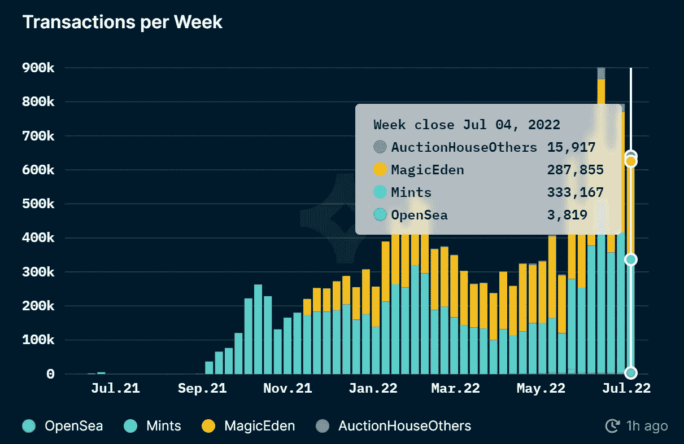

# 索拉纳 NFTs 正在超越以太坊 NFTs 卷:了解如何在索拉纳创建一个 NFT 市场

> 原文：<https://medium.com/geekculture/solana-nfts-are-surpassing-ethereum-nfts-volume-get-to-know-how-to-create-an-nft-marketplace-on-a2d7028db72d?source=collection_archive---------15----------------------->

来自其他区块链的一部分，有两个最突出的——索拉纳和以太坊。我可以勾勒出在索拉纳创造一个充满活力的 NFT 市场的美好图景。有耐心从这篇文章中抓住迷人的想法和提示。你现在可以提前搜索索拉纳 NFT 市场开发公司，了解他们的特点。只有密码迷才能想出如此优雅的点子，比如在索拉纳引入 NFT 市场。

出色地设计了策略，现在开发人员很容易测试索拉纳的最大潜力。据一份报告估计，与以太坊相比， [**的索拉纳**](https://coinquora.com/volume-of-solana-based-nfts-surpasses-ethereums-numbers/) 的 NFT 体积大约大 136%。因此，索拉纳是潮流的引领者，否定了以太坊的利弊。它只是通过产生非常复杂的特性来阐明 NFT 平台的开发。

如果你想知道索拉纳·区块链技术转变的“为什么”原因，那么继续前进。读完这篇文章后，你可以很容易地承认索拉纳 NFT 市场的高性能。你还可以了解如何在 Solana 上创建一个 NFT 市场。

# NFT 市场——虚拟但现实的交易平台

当我们通过不可替代的令牌资产在加密竞赛中前进时，这听起来确实不错。因为他们与众不同，与众不同，并保留所有权。许多蓝筹股公司绝不会错过这个引领潮流的机会。然后想到为什么 cryptopreneurs 和 digipreneurs 靠这些高级代币类——NFT 获取暴利？

在各种数字资产中，人们肯定会选择最突出的 NFTs 来在最佳区块链上操作。成为这个行业的标杆是一个令人陶醉的点缀。

简单地说，NFT 市场是一个虚拟的舞台，上演着不朽的 NFT 收藏品。该平台充当交易的媒介，也允许用户和创作者之间的最佳沟通。它为加密用户提供了一个展示和参与的机会。此外，NFT 市场在机械上不能没有两个实体——智能合约和区块链。

当买卖双方达成一致时，智能合同是执行功能和实现任务的指南。这是一组根据区块链预先确定的技术代码。然后，跳过所有步骤首先选择区块链是重要的。

# 索拉纳，超越以太坊区块链拍摄高 NFT 卷

> 索拉纳是以太坊的一个范式转变，因为从统计数据来看，以太坊明显落后于索拉纳。Solana 平台的 NFT 销售额是每周 63 万英镑，但以太坊只有 50 万英镑。因此，索拉纳·NFT 的产量和销售量增加了 32%。

像 MagicEden 这样的 NFT 市场在雇佣 Solana 的情况下，在 NFT 的销售额更高，收入高达 120 万美元。而以太坊平台并没有超越索拉纳，它们在现金流方面落后。

以太坊有点衰落，它现在无法像以前那样创造 NFT 的销量。现在，索拉纳·区块链以其低廉的天然气费和能源消耗为这个星球带来了一个新的 NFT 市场。相对于以太坊，Solana 的令牌标准协议是用户友好的，处理方法也很简单。

# 索拉纳岛上 NFT 市场的刺激特征

看起来像没有特色的沼泽地！NFT 市场专注于其内部建筑设计，构成各种令人难以置信的功能。你会在下面看到这些东西:

## 店面

登陆页面是吸引眼球的网站，它倾向于将用户的注意力拉向平台。因此，开发人员会尽最大努力使其具有吸引力，并嵌入过滤器进行搜索。

## 加密钱包

钱包的开发将使你的市场成为一个值得信赖的市场。有无缝钱包，可以安全可靠地存储、出售或购买资金。例如，wallet 是一个应用程序，Sollet for Solana 将拥有用户帐户中的钱的文件位置。因此，用户在开始交易前的第一项工作就是连接他们的钱包。

## 搜索工具

搜索选项是强制性的，以使用户的工作更容易找到他们最喜欢的。搜索引擎将直接导航到渴望的 NFT 收藏品网站。你很容易确定你的观众喜欢看什么，下次你可以展示给他们看。

## 用户历史

建议记录和展示购买和销售非功能性交易的历史，包括投标。以便用户可以根据他们的排名跟踪最好的 NFT。尤其是当有热门交易和 NFT 有最高的评论和评级。

## 重要警报

这些通知确实有助于促使用户回来购买他们的 NFT 收藏。他们可以接近非功能性测试，可以在很大程度上提高购买非功能性测试的转化率。

## 帮助和支持服务

应该为用户提供全天候的支持服务。因为您的客户可能会面临错误或问题。因此，帮助他们承担责任并给予适当的关注将会提高更多用户的信任度并留住他们。

# 最后，索拉纳事前的可信度

每秒巨大的事务:只要适应 Solana 无止境的服务，您就可以在瞬间获得动态事务。在很短的时间内，高达 10，000 笔交易是可能的，而且汽油费用很低。

**划算**:每笔不超过 0.000125 美元，就可以轻松搞定这些交易。

**迅猛增长**:索拉纳 NFT 市场呈指数级增长。2020 年是 8540 万美元，2021 年是 500 亿美元。

## 结果

因此，总结我的想法，尽管以太坊是一个突出的，但索拉纳有驱动功能。你很快就能攀上这个星球上最顶尖的 [**索拉纳 NFT 市场发展公司**](https://www.appdupe.com/nft-marketplace-development) 。因为你可以在别人超过你之前督促自己。与密码行业的标准协议和顶级天才合作，检查你的目标。在 Solana 上创建 NFT 市场，向全球展示您的业务成果。