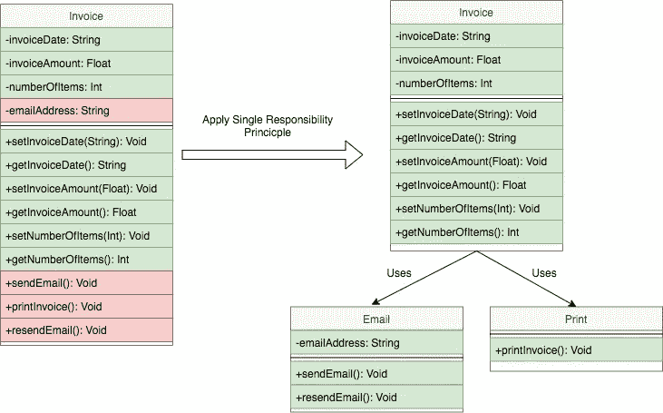
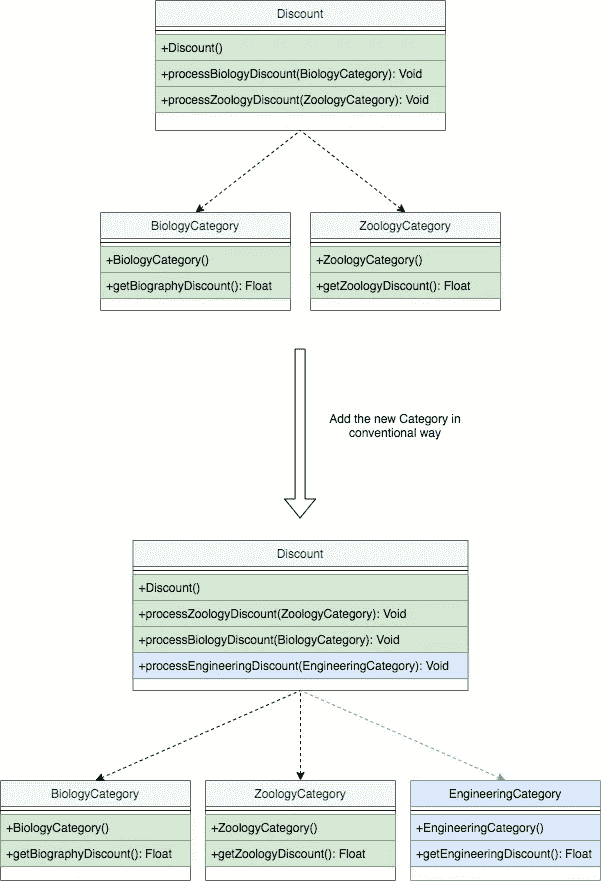
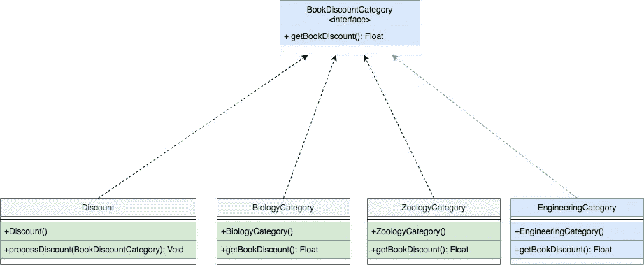
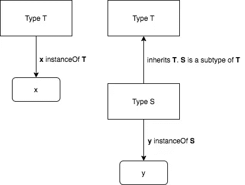
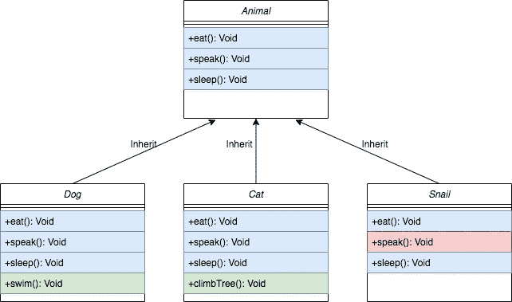
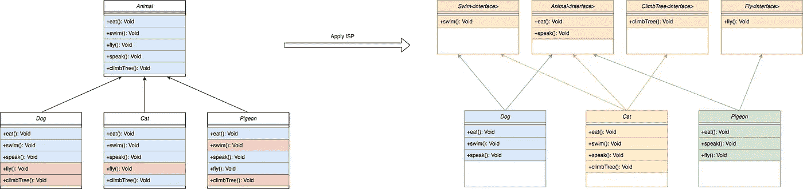
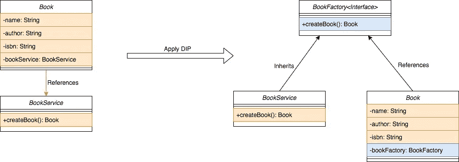

# 实体设计原则

> 原文：<https://medium.com/geekculture/solid-design-principles-ea0e24f60ca?source=collection_archive---------12----------------------->

SOLID 是一个首字母缩写词，用来代表由罗伯特·c·马丁(又名鲍勃叔叔)设计的 5 个设计原则，由软件工程师使用。固体， **S** 代表单一责任原则， **O** 代表开/闭原则， **L** 代表利斯科夫替代原则， **I** 代表接口分离原则， **I** 代表依赖倒置原则。

Photo by [Mohammad Rahmani](https://unsplash.com/@afgprogrammer) from [Unsplash](https://unsplash.com/)

# 单一责任原则

根据罗伯特·c·马丁的说法，“一个类应该有一个，而且只有一个改变的理由。”

这意味着，在面向对象中，类应该更有凝聚力。一个班应该专攻一件事/一个班应该只有一项工作。

Image show before & after applying SRP

# **开闭原理**

面向对象设计最重要的原则，
“软件实体(类、模块、函数等。)应该对扩展开放，但对修改关闭。”

这一原则的总体思想是编写能够在不改变现有代码的情况下添加新功能的代码。
例如，当需要添加某些东西时，现有的、测试良好的类将需要修改。但是，改变类会导致问题或严重的错误。我们只是想扩展它，而不是改变类。

这可以通过使用**继承**轻松实现。但是如果子类依赖于超类的实现细节，继承就会引入高耦合。所以这个原理可以定义为多态原理。

例如，一家书店针对不同的图书类别提供折扣，作为一项新功能，他们需要在折扣列表中添加一个新类别。假设书店在以下几类商品上打折:**生物**，**动物学**。在新特性中，他们需要添加**工程**类别。

让我们将我们的类定义如下，
* Class **Discount** 处理与折扣相关的事情。
* Class**biology category**和 **ZoologyCategory** 为现有类别。
* Class **工程类别**为新类别。

让我们在不考虑 OC 原则的情况下添加这个新类别

Make the enhancement without considering OC Principle

你可能注意到上面的例子有 OO 设计问题，为了遵循 OC 原则，上面的设计应该使用最佳实践来实现。*仅供参考:改变设计不是这一原则的一部分。*

After applying OC Principle

按照 OC 原则，我们应该只创建一个新的类，**实现**的**BookDiscountCategory****接口**。

# 利斯科夫替代原理

1987 年，Barbara Liskov 在她的会议主题“数据抽象”中介绍了 Liskov 替代原理。几年后，她与珍妮特·温(Jeanette Wing)发表了一篇论文，他们在文中将这一原则定义为:

“设*φ(x)*是关于类型 *T* 的对象 *x* 的一个可证性质。那么*φ(y)*对于类型 *S* 的对象 *y* 应该为真，其中 *S* 是 *T* 的子类型。

这有点令人困惑，让我用图表简化一下。

Liskov Substitution Principle Visual explanation

根据原理，一个超类的**对象应该可以被它的子类的对象替换，而不会破坏应用**。这要求你的子类的对象以和你的超类的对象相同的方式运行。

例子——查看下图，在那里，子类不能做超类能做的所有事情。在下面的场景中，蜗牛是动物的一个子类，但蜗牛不会说话，这违反了这个原则。

Demonstrating inheritance

为了解决上述问题，
1)我们可以创建一个包含 **speak** 的单独接口，并将其实现到必要的类中，比如 Dog 和 Cat。
2)或者说，有时候构成比遗传更好。"比 A 更好"

# 界面分离原理

"客户不应该被迫依赖他们不使用的接口."对于客户端，他指的是实现接口的类。简单地说，界面不应该包含太多的功能。违反接口分离原则会降低代码的可读性，并迫使程序员编写无用的方法。在一个设计良好的应用程序中，你应该避免接口污染(也就是胖接口)。解决方案是创建更小的接口，以便更灵活地实现。

例子—

Before and after ISP applying

# 从属倒置原则

依赖性反转原则的目标是避免紧密耦合的代码，因为它很容易破坏应用程序。

“高层模块不应该依赖低层模块。两者都应该依赖于抽象。”

“抽象不应该依赖于细节。细节应该依赖于抽象。”

大多数人希望高级类依赖于低级类(比如实用程序类)。但是，根据依赖倒置原则，我们需要倒置依赖。否则，当低级类被替换时，高级类也会受到影响。

作为解决方案，我们需要为低级类创建一个抽象层，这样高级类就可以依赖于抽象而不是具体的实现。

罗伯特·C·马丁提到**依存倒置原则**是**开/闭**和**利斯科夫替代原则**的具体组合。

例子—

Before and After applying DIP

就这些，希望以上能帮助你理解扎实的设计原则。如果你没有得到上述原则，我建议你读几遍，直到你熟悉它。