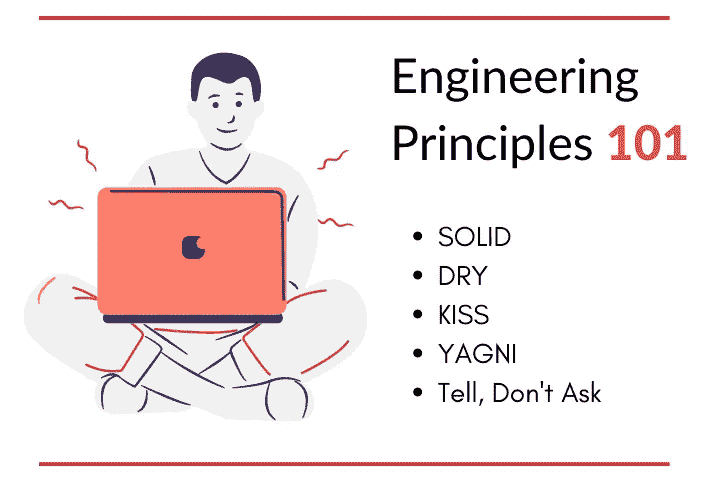

# 固体干吻 YAG ni——工程原理

> 原文：<https://medium.com/geekculture/solid-dry-kiss-yagni-engineering-principles-c1e73610db4c?source=collection_archive---------55----------------------->

迷茫？这和现实生活中的接吻毫无关系😂

“固体，干，吻。YAGNI”是我们今天将要讨论的一些软件工程原则。

# 我为什么要学这些？

这些原则是一套指导方针，可以帮助您编写更好、更健壮、更干净的代码。一旦你开始应用它们，你将开始看到产品开发整个过程的结果。下面是一些在你的代码中可以看到的优点-

*   稳健性
*   效率
*   交付高质量的软件
*   灵活，易于重构

> 编写代码很容易，但是编写好的高质量的代码很难

在这篇文章中，我将介绍我在过去一年的专业软件开发生涯中学到的一些东西。

# 原则

> 简单是可靠的前提。—埃德格·迪克斯特拉

# 吻

KISS 是**“保持简单愚蠢”**的首字母缩略词，这个原则字面意思是让你的代码尽可能简单。

你可能会想——“但是，我总是只保持简单！?"

嗯，很多工程师的情况并非如此。您从一些基本的东西开始，但是随着代码的增长，很快就会增加不必要的复杂性。

> 工程师喜欢把事情复杂化！

代码越简单，就越容易理解和维护。

一个非常基本的例子是，当一个简单的库排序可以满足您的需求时，添加一个复杂的排序函数！除非有需求，否则不要优化。

KISS 的另一个常见问题是在代码中使用新的框架或添加新的 npm 模块，这很容易避免。有一个 npm 包可以让[把绳子转换成骆驼箱](https://github.com/ianstormtaylor/to-camel-case)。想一想，你真的需要这个或者一个简单的函数就能解决你的任务吗？

一旦你添加了一个新的依赖项，你就基本上增加了整个代码的复杂性，这在将来会成为问题。

> 遵循这个原则的关键是学会把你的问题分成尽可能简单和小的步骤，然后编写最少的代码来实现它们。

# 干燥的

干代表**“不要重复自己”**

这个原则集中在应用可重用性和减少代码中的重复。这意味着您不应该在更改某个单一元素时要求更改逻辑上不相关的组件。

当您重用组件时，您基本上是在减少要编写的代码。代码越少，可维护性越好！

> 作为一名工程师，尽可能自动化和重用！

最常见的例子是函数！一个普遍的规则是，如果你编写相同的逻辑超过三次，是时候将逻辑重构为一个函数并重用它了！

数据库规范化是通过消除列来减少数据冗余的方法之一。这就是干的例子！

# YAGNI

YAGNI 是**“你不会需要它”**的缩写

这个原则表明，你不应该优化和增加未来的复杂性。

> 现在就做需要做的事情。不要过早优化！

还有，你不知道前方可能会出现什么新的病例！为什么要浪费额外的时间和精力在一些实际上并不需要的事情上呢！尽管如此，您应该以这样一种方式设计您的系统，即对于未来可预测的变化，只需要最小的改变。

它与避免任何额外复杂性的 KISS 原则保持一致。

一个简单的例子是，当一个简单的文件系统可以工作时，不要使用数据库！

# 固体

这个原理是首字母缩略词的缩写😛

*   RP —单一责任原则
*   **O** CP —开闭原理
*   **L** SP —利斯科夫替代原理
*   **I** SP —界面分离原理
*   **D** IP —依赖倒置原则

## 单一责任

维基百科上的定义非常清楚-

> *每个模块或类都应该对软件提供的功能的一个部分负责，而这个责任应该完全被类封装起来*

每个方法或类都应该绑定到一些功能上。它不应该做得更少或更多。它改变的原因应该只有一个！

示例— `Login`包应该处理用户登录代码，而不应该处理用户注册。

上面的代码违反了 SRP，因为如果我们的排序逻辑改变了，就有理由改变`showPosts()`。正确的方法是调用排序函数，然后将排序后的列表传递给这个方法。

现在，`showPosts`只在我们想要显示文章的附加信息时才会改变。(改变的单一原因)

## 开/关原则

一旦你写了一段代码，然后一些新的功能来了，现在你必须回到旧的代码，并再次改变它！开/闭原理正是针对这一点！

以某种方式编写代码，使您的类/方法-

> 对扩展开放，但对修改关闭

## 利斯科夫替代原理

LSP 提倡子类的对象应该和超类的对象行为一致。

上面的例子`Car`和`Bicycle`都扩展了`Vehicle`类。LSP 失败，因为自行车对象不能替换车辆，因为`startEngine()`将返回一个错误！

## 界面分离原理

> 不应该强迫客户端依赖他们不使用的接口。 *—罗伯特·马丁*

这意味着你应该保持你的接口尽可能的小。不要用不需要的方法污染你的接口。

在这种情况下，我们的接口被不适用于`Dog`类的 swim 和 fly 之类的方法污染了。我们可以通过将我们的接口分成多个接口来解决这个问题，比如`AnimalsWhoSwim`和`AnimalsWhoFly`。动物界面可以包含功能`eat()`

## 从属倒置原则

DIP 基本上建议高级模块不应该依赖于低级模块，而是两者都应该依赖于抽象。这意味着你应该尽可能使用接口而不是具体的实现。

这方面有一个[很好的例子](https://www.tutorialsteacher.com/ioc/dependency-inversion-principle)，如果你想更好地理解它，它会引导你。

# 告诉，不要问

告诉，不要问原则建议避免询问对象的状态，而是告诉他们根据决定做什么，即告诉对象做什么！

## 例子

这里，我们询问用户是否登录，然后询问配置文件。我们想要获取配置文件，我们只需要告诉对象显示我们的配置文件，登录检查应该在`showProfile()`内部实现。正确的方法应该是-

# 资源

试着遵循你在这里读到的原则，因为-

> 你不能不湿就游泳――武西·JCK·马塞科

在评论中展示你遵循的其他有用的原则👇

喜欢这篇文章吗？考虑支持我☕️

我希望你学到了新东西。请随时提出改进建议，✔️

我在 Twitter 上分享定期更新和资源。我们连线吧！

**继续探索🔎不断学习🚀**

*原载于*[*https://www.mohitkhare.com*](https://www.mohitkhare.com/blog/solid-dry-kiss-yagni/)*。*