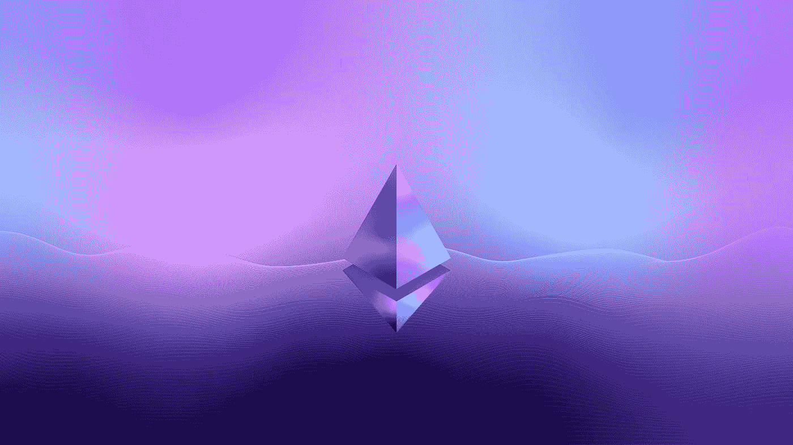

# 稳健 101:让我们来认识一下数据类型

> 原文：<https://medium.com/geekculture/solidity-101-lets-meet-the-data-types-fa49bfc4307a?source=collection_archive---------15----------------------->

Photo by [Nenad Novaković](https://unsplash.com/@dvlden?utm_source=medium&utm_medium=referral) on [Unsplash](https://unsplash.com?utm_source=medium&utm_medium=referral)

# 介绍

你可能已经知道，Solidity 是一种编程语言，它赋予了所谓的 Web3 革命很大一部分力量。Solidity 是一种编程语言，它使我们能够创建在以太坊或基于以太坊的区块链网络上运行的智能合约。

当在 Solidity 中编码时，关键是要记住它是一个静态类型的 …