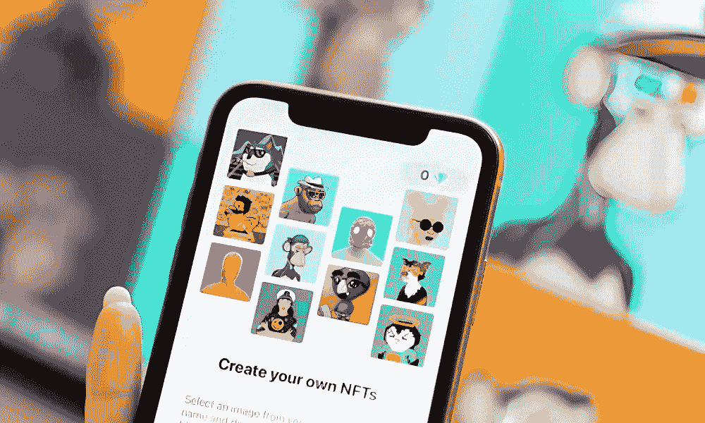
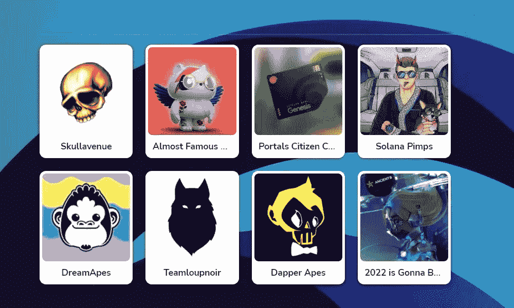

# 索尔西克隆:在索拉纳链上启动像索尔西这样的 NFT 市场指南

> 原文：<https://medium.com/geekculture/solsea-clone-guide-to-launching-an-nft-marketplace-like-solsea-on-the-solana-chain-6f6cc2166cfa?source=collection_archive---------15----------------------->

NFT 现在在艺术家和艺术品收藏家中也越来越受欢迎。不可替代的代币被认为是这些天来新的正常收藏品，因为它们在区块链上提供了明确的不可擦除的所有权。这不仅仅局限于艺术和其他数字资产，而是一切。像索尔西这样的 NFT 市场最近被大肆宣传。NFT 市场正在向企业家敞开大门，为那里的创作者和收藏家提供一个强大的 NFT 市场。

您知道 NFT 正在推动新兴的元宇宙技术吗？NFT 是区块链上的不朽文物，人们已经开始收集了。在这篇博客中，你将获得所有的洞察力，为 [**在索拉纳**](https://www.appdupe.com/nft-marketplace-development) 区块链网络上推出 NFT 市场做好准备。

# **索尔西——开放的 NFT 市场**

Solsea 是 Solana 链上的一个开放的 NFT 市场，NFT 爱好者可以在这里购买、销售和创建 NFT。这是一个建立在 Solana 链上的独家 NFT 市场，为创作者提供选择和嵌入许可证，当他们铸造他们的 NFT 时。这个平台提供更少的费用和更高的交易速度。

索拉纳链正在成为仅次于以太坊的最好的区块链网络，使得那里的创作者可以利用这个网络进行创作。这是一个易于使用的市场，具有简单的用户界面。即使是初学者也能理解这个过程并创造自己的 NFT。用户必须连接他们的 Phanthom 或 Sollet 钱包才能使用该平台。Sollet 是为 Solana 连锁店设计的开源钱包，提供最佳的 Solana 体验和用户支持。

## **索拉纳还是以太坊？最适合您的 NFT 市场**

如果你密切关注区块链的更新，你可能已经听说索拉纳·区块链正在进化，使得以太坊难以为继。尽管以太坊并不是第一个采用不可替代代币的区块链，但它现在是 NFT 的胜地。那么，为什么索拉纳现在越来越受欢迎，为什么你应该让索拉纳进入你的 NFT 市场？以下是一些已被证实的事实，支持索拉纳成为区块链世界的下一个进化生态系统。

*   Solana 遵循比以太坊更有效的历史证明共识机制，从而实现低成本、高速度的交易。因此，它提供了更好的效率，在铸造和交易非功能性金融工具。
*   该网络是高度可扩展的，它将交易的成本和速度保持在特定的阈值
*   虽然 Solana 是最近推出的新区块链，但它正在以更快的速度进行优化，以确保可扩展性到位
*   低成本和极高速度的交易使得独立艺术家可以负担得起在区块链网络上获得他们的作品。
*   蓝筹股 NFT 正在进入 Solsea，使它成为一个更好的发展场所

因此，尽管以太坊是目前社区中最好的，索拉纳正在慢慢占据它的位置，邀请企业家、创造者和收藏家。

## **像索尔西这样的 NFT 市场**

开发像 Solsea 这样的 NFT 市场不再是火箭科学。企业家们认为开发一个 NFT 市场是一个乏味的过程。这是你从零开始的过程。你需要了解从后端开发到用户界面设计的整个过程。运行一系列测试过程来检查平台中的错误也是非常重要的。

[**Solsea clone，一款白色标签的 NFT 市场解决方案**](https://www.appdupe.com/nft-marketplace-development) 可以帮你跳过所有耗时的流程，包括测试阶段。你需要做的就是为平台准备好完美的构思，据此定制，立刻上市。可以根据需求定制功能，做一个初学者友好的设计来吸引新手人群。

## **索尔西克隆的工作流程**

Solsea 克隆的工作尽可能简单，让非技术艺术家和收藏家能够方便地访问该平台。这是它的工作原理

*   每个用户都必须在平台上注册自己的基本信息，并创建一个安全的个人资料。
*   在开始之前，连接一个像 Sollet 这样的加密钱包是很重要的
*   在 explore 选项卡中，用户可以获得不同类型的各种 NFT。他们可以为自己的钱包提供资金，并通过简单的交易轻松购买
*   在 create 选项卡中，用户可以创建单个 NFT 或一组 NFT。
*   用户还可以在本地公用令牌(索尔西的 AART)上下注，以获得交易费折扣等奖励

以索尔西为例，可以在索拉那区块链的分散交易所买到当地的公用事业代币 AART。功能必须发挥作用，工作必须简单明了，使其成为一个舒适的平台，吸引更多的用户。

## **索尔西克隆的特征**

像索尔西这样的 NFT 市场的一些重要特征是

*   创作者可以在他们作品的 NFT 上嵌入许可证
*   平台上的非加密用户可以通过法定货币购买 NFT
*   该平台允许用户制作 3D NFTs，也可以以 3D 方式观看
*   该平台提供了快速和低铸造成本，因为它采取了索拉纳区块链的优势
*   NFT 可以以较低的成本以较高的交易速度进行买卖
*   交易可以通过索尔、USDT、USDC 等加密货币发起

这些优势使得它成为崭露头角的艺术家的完美的 NFT 市场平台。可以在平台中创建的 NFT 类别有

*   3D 艺术
*   艺术
*   涂漆
*   （同 payforperformance）按业绩付费
*   摄影
*   交易卡
*   录像

**外卖**

NFT 正受到独立艺术家、建筑师、时装设计师、摄影师和其他独立数字内容创作者的关注。像 Solsea 这样的 NFT 市场有利于吸引已经对区块链感兴趣的社区。使用[**NFT 市场白标解决方案**](https://www.appdupe.com/nft-marketplace-development) 开始您的开发流程永远不会太晚。你所需要做的就是找一个在这个领域有经验的专业开发人员，然后开始工作。