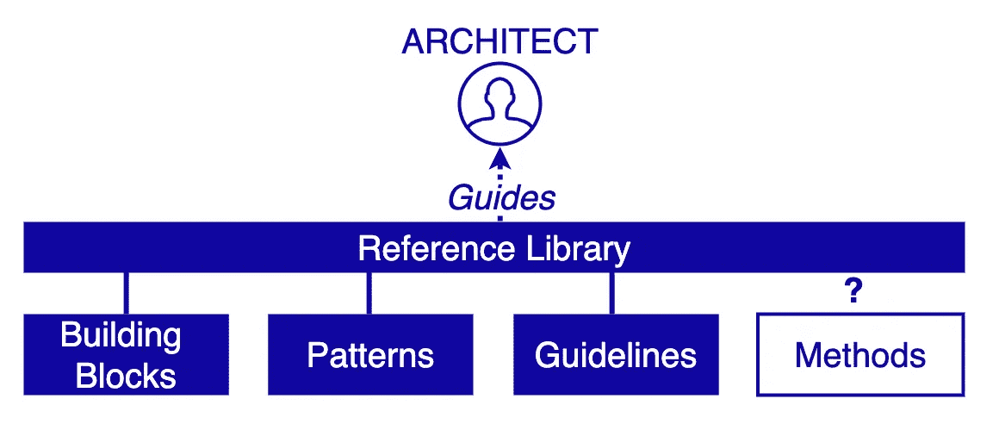

# 解决方案架构:疯狂中有方法

> 原文：<https://medium.com/geekculture/solution-architecture-theres-method-in-the-madness-d1047ce92265?source=collection_archive---------0----------------------->

## 我们已经有了构建模块、模式和指导方针，但是方法呢？

## 概观

本文探索了实用的架构方法以及它们如何帮助设计过程。

# 《五十度灰:建筑师的角色》