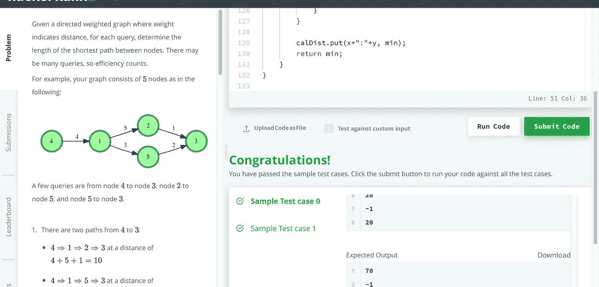
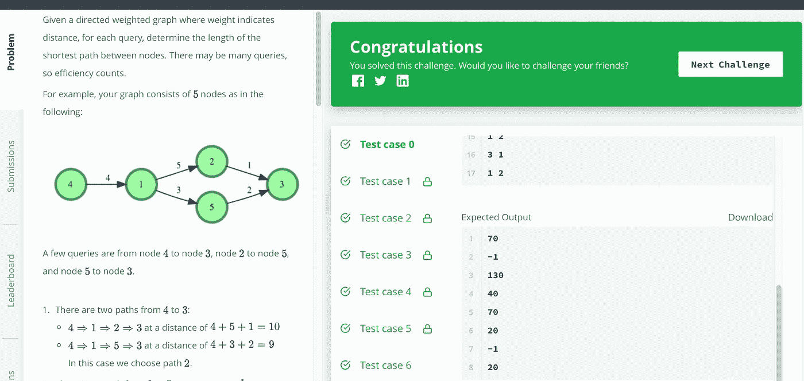

# 破解黑客兰克·弗洛伊德:眩目灯光之城

> 原文：<https://medium.com/geekculture/solve-hackerrank-floyd-city-of-blinding-lights-bed17ff94ea?source=collection_archive---------7----------------------->

## 用 Java 解决 Floyd:眩目灯光之城加权图搜索问题


Photo by [Sai Kiran Anagani](https://unsplash.com/@anagani_saikiran?utm_source=medium&utm_medium=referral) on [Unsplash](https://unsplash.com?utm_source=medium&utm_medium=referral)

## 问题

给定一个有向加权图，其中权重表示距离，对于每个查询，确定节点之间的最短路径的长度。可能会有很多查询，所以效率很重要。

[](https://www.hackerrank.com/challenges/floyd-city-of-blinding-lights/problem) [## 弗洛伊德:眩目灯光之城

### 学会使用弗洛伊德·沃肖尔的算法！

www.hackerrank.com](https://www.hackerrank.com/challenges/floyd-city-of-blinding-lights/problem) 

## 解决办法

这是一个典型的加权图搜索问题。常见的解决方案有两种:使用 BFS 搜索图和基于图矩阵计算。两者都可以通过使用动态编程(DP)来加速。这里将用 Java 来说明这两种方式。

**解决方案 1:使用 BFS** 搜索图形，但可能效率不高。

```
import java.io.*;
import java.math.*;
import java.security.*;
import java.text.*;
import java.util.*;
import java.util.concurrent.*;
import java.util.function.*;
import java.util.regex.*;
import java.util.stream.*;
import static java.util.stream.Collectors.joining;
import static java.util.stream.Collectors.toList;

class Pair {
    Integer a;
    Integer b;
    Pair(Integer A, Integer B) {
        a = A;
        b = B;
    }
}

public class Solution {
    public static void main(String[] args) throws IOException {
        BufferedReader bufferedReader = new BufferedReader(new InputStreamReader(System.in));

        String[] roadNodesEdges = bufferedReader.readLine().replaceAll("\\s+$", "").split(" ");

        int roadNodes = Integer.parseInt(roadNodesEdges[0]);
        int roadEdges = Integer.parseInt(roadNodesEdges[1]);

        // List<Integer> roadFrom = new ArrayList<>();
        // List<Integer> roadTo = new ArrayList<>();
        // List<Integer> roadWeight = new ArrayList<>();
        Map<Integer, Map<Integer, Integer>> graph = new HashMap<>();

        IntStream.range(0, roadEdges).forEach(i -> {
            try {
                String[] roadFromToWeight = bufferedReader.readLine().replaceAll("\\s+$", "").split(" ");
                int from = Integer.parseInt(roadFromToWeight[0]);
                int to = Integer.parseInt(roadFromToWeight[1]);
                int weight = Integer.parseInt(roadFromToWeight[2]);
                // build the map
                Map<Integer, Integer> children = null;
                if (graph.containsKey(from)) {
                    children = graph.get(from);   
                }
                else {
                    children = new HashMap<>();
                    graph.put(from, children);
                }
                children.put(to, weight);
            } catch (IOException ex) {
                throw new RuntimeException(ex);
            }
        });

        int q = Integer.parseInt(bufferedReader.readLine().trim());

        IntStream.range(0, q).forEach(qItr -> {
            try {
                String[] firstMultipleInput = bufferedReader.readLine().replaceAll("\\s+$", "").split(" ");

                int x = Integer.parseInt(firstMultipleInput[0]);
                int y = Integer.parseInt(firstMultipleInput[1]);

                // query here
                int minDist = findMinDist(graph, x, y);
                System.out.println(minDist);

            } catch (IOException ex) {
                throw new RuntimeException(ex);
            }
        });

        bufferedReader.close();
    }

    static Map<String, Integer> calDist = new HashMap<>();

    static int findMinDist(Map<Integer, Map<Integer, Integer>> graph, int x, int y) {
        if (graph == null) return -1;
        if (x == y) return 0;
        if (calDist.containsKey(x+":"+y)) {
            return calDist.get(x+":"+y);
        }

        Set<Integer> visited = new HashSet<>();
        visited.add(x);
        int min = -1;
        Map<Integer, Integer> children = graph.get(x);
        if (children != null) {
            if (children.containsKey(y)) {
                min = children.get(y);
                visited.add(y);
            }
            Deque<Pair> queue = new LinkedList<>();
            for (Map.Entry<Integer, Integer> entry : children.entrySet()) {
                if (entry.getKey() == y) continue;
                Pair pair = new Pair(entry.getKey(), entry.getValue());
                queue.add(pair);
            }

            while (!queue.isEmpty()) {
                Pair node = queue.poll();            
                if (calDist.containsKey(node.a+":"+y) && calDist.get(node.a+":"+y) != -1) {
                    if (min == -1 || min > calDist.get(node.a+":"+y) + node.b) {
                        min = calDist.get(node.a+":"+y) + node.b;
                    }
                }
                else if (node.a == y) {
                    if (min == -1 || min > node.b) {
                        min = node.b;
                    }    
                }

                if (!visited.contains(node.a)) {
                    Map<Integer, Integer> next1 = graph.get(node.a);
                    if (next1 != null && next1.size() > 0) {
                        for (Map.Entry<Integer, Integer> entry : next1.entrySet()) {
                            Pair pair = new Pair(entry.getKey(), entry.getValue()+node.b);
                            queue.add(pair);
                        }    
                    }   
                    visited.add(node.a);
                }
            }
        }

        calDist.put(x+":"+y, min);
        return min;    
    }
}
```

这种逻辑是可行的，可以通过如下的 HackerRank 测试用例。



**方案二** : **基于图矩阵**计算，可以通过所有 HackerRank 测试用例。

```
import java.io.*;
import java.math.*;
import java.security.*;
import java.text.*;
import java.util.*;
import java.util.concurrent.*;
import java.util.function.*;
import java.util.regex.*;
import java.util.stream.*;
import static java.util.stream.Collectors.joining;
import static java.util.stream.Collectors.toList;

public class Solution {
    public static void main(String[] args) throws IOException {
        BufferedReader bufferedReader = new BufferedReader(new InputStreamReader(System.in));

        String[] roadNodesEdges = bufferedReader.readLine().replaceAll("\\s+$", "").split(" ");

        int roadNodes = Integer.parseInt(roadNodesEdges[0]);
        int roadEdges = Integer.parseInt(roadNodesEdges[1]);

        // List<Integer> roadFrom = new ArrayList<>();
        // List<Integer> roadTo = new ArrayList<>();
        // List<Integer> roadWeight = new ArrayList<>();
        if (roadNodes < 2) return;
        int [][] matrix = new int [roadNodes+1][roadNodes+1];
        for (int i = 1; i < matrix.length; i++) {
            for (int j = 1; j < matrix.length; j++) {
                if (i == j) matrix[i][j] = 0;
                else matrix[i][j] = -1;  
            }
        }

        IntStream.range(0, roadEdges).forEach(i -> {
            try {
                String[] roadFromToWeight = bufferedReader.readLine().replaceAll("\\s+$", "").split(" ");

                int a = Integer.parseInt(roadFromToWeight[0]);
                int b = Integer.parseInt(roadFromToWeight[1]);
                int d = Integer.parseInt(roadFromToWeight[2]);
                matrix[a][b] = d;
            } catch (IOException ex) {
                throw new RuntimeException(ex);
            }
        });

        // construct distance matrix before querying
        // ensure k is the outside look to allow DP
        for (int k = 1; k < matrix.length; k++) {
            for (int i = 1; i < matrix.length; i++) {
                for (int j = 1; j < matrix.length; j++) {
                    if (i != j && matrix[i][k] != -1 && matrix[k][j] != -1) {
                        if (matrix[i][j] == -1) matrix[i][j] = matrix[i][k] + matrix[k][j]; 
                        else matrix[i][j] = Math.min(matrix[i][j], matrix[i][k] + matrix[k][j]); 
                    }
                }
            }
        }

        int q = Integer.parseInt(bufferedReader.readLine().trim());

        IntStream.range(0, q).forEach(qItr -> {
            try {
                String[] firstMultipleInput = bufferedReader.readLine().replaceAll("\\s+$", "").split(" ");

                int x = Integer.parseInt(firstMultipleInput[0]);
                int y = Integer.parseInt(firstMultipleInput[1]);
                // print min dist
                System.out.println(matrix[x][y]);
            } catch (IOException ex) {
                throw new RuntimeException(ex);
            }
        });

        bufferedReader.close();
    }
}
```

它可以 100%通过所有的 HackerRank 测试案例。



编码快乐！

*问题，想法？在这里留下评论。跟随我成为有趣的解决问题之旅的一部分。*