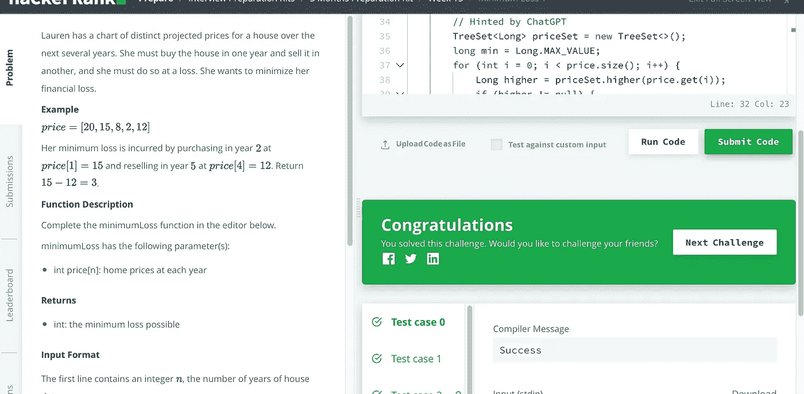

# 求解 HackerRank 最小损失 1

> 原文：<https://medium.com/geekculture/solve-hackerrank-minimum-loss-1-6f27f847f0b0?source=collection_archive---------4----------------------->

## 在 Java 中求解 HackerRank 最小损失 1


Photo by [Yancy Min](https://unsplash.com/@yancymin?utm_source=medium&utm_medium=referral) on [Unsplash](https://unsplash.com?utm_source=medium&utm_medium=referral)

这应该是一个简单的问题，但在网上找到正确的解决方案似乎具有挑战性。所以我想用 O(n)和优化的 O(nlogn)解来求解。

## 问题

劳伦有一张未来几年房价的图表。她必须在一年内买下房子，然后在另一年卖掉，而且她必须亏本。她想尽量减少她的经济损失。

**例子**

```
price = [20, 15, 8, 2, 12]
```

她的最小损失是在第二年以 15 的价格买进，第五年以 12 的价格卖出。返回 3。

**功能描述**

在下面的编辑器中完成 minimumLoss 函数。

minimumLoss 具有以下参数:

*   内部价格[n]:每年的房价

**回报**

*   int:可能的最小损失

HackerRank 原问题如下:

[](https://www.hackerrank.com/challenges/minimum-loss/problem) [## 最小损失|黑客等级

### 劳伦有一张未来几年房价的图表。她必须一次买下这所房子…

www.hackerrank.com](https://www.hackerrank.com/challenges/minimum-loss/problem) 

## 解决办法

常见的错误是对价格数组进行排序，然后找出最小值。我们需要保持原来的顺序来找到最小值。

**解决方案 1** :保持简单，使用 O(n)

```
import java.io.*;
import java.math.*;
import java.security.*;
import java.text.*;
import java.util.*;
import java.util.concurrent.*;
import java.util.function.*;
import java.util.regex.*;
import java.util.stream.*;
import static java.util.stream.Collectors.joining;
import static java.util.stream.Collectors.toList;

class Result {

    /*
     * Complete the 'minimumLoss' function below.
     *
     * The function is expected to return an INTEGER.
     * The function accepts LONG_INTEGER_ARRAY price as parameter.
     */

    public static long minimumLoss(List<Long> price) {
        // Write your code here
        long min = Long.MAX_VALUE;
        for (int i = 0; i < price.size(); i++) {
            for (int j = i + 1; j < price.size(); j++) {
                if (price.get(i) >= price.get(j) && price.get(i) - price.get(j) < min)
                min = price.get(i) - price.get(j);
            }
        }

        return min;
    }

}

public class Solution {
    public static void main(String[] args) throws IOException {
        BufferedReader bufferedReader = new BufferedReader(new InputStreamReader(System.in));
        BufferedWriter bufferedWriter = new BufferedWriter(new FileWriter(System.getenv("OUTPUT_PATH")));

        int n = Integer.parseInt(bufferedReader.readLine().trim());

        List<Long> price = Stream.of(bufferedReader.readLine().replaceAll("\\s+$", "").split(" "))
            .map(Long::parseLong)
            .collect(toList());

        long result = Result.minimumLoss(price);

        bufferedWriter.write(String.valueOf(result));
        bufferedWriter.newLine();

        bufferedReader.close();
        bufferedWriter.close();
    }
}
```

**解决方案 2** :针对 O(nlogn)进行优化

```
import java.io.*;
import java.math.*;
import java.security.*;
import java.text.*;
import java.util.*;
import java.util.concurrent.*;
import java.util.function.*;
import java.util.regex.*;
import java.util.stream.*;
import static java.util.stream.Collectors.joining;
import static java.util.stream.Collectors.toList;

class Result {

    /*
     * Complete the 'minimumLoss' function below.
     *
     * The function is expected to return an INTEGER.
     * The function accepts LONG_INTEGER_ARRAY price as parameter.
     */

    public static long minimumLoss(List<Long> price) {

        TreeSet<Long> priceSet = new TreeSet<>();
        long min = Long.MAX_VALUE;
        for (int i = 0; i < price.size(); i++) {
            Long higher = priceSet.higher(price.get(i));
            if (higher != null) {
                min = Math.min(higher - price.get(i), min);     
            }
            priceSet.add(price.get(i));
        }

        return min;
    }

}

public class Solution {
    public static void main(String[] args) throws IOException {
        BufferedReader bufferedReader = new BufferedReader(new InputStreamReader(System.in));
        BufferedWriter bufferedWriter = new BufferedWriter(new FileWriter(System.getenv("OUTPUT_PATH")));

        int n = Integer.parseInt(bufferedReader.readLine().trim());

        List<Long> price = Stream.of(bufferedReader.readLine().replaceAll("\\s+$", "").split(" "))
            .map(Long::parseLong)
            .collect(toList());

        long result = Result.minimumLoss(price);

        bufferedWriter.write(String.valueOf(result));
        bufferedWriter.newLine();

        bufferedReader.close();
        bufferedWriter.close();
    }
}
```

它可以 100%通过所有测试用例。



编码快乐！

*问题、想法？在这里留下评论。跟随我成为有趣的解决问题之旅的一部分。*