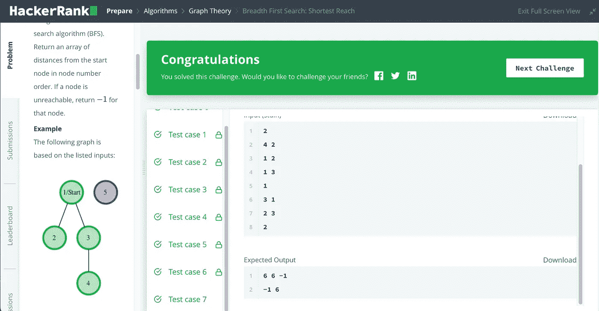

# 求解 HankerRank 广度优先搜索:最短距离

> 原文：<https://medium.com/geekculture/solve-hankerrank-breadth-first-search-shortest-reach-6977f52174f2?source=collection_archive---------7----------------------->

## 用 Java 解决 HankerRank 难题:广度优先搜索:最短到达


Photo by [Martin Shreder](https://unsplash.com/@martinshreder?utm_source=medium&utm_medium=referral) on [Unsplash](https://unsplash.com?utm_source=medium&utm_medium=referral)

树和图是基本的数据结构。他们在编码面试中很常见。这里将解决 HankerRank 广度优先搜索:最短到达和走过如何优化一个图的问题。

## 问题

考虑一个无向图，其中每条边重 6 个单位。从 1 到 n 连续标记每个节点

你将会被问到一些问题。对于每个查询，您将得到一个描述无向图的边列表。在创建了图形表示之后，您必须使用广度优先搜索算法( [BFS](https://en.wikipedia.org/wiki/Breadth-first_search) )确定并报告从给定起始位置到每个其他节点的最短距离。按照节点编号顺序返回从起始节点开始的距离数组。如果某个节点不可达，则为该节点返回-1。

**功能描述**

在下面的编辑器中完成 bfs 函数。如果一个节点是不可达的，它的距离是-1。

bfs 具有以下参数:

*   int n:节点的数量
*   int m:边的数量
*   int edges[m][2]:边的开始和结束节点
*   int s:开始遍历的节点

Returns
int[n-1]:以节点号递增的顺序到节点的距离，不包括起始节点(如果节点不可达，则为-1)

请在这里看 HankerRank 原问题。

[](https://www.hackerrank.com/challenges/bfsshortreach/problem) [## 广度优先搜索:最短距离

### 考虑一个无向图，其中每条边重 6 个单位。每个节点从 1 到 n 被连续标记…

www.hackerrank.com](https://www.hackerrank.com/challenges/bfsshortreach/problem) 

## 解决办法

这个问题可以分两步解决:构造一个图，然后用 BFS 搜索。下面就来实现吧。

```
import java.io.*;
import java.math.*;
import java.security.*;
import java.text.*;
import java.util.*;
import java.util.concurrent.*;
import java.util.function.*;
import java.util.regex.*;
import java.util.stream.*;
import static java.util.stream.Collectors.joining;
import static java.util.stream.Collectors.toList;

class Result {

    /*
     * Complete the 'bfs' function below.
     *
     * The function is expected to return an INTEGER_ARRAY.
     * The function accepts following parameters:
     *  1\. INTEGER n
     *  2\. INTEGER m
     *  3\. 2D_INTEGER_ARRAY edges
     *  4\. INTEGER s
     */

    public static List<Integer> bfs(int n, int m, List<List<Integer>> edges, int s) {
    // Write your code here
        if (n < 1 || edges == null || edges.size() < 1 || s < 1) return null;

        // Step 1
        Set<Integer> [] tree = new Set[n];
        for (List<Integer> edge : edges) {
            int a = edge.get(0);
            int b = edge.get(1);
            if (tree[a-1] == null) {
                tree[a-1] = new HashSet<Integer>();
            }
            tree[a-1].add(b);
            if (tree[b-1] == null) {
                tree[b-1] = new HashSet<Integer>();
            }
            tree[b-1].add(a);
        }

        // Step 2
        List<Integer> res = new ArrayList<Integer>();
        // O(n^2)
        for (int i = 1; i <= n; i++) {
            if (i == s) continue;
            // find from i to s
            Set<Integer> root = tree[i-1];
            if (root == null) {
                res.add(-1);
                continue; 
            }
            Deque<Integer> queue = new LinkedList<Integer>();
            for (Integer r : root) {
                queue.add(r);
            }
            int height = 1;
            boolean [] visited = new boolean [n];
            while (!queue.isEmpty()) {
                Deque<Integer> queuen = new LinkedList<Integer>();
                boolean found = false;
                while (!queue.isEmpty()) {
                    int v = queue.poll().intValue();
                    if (!visited[v-1]) {
                        visited[v-1] = true;
                        if (v == s) {
                            res.add(height *6);
                            found = true;
                            break;
                        }
                        if (tree[v-1] != null) {
                            for (Integer r : tree[v-1]) {
                                queuen.add(r);
                            } 
                        }
                    } 
                }

                if (found) break;
                queue = queuen;
                height++;
            } 
        }

        // return res
        return res;
    }
}

public class Solution {
    public static void main(String[] args) throws IOException {
        BufferedReader bufferedReader = new BufferedReader(new InputStreamReader(System.in));
        BufferedWriter bufferedWriter = new BufferedWriter(new FileWriter(System.getenv("OUTPUT_PATH")));

        int q = Integer.parseInt(bufferedReader.readLine().trim());

        IntStream.range(0, q).forEach(qItr -> {
            try {
                String[] firstMultipleInput = bufferedReader.readLine().replaceAll("\\s+$", "").split(" ");

                int n = Integer.parseInt(firstMultipleInput[0]);

                int m = Integer.parseInt(firstMultipleInput[1]);

                List<List<Integer>> edges = new ArrayList<>();

                IntStream.range(0, m).forEach(i -> {
                    try {
                        edges.add(
                            Stream.of(bufferedReader.readLine().replaceAll("\\s+$", "").split(" "))
                                .map(Integer::parseInt)
                                .collect(toList())
                        );
                    } catch (IOException ex) {
                        throw new RuntimeException(ex);
                    }
                });

                int s = Integer.parseInt(bufferedReader.readLine().trim());

                List<Integer> result = Result.bfs(n, m, edges, s);

                bufferedWriter.write(
                    result.stream()
                        .map(Object::toString)
                        .collect(joining(" "))
                    + "\n"
                );
            } catch (IOException ex) {
                throw new RuntimeException(ex);
            }
        });

        bufferedReader.close();
        bufferedWriter.close();
    }
}
```

只要遵循一些常见的图形模式，这就很简单了。但是它的时间复杂度是 O(n ),并且会使 HackerRank 硬测试用例失败。所以我们把它优化为 O(n)。也就是说，用一个 BFS 来计算距离。

```
import java.io.*;
import java.math.*;
import java.security.*;
import java.text.*;
import java.util.*;
import java.util.concurrent.*;
import java.util.function.*;
import java.util.regex.*;
import java.util.stream.*;
import static java.util.stream.Collectors.joining;
import static java.util.stream.Collectors.toList;

class Result {

    /*
     * Complete the 'bfs' function below.
     *
     * The function is expected to return an INTEGER_ARRAY.
     * The function accepts following parameters:
     *  1\. INTEGER n
     *  2\. INTEGER m
     *  3\. 2D_INTEGER_ARRAY edges
     *  4\. INTEGER s
     */

    public static List<Integer> bfs(int n, int m, List<List<Integer>> edges, int s) {
    // Write your code here
        if (n < 1 || edges == null || edges.size() < 1 || s < 1) return null;

        // Step 1
        Set<Integer> [] tree = new Set[n];
        for (List<Integer> edge : edges) {
            int a = edge.get(0);
            int b = edge.get(1);
            if (tree[a-1] == null) {
                tree[a-1] = new HashSet<Integer>();
            }
            tree[a-1].add(b);
            if (tree[b-1] == null) {
                tree[b-1] = new HashSet<Integer>();
            }
            tree[b-1].add(a);
        }

        // Step 2
        List<Integer> res = new ArrayList<Integer>();

        // O(n) start from S
        for (int i = 0; i < n - 1; i++) {
            res.add(-1);    
        }

        Set<Integer> root = tree[s-1];
        if (root == null) return res;

        Deque<Integer> queue = new LinkedList<Integer>();
        for (Integer r : root) {
            queue.add(r);
        }
        int height = 1;
        boolean [] visited = new boolean [n];
        visited[s-1] = true;
        while (!queue.isEmpty()) {
            Deque<Integer> queuen = new LinkedList<Integer>();
            while (!queue.isEmpty()) {
                int v = queue.poll().intValue();
                if (!visited[v-1]) {
                    visited[v-1] = true;
                    // update distances
                    if (v > s)
                        res.set(v-2, height*6);
                    else 
                        res.set(v-1, height*6);
                    if (tree[v-1] != null) {
                        for (Integer r : tree[v-1]) {
                            queuen.add(r);
                        } 
                    }
                } 
            }
            queue = queuen;
            height++;
        }

        // return res
        return res;
    }

}

public class Solution {
    public static void main(String[] args) throws IOException {
        BufferedReader bufferedReader = new BufferedReader(new InputStreamReader(System.in));
        BufferedWriter bufferedWriter = new BufferedWriter(new FileWriter(System.getenv("OUTPUT_PATH")));

        int q = Integer.parseInt(bufferedReader.readLine().trim());

        IntStream.range(0, q).forEach(qItr -> {
            try {
                String[] firstMultipleInput = bufferedReader.readLine().replaceAll("\\s+$", "").split(" ");

                int n = Integer.parseInt(firstMultipleInput[0]);

                int m = Integer.parseInt(firstMultipleInput[1]);

                List<List<Integer>> edges = new ArrayList<>();

                IntStream.range(0, m).forEach(i -> {
                    try {
                        edges.add(
                            Stream.of(bufferedReader.readLine().replaceAll("\\s+$", "").split(" "))
                                .map(Integer::parseInt)
                                .collect(toList())
                        );
                    } catch (IOException ex) {
                        throw new RuntimeException(ex);
                    }
                });

                int s = Integer.parseInt(bufferedReader.readLine().trim());

                List<Integer> result = Result.bfs(n, m, edges, s);

                bufferedWriter.write(
                    result.stream()
                        .map(Object::toString)
                        .collect(joining(" "))
                    + "\n"
                );
            } catch (IOException ex) {
                throw new RuntimeException(ex);
            }
        });

        bufferedReader.close();
        bufferedWriter.close();
    }
}
```

它工作得很好，可以通过如下所有的 HackerRank 测试用例。



编码快乐！

*问题、想法？请在下面的回复中留下评论。如果你喜欢解决有趣的问题，请联系我。*