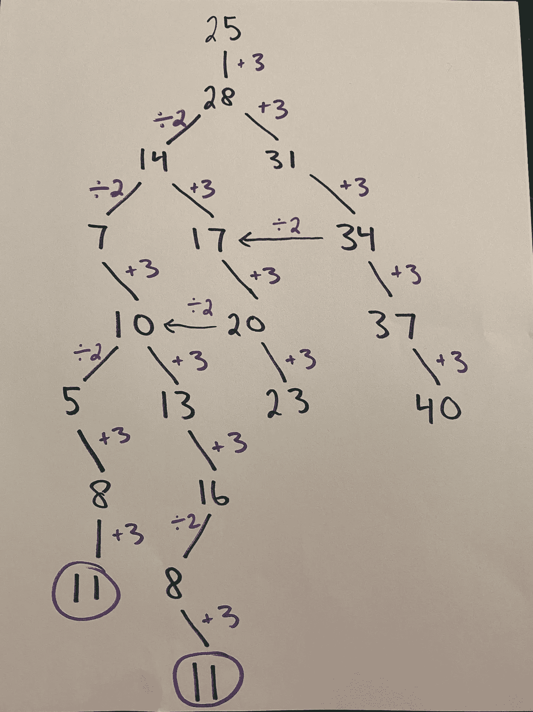

# 用广度优先遍历解决一个数学谜题

> 原文：<https://medium.com/geekculture/solving-a-math-riddle-with-breadth-first-traversal-d8c37ca56642?source=collection_archive---------53----------------------->

# 介绍

我最近有点痴迷于 YouTube 上的这些无聊的谜题([第一季](https://www.youtube.com/playlist?list=PLJicmE8fK0EhMjOWNNhlY4Lxg8tupXKhC)、[第二季](https://www.youtube.com/playlist?list=PLJicmE8fK0EimY5ZyoyJ39IClMnOqqVXN)、[第三季](https://www.youtube.com/playlist?list=PLJicmE8fK0EjrWRyVciHzMia96wOrK6-p)、[第四季](https://www.youtube.com/playlist?list=PLJicmE8fK0EgYajeKYtp8IsJoqSb7G--N))，并试图用代码解决一些问题。在一个视频的结尾，有一个额外的数学难题是这样的:

*从 11 开始，怎么只用两个运算就到了 25:****乘以 2*** *或者* ***减去 3*** *？而且最重要的是，* ***最短的路线是什么*** *？*

在几分钟试图在脑子里解决它的努力无果后，我终于崩溃了，在纸上画了出来(见下面的“画出”方法在起作用！).

当你开始尝试解决它时，一些事情变得很明显:首先，如果你从 11 开始，你有两条路:你可以乘以 2，然后在 22 着陆，或者减去 3，然后在 8 着陆。在每一个数字上，你都有两条以上的路径，以此类推。

*   11–22–44–41–38…等等
*   11–22–19–16–32…等等
*   11–8–5–10–20–17…等等
*   11–8–16–13–26–23…等等

第二，逆向工作可能是你最好的选择。你的尾数 25 是奇数，这意味着一个整数不可能乘以 2 才能得到 25…所以紧接在 25 **之前的数字一定是** 28。

**剧透提示:**解决方案只是向下滚动一小段，所以如果你想自己解决，就停下来！

# 纸质解决方案

我选择了从 28 开始往回走的路线，在画完我的树后，我最终在 8 步内走到了 11 步(这不是最快的路线)。如果你自己这样做，请记住，如果你是逆向操作，你必须**加 3** 和**除以 2** 。

我最终确实找到了最快的路线，但只是在我写了代码来确认之后。这篇文章将展示我如何创建一个基本的树结构，以及我如何使用广度优先遍历来找到最短的路径。

# 为什么要用树？

在我走得太远之前，为什么我立即着陆在树结构上，为什么不是深度优先遍历？至于树结构，它只是有意义的——“根”是我的起始数字，11，每个节点是一个后续的数字或路径。每个节点将有两个可能的分支——*乘以两个分支*和*减去三个分支*。使用树是最有意义的，可以让我实现我所勾画的。

至于为什么不深度优先，当你开始写出每一种可能性时，答案就很明显了。例如，从 11 开始，我可以一直乘以 2:11–22–44–88–176…等等。虽然可能有一条从 176 到 25 的路径，但它可能不是最短的。它也忽略了问题的整个要点:我们不只是试图找到一条路，我们想要最短的。

广度优先遍历将允许我查看我的树的每一行，并问这个问题:这些数字中有 25 吗？如果没有，让我们检查下一行。当我们最终找到 25，这将是最短的路径。

# 让我们开始编码吧

由于对树有点生疏/没有经验，我犯了一个错误，试图用数字的值作为对象的键。我的根对象有一个属性，数字 11，它的值是一个有两个属性的对象，8 和 22，它们都是有两个属性的对象，以此类推。它看起来是这样的:

我很快了解到，没有简单的方法来获取特定节点的值，因为属性总是在变化——因此，虽然当您对其进行控制时，结构“看起来”更好，但它更难遍历，并且需要更多的工作来使用。因此，我没有重新发明轮子，而是从几年前上的一门算法课程中借用了一些代码。我将分别分解每个类(树和节点)。

我将首先从节点类开始，然后做树。该节点只需要三样东西:一个数据或值属性，无论数字是多少(例如 11、8、22 等)。)，任何节点的子属性，以及指向其父节点的父属性(我将在后面详细讨论)。下面是节点类的代码，我将在下面进行分解。

在构造器之后，有三种方法:*添加*、*分支*和*路径根*。 *Add* 是不言自明的——它只是向当前节点的子节点添加一个新节点。*分支*为每个操作创建一个分支:**乘以 2** 然后**减去 3** 。

*那么为什么不在初始化的时候自动运行这个呢*？

它创建了两个新节点，如果我们立即创建更多分支，那么每个新节点会创建两个新节点，每个新节点会创建两个新节点，以此类推。为了防止无限循环，我将两个分支的创建都作为一个单独的方法，必须在一个特定的节点上调用，从而允许我们精确地控制一个节点何时添加子节点。最后， *pathToRoot* 返回一个数组，其中包含从根节点(在本例中为 11)到我们当前所在节点的路径。当试图找出到达特定值的最短路径时，这将非常有用。

这就是我们的节点类，让我们看看我们的树:

这棵树不需要担心它的任何叶子或节点的值。本例中的 Tree 类主要关注整个树的功能，比如遍历树并填充其分支。在构造函数中，我只给了树两个属性:一个*根*和*深度*。根仅仅是一个节点(对于你为其创建树的任何数字；在这种情况下，深度只能让我记录下树往下走了多少层。

最后是 *traverseBF* 函数(BF =广度优先)。编写这个函数是为了接受将在特定节点上调用的另一个函数。所以从根开始，它一路向下，在它遇到的每个节点上调用那个函数。从代码中可以看出，它非常简单:

第一行只是将根节点放入一个数组，树的第一行就完成了！

第二行开始 while 循环:“只要这个数组中有节点，就执行以下操作…”。

在 while 循环体中，我们简单地从数组中删除第一个节点，将该节点的所有子节点添加到数组中，然后运行我们在该节点上传递的任何函数。从根 11 开始，该循环的操作如下:

*   首先将根 11 添加到数组:[11]
*   删除 11 并添加它的孩子 8 和 22: [8，22]
*   删除 8 并添加它的子元素 5 和 16: [22，5，16]
*   删除 22 并添加其子代 19 和 44: [5，16，19，44]
*   删除 5 并添加其子项 2 和 10: [16，19，44，2，10]

如果所有这些节点都有子节点，数组可能会继续增长，这就是为什么不是每个节点都有子节点，为什么我们只有一定的深度。此外，父节点和子节点是混合的。

在循环的第一次迭代中，根节点 11 被删除，其子节点被添加:8 和 22 都是 11 的子节点。但是在下一次迭代中，8 被删除，它的子元素被添加，所以 22(11 的子元素)和 11 的“孙元素”5 和 16 在同一个数组中。保持对哪个节点来自哪个级别的清楚理解是困难的，这就是为什么我给每个节点添加了**父**属性。因为只要一个节点有一个父属性，我就可以在树中找到自己的位置。

有了这些，我们实际上可以解决这个问题:

我们简单地用根值 11 来实例化树，我们构建我们的分支，然后我们传递我们的函数来寻找 25。(如果你想自己尝试一下，可以将这段代码复制粘贴到你的控制台或者 Chrome 片段中，在那里运行。)如您所见，这里显示了几个数组，但步骤最少的一个是:11，8，5，10，7，14，28，25。

我希望这是一个平易近人的职位，与树木一起工作。它们不是最容易使用的，但是一旦你掌握了基础知识，你就能解决一些大问题，甚至还能从中得到一点乐趣。