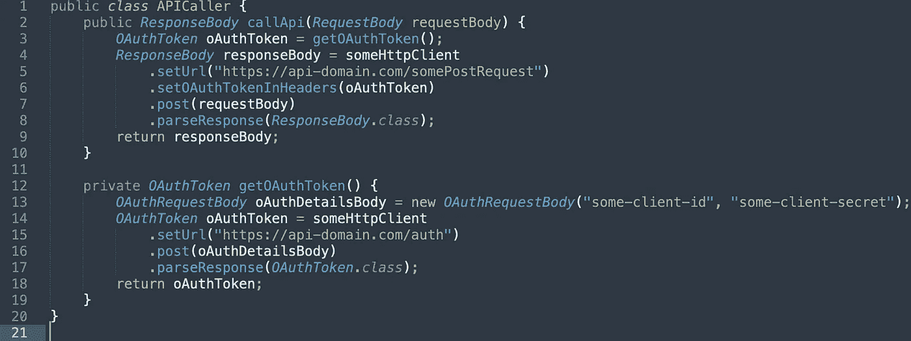
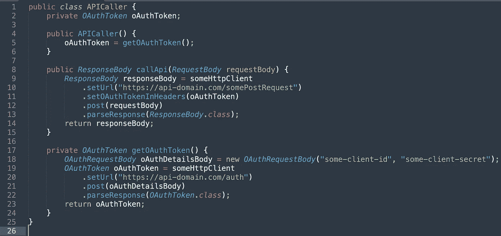
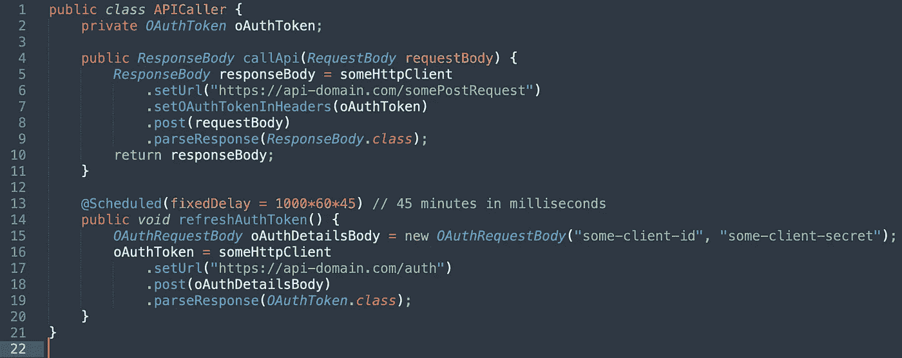
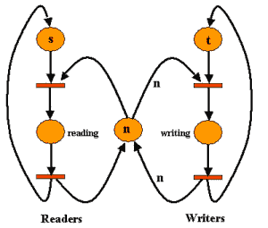
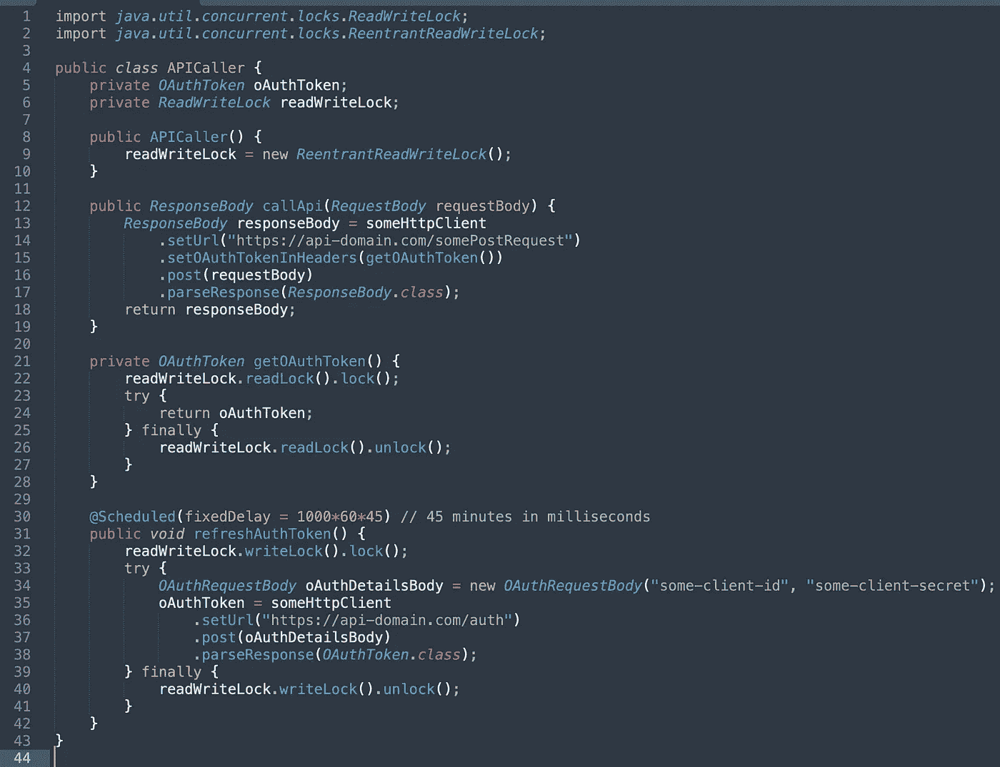
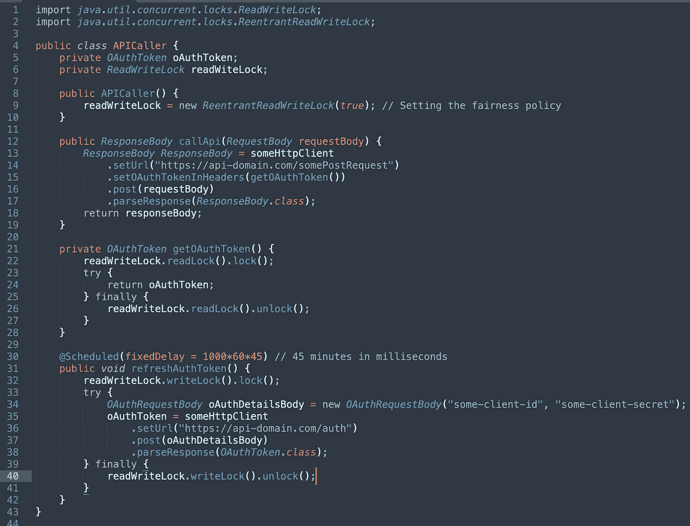

# 在多线程环境中解决读者-作者问题。

> 原文：<https://medium.com/geekculture/solving-the-readers-writers-problem-in-a-multithreaded-environment-cfd3cb5772a7?source=collection_archive---------27----------------------->

没有废话。直接进入用例。

在工作中，在我们的一个服务中，我们使用了一个支持 OAuth 的 API。对于向该 API 发出的每个请求，必须在请求头中传递身份验证令牌。

**到目前为止，我们一直在做什么来进行 API 调用:**

1.  进行 API 调用以获取新的身份验证令牌。
2.  使用这个令牌进行任何其他 API 调用来完成我们的请求。

大概是这样的:

What we were doing till now…

**问题！**

每次调用`callApi()`时，获取新的认证令牌是完全不必要的。我们可以对多个 API 调用使用同一个认证令牌。想象一下大规模地做这件事。

**解决方案:**在应用程序启动时获取一个认证令牌并保存它。对该 API 的每个其他调用使用该身份验证令牌。

也许是这样的？

Initializing the oAuthToken in the constructor and re-using it

**完成的更改:**

1.  引入了一个类变量`oAuthToken`。
2.  为`APICaller`类引入了一个构造函数。
3.  `oAuthToken`在构造函数中初始化。

**结果:**有了这个，我们不再需要在`callApi()`获得一个新的认证令牌。我们可以简单地实例化`APICaller`，它在对象初始化期间初始化`oAuthToken`。

**另一个问题！**

在现实生活中，我们不可能一辈子都使用同一个认证令牌。过一段时间就过期了。因此，我们需要在认证令牌过期之前更新`oAuthToken`变量。否则我们的`callApi()`方法将开始失败。

**解决方案:**定期运行`getOAuthToken()`方法。在我们的用例中，我们选择每 45 分钟任意运行一次。

看看这个。

Running getOAuthToken() every 45 minutes

**完成的更改:**

1.  移除了构造函数。
2.  将`getOAuthToken()`的方法名改为`refreshAuthToken()`，将其返回类型改为`void`。这个方法更新了类变量`oAuthToken`。
3.  添加了带`fixedDelay`参数的弹簧引导注释`@Scheduled`。这只是每 45 分钟运行一次`refreshAuthToken()`。

**结果:**这将刷新认证令牌并每 45 分钟更新一次`oAuthToken`的值。因此，我们消除了使用过期身份验证令牌的情况。

**更多问题！**

当数百个线程正在使用同一个`oAuthToken`而调度器线程试图更新`oAuthToken`时会发生什么？

嗯，没什么大问题。或者是？

Readers-Writers Problem

这就是著名的 [***读者——作家问题***](https://splunk.prod.pcln.com/en-US/app/pcln_air/search?earliest=1623643200&latest=16239[…]sid=1629818920.939913_F6795E96-A975-49FE-A276-D55ACC6430EF) 。`oAuthToken`是一段**数据，跨**多线程共享。这是一种共享资源。即使在调度程序线程刷新了过期的身份验证令牌之后，一些线程也很有可能使用它。因此，我们知道我们的数据在多线程中不会**一致**。

简单地说，假设我们有两个线程。现在，如果两个线程同时执行`read`或`write`操作，我们最满意的情况是两个线程都执行`read`操作。下表对此进行了更好的描述:

Table describing happy and problem cases

在我们的例子中，我们可能有`N`个读者和`1`个作者。

在这种情况下，我们如何确保数据的一致性？

作为我们解决方案的一部分，需要确保以下两点:

1.  当调度程序线程刷新`oAuthToken`时，不要让任何线程读取或更新它。
2.  当有线程正在读取`oAuthToken`时，不要让调度程序线程更新它。

我们可以用一对读/写锁来实现这一点。本质上，

1.  只有当任何线程都没有获得写锁时，多个线程才能同时获得读锁。
2.  一次只能有一个线程获取写锁。并且只有在没有线程持有读锁时才能被获取。

Java 在`java.util.concurrent.locks`包中提供了一个`ReadWriteLock`接口。我们可以简单地使用来实现数据一致性。

最后，我们的产品就绪代码😃：

Makes use of a ReadWriteLock to achieve data consistency

**所做的更改:**

1.  利用了`ReadWriteLock`。在构造函数中初始化锁。
2.  我们现在调用一个`getOAuthToken()`方法，而不是直接读取`callApi()`方法中的`oAuthToken`。
3.  在`getOAuthToken()`中，我们所做的就是获取读锁，返回`oAuthToken`，最后释放读锁。
4.  在`refreshAuthToken()`中，我们获取写锁，更新`oAuthToken`，并释放写锁。

我们不必处理确保在我们获得写锁时没有线程获得读锁或写锁的复杂性，或者确保在我们获得读锁时没有线程获得写锁的复杂性。Java 为我们处理了复杂性。

**坚持住！还没有！**

我们还有一个问题。我们每 45 分钟更新一次`oAuthToken`的作者线程可能会挨饿很长时间，可能是永远。对于要获取的写锁，任何线程都不应该获取读锁或写锁。当我们的服务太忙而读锁从未被释放时会发生什么？假设我们的调度程序线程正在等待获得写锁，而读请求却一次又一次地到来。

我们如何确保线程不会饿死？

**解决方案:**嗯，不是很复杂的任务。我们需要做的就是在`ReentrantReadWriteLock`构造函数中将公平策略设置为`true`。这将保证线程获得锁的公平性。

就像这样:

Fairness policy set

**结果:**我们最小化了线程饥饿的可能性。你可以在这里阅读更多关于公平政策的内容。

**结论:**我们设法跨多个线程实现数据的一致性(`oAuthToken`)。

我全心全意地写这篇文章是为了教育你并回馈编程社区。当我教书时，我学到更多。当我从你身上学到更多的东西，我可以教给别人更多的东西。如果你发现任何错误，或者我可能无意中在这里产生的任何错误信息，请随时评论你的批评和评论。😄