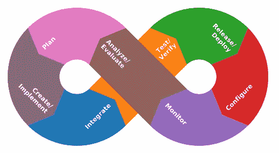
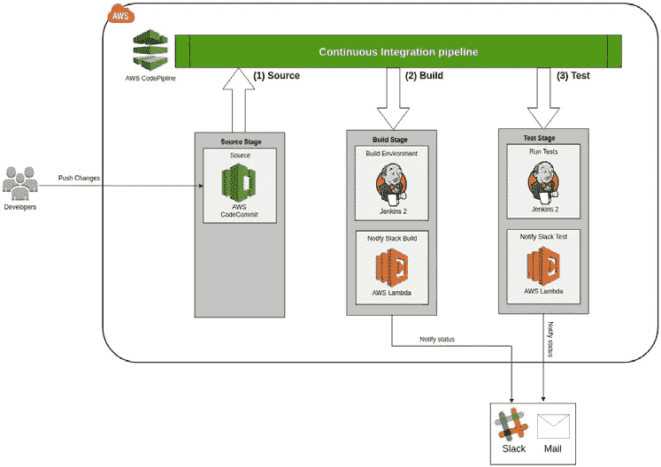
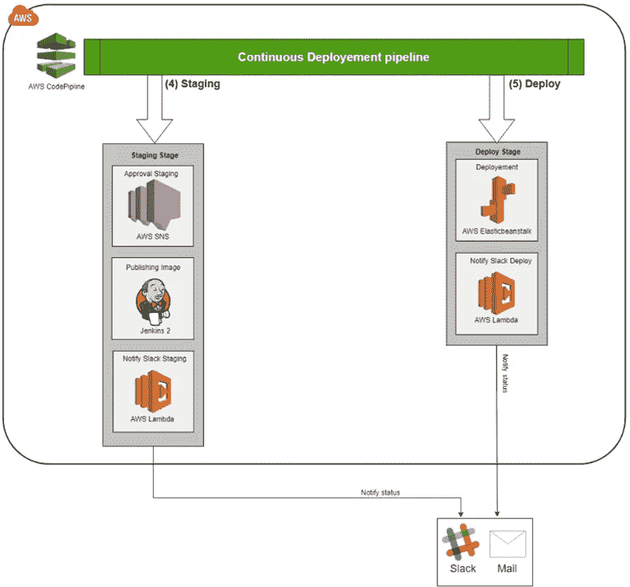

# 将 DevOps 应用于您的数据科学

> 原文：<https://medium.com/geekculture/some-devops-within-the-data-team-8857165d9a85?source=collection_archive---------17----------------------->

## 欧洲领先的翻新汽车公司的案例研究。

Photo by [Xavi Cabrera](https://unsplash.com/@xavi_cabrera?utm_source=medium&utm_medium=referral) on [Unsplash](https://unsplash.com?utm_source=medium&utm_medium=referral)

# 介绍

我们的主题创建于 2001 年，是法国的一家多品牌汽车经销商。它提供了通过销售网络在线购买新车或翻新二手车的可能性。该公司网站每月有 100 万独立访客，以及两个移动应用程序。几年来，该公司一直依靠详细的数据分析来优化其流程，从而提高其竞争力，以交付高质量的产品。

# 数据团队

2016 年，**B**business**I**intelligence division 重组为一个独立的数据部门，其主要活动是识别，然后拉动所有杠杆来优化公司流程。

## 数据背后的人类

在团队内部，我们可以将他们分为几个计算机科学类别:

*   数据科学家和 BI 工程师:**开发人员**私奔者
*   数据工程师和 it 架构师:**运营**运营

每个数据项目都涉及整个团队(开发和运营),从规划到开发，贯穿整个部署。

## 数据项目

鉴于我们谈论的是翻新汽车行业的领先公司之一，让我们来看看数据团队开展的一些项目的几个例子:

*   网上汽车估价:计算你的汽车的大概价值。
*   “您可能会喜欢”:根据推荐算法推荐一系列汽车。

## “陈词滥调”的挑战

团队面临的挑战之一是提高 TTM，同时确保产品质量始终保持在较高水平。

# 如何之前的为什么

## 诊断结果

在说 DevOps，CI/CD，管道等之前。我们将深入研究数据团队产品的开发周期。“在线估价”项目就是一个很好的例子:

1.  计划:所有团队。
2.  代码:由数据科学家、开发团队在本地开发。
3.  构建:架构师、运营团队组装应用程序。
4.  测试:执行不同类型的测试，所有团队(开发和运营)。
5.  发布:架构师、运营团队发布产品。
6.  部署:在生产中部署，运营团队。

在与团队讨论并试图了解如何改进流程的每一步后，我们准备好面对一些挑战并提出问题:

*   我们在开发、测试和生产中使用相同的环境吗？号码
*   重复手动完成的任务？是的。
*   我们有中央监控仪表板吗？号码

## 治疗

我们的目标是使人类行为成为一种验证，而不是最大程度自动化的技术行为的表现，包括测试。

自动化并不意味着减少甚至消除人力。事实上，它应该旨在通过管理所有标准化的任务来消除重复性任务。

# 走向 DevOps 方法

建立一个既能作为自动化过程的工具又能作为持续反馈的解决方案，需要一个策略，这个策略将作为一个由戴着两顶帽子的概要文件(Dev 和 Ops)承载的桥梁。

DevOps — image by openclipart

## 文化高于一切

DevOps 运动被认为不仅仅是一套工具，它是一种专注于开发人员和运营人员两个团队之间协作的文化。

为了促进这种文化的建立，必须遵守几个关键原则:

*   持续集成(CI):我们集成每一个变更(开发、构建和测试)。
*   **C** 连续 **D** 部署(CD):每一个变更都相当于一个产品发布。
*   持续反馈。

分而治之，不情愿地发布更多小版本，因为主要影响较小。

# 技术部分

Amazon Web Services 成为托管我们的数据湖和工作负载的解决方案。随着 DevOps 的兴起，AWS 提供了 AWS CodePipeline、AWS CodeBuild、AWS CodeDeploy 等多个 CI/CD 服务。

在对一些工具(例如 Jenkins、Gitlab CI、Travis CI)进行基准测试后，我们开始对最适合我们团队的解决方案有了更清晰的认识。
由于 AWS 承载着数据湖以及所有数据科学项目，我们最终选择使用 AWS CodePipeline 来处理集成了 Jenkins 的 CI/CD 流。有了这套工具，我们可以保证现有基础设施的兼容性和灵活性，包括像 Jenkins 这样的 CI 服务器的功能，尤其是它的插件。

## 连续集成管道

让我们从详细描述架构和持续集成(CI)过程的不同阶段开始

CI pipeline architecture

1.  **源代码** **:** 配置 AWS 代码管道的第一步称为“源代码阶段”(即项目的代码)..管道将自动对代码提交做出反应。在我们的例子中，项目托管在 AWS CodeCommit 中，这是 AWS 的托管源代码控制服务。
2.  **构建:**获得产品(我们项目的源代码)后，这一步包括由 Jenkins 构建和启动应用程序。
3.  **测试:**一旦应用程序容器启动并运行，管道就会触发将由 Jenkins 服务器执行的一系列测试(单元、集成和验证)。

## 持续部署管道

让我们转到第二部分，即持续部署(CD)

CD pipeline architecture

4. **Staging :** 这一步包括标记和上传映像到我们的 docker 注册表，以及为部署步骤请求手动验证。

5.**部署:**流程中的最后一个阶段，使用 AWS ElasticBeanstalk 部署应用程序。

CI / CD 管道中触发的任何操作都有持续的反馈:使用 AWS Lambda 功能通过专用的 Slack 通道发送电子邮件警报和通知。

# 我们是如何工作的？

还记得一开始团队是如何运作的吗？在某些情况下，测试或部署一个新功能/新版本可能需要几天到几周的时间，而且这并不总是简单的。
现在我们已经做了一些更改，在为不同的环境部署管道后，开发团队开始完全自治，对项目的特定分支(例如发布分支或热修复)的简单合并请求将触发部署过程，我们在几分钟内而不是几天内完成部署。

这是一种不同的合作方式。我们努力让所有团队的事情都易于访问，并且易于用一种通用语言可视化(邮件和延期通知)。

## 接下来呢？

如何自动创建 CI/CD 管道？用基础设施做代码工具像 AWS CloudFormation 或者 Terraform，有意思！

## 请便

如果您有任何问题，或者需要这些技术的帮助，欢迎您直接给我发电子邮件，我会尽快回复您。