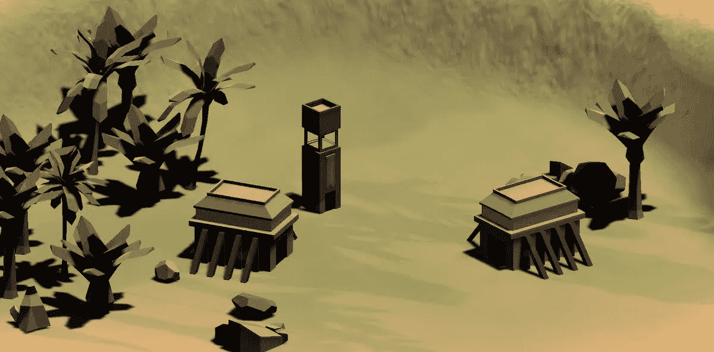

# 我的 RTS 教程的一些(免费)建筑资产！

> 原文：<https://medium.com/geekculture/some-free-building-assets-for-my-rts-tutorial-420aed92369a?source=collection_archive---------15----------------------->

## 今天，发现一些我制作的基本建筑来填充我的 RTS 教程场景:)

几个月来，现在，我每周都在张贴我的系列的新一集 [**如何在 Unity/C#**](/c-sharp-progarmming/making-an-rts-game-in-unity-91a8a0720edc) 中制作 RTS(即时战略)游戏。教程主要关注编程/游戏设计部分——所以如果你对核心感兴趣…