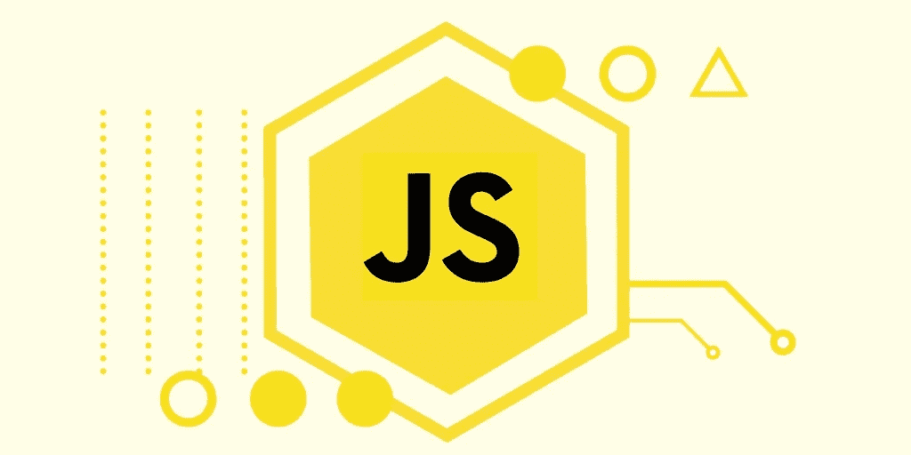

# 你需要知道的一些有趣的 JavaScript 基础知识👇

> 原文：<https://medium.com/geekculture/some-interesting-javascript-basics-you-need-to-know-61198f158e39?source=collection_archive---------31----------------------->

JS along with ES6

## 原始值:

什么是原始值？答案很简单。JavaScript 中除了数字和字符串之外的一切都是原始值。好吗？所以，你可能会想为什么叫它们原始人？原因很难解释，但很容易理解！听起来很困惑？就像那样。😛

好吧，让我试着解释一下。将原始值视为变量，但这些变量的值是可变的，但不可恢复或分配。我的意思是，如果你写一个字符串`i love banana`，它的值可以改变，但不能恢复。一旦更改，该值就不可恢复。有道理？😐

好的，让我们试试另一个例子:`let a = {}`这里你可以改变&赋值给`a`这就是为什么`a`命名对象不是原语。简单来说，原始意味着不可操纵。

## 对象:

对象也是值，但不是原始值。为什么？因为它是可以操控的。上面我已经举了例子。

假设有一个名为`Person`的类，你可以创建一个像`let person = new Person()`这样的对象，但是，你可以操作对象值&给它赋值。但在字符串的情况下，这不会发生。这就是为什么字符串是原语&对象不是。

## 功能:

函数也是原始的，道理是一样的。如果你有一个答案，那么你就明白了。原始值&非原始值在控制台上显示不同。试试&看看这个例子:

`console.log({})` `console.log([])` `console.log((x => x * x))`

它显示了最后一个函数的数据，但是第一个和第二个函数的对象和数组都是空的

## 表情:

什么是表达式？当我们向最亲爱的人表达我们的感情时，那是一种表达，不是吗？😜

然而，在 JavaScript 中，问题的答案是一个表达式。我的意思是，我们问浏览器控制台一个问题&当我们按下 enter 按钮时，控制台给我们一个答案。答案就是表情。例如，如果我们写`console.log(1 + 7)`，浏览器控制台会给我们一个表达式`8`。

再次，`console.log(4 + ‘’)`给出了一个表达式`'4'`

同样地`console.log(‘i love u’ + ‘ haha, just kidding’)`给了我们一个调情的表情😜

## 未定义:

在 JavaScript 中，undefined 是一个将自己的值定义为 undefined 的关键字。有时候。我们在没有初始化的情况下声明了一个变量或常量&后来不知怎么的我们忘记了。因此，当我们需要它们在控制台中的值时，它们会给我们`undefined`作为结果。所以，`undefined`的意思是还没有定义，有意义吗？好酷！

## 空:

Null 是 Undefined 的表亲。我的意思是，它们与价值观非常相似，但它们并不相同。`null`听起来就像`null`(孤独)，因为没有人真正关心 null(像我一样)😔

好吧，让我简化一下。假设你声明了一个变量`let a;`,如果你输入`console.log(a)`,这会给我们`undefined`为什么？因为，你刚刚宣布`a` &忘记了他，所以，他生气了😣

然而，如果你输入`let a = null;` &然后`console.log(a)`现在它会给我们`null`

所以，你可以这样想，`undefined`是无意的失误，另一方面`null`是有意的。如果在没有初始化的情况下声明一个变量，它的值将保持`undefined` 直到你初始化它。但是如果您有意将它的值初始化为`null`，那么它的值仍然为空。

## 类型:

当你不确定一个对象是什么样子，一个表达式是什么样子，或者一个数组是什么样子的时候，类型在 JavaScript 中是很重要的。

JavaScript 中有不同的类型(再读一遍句子)😕

用于数学或计算的数字(`-4, -3, -1, 0, 1, 3, 5, 150`)

用于文本的字符串(`‘hello’, ‘dear’, ‘honey’, ‘la la la’, 'shut up’`)

Undefined ( `undefined`)用于意外丢失的值

Null ( `null`)用于有意缺失的值

用于逻辑运算的布尔值(`true`或`false`)

很少使用的 BigInts & Symbols(不常见的和新的)

这些是 JavaScript 中的一般类型。现在你可能会问数组是什么类型的？好吧，我的朋友，这就是 JavaScript 玩天才游戏的地方。在 JavaScript 中，不仅数组是对象，除了上面提到的以外，其他数组也是对象😉

我们可以对类型做的另一件事是`typeof()`方法。只要打出`let yourValue = 'some value'; console.log(typeof(yourValue)` &(我的意思是写)你就知道`yourValue`是什么类型了。同样，如果你想知道你喜欢的类型，你可以试试这个`console.log(typeof(myCrush)`，但这里你有可能得到一个`undefined` 的结果😒

但是，记住`typeof()`是一个方法，所以要和括号`()`一起使用。有时，没有`()`它会得到正确的结果，但有时不会。所以，还是用它们比较好。

试着用下面这些例子，加上或不加上`()` &你就会明白了

`console.log(typeof(9))` `console.log(typeof(‘my lover’))`

`console.log(typeof(myCrush => myCrush * anotherPerson));`🐸

## 错误处理(尝试和捕捉) :

在编码时，我们有时会遇到一些意想不到的错误。这就是错误处理有用的时候。`try` & `catch`彼此相反。把它们想象成硬币的两面。如果头部是`try`那么尾部是`catch`

try & catch 的基本结构如下所示

`try { // hi, I am code… not some error }`

`catch (err) { // Hi, I am error, handle me}`

如果`try`块中的代码没有错误，则`catch`块被忽略。但如果代码有错误，程序会在发现错误后停止执行代码&跳转到`catch`块。让我简化一下

`try {`

`let a = 5;`

`console.log(a);`

`I love soup but s, o & p are silent ; // this line will give an error`

`}`

`catch (err) {`

`// Now you see me ! yay!`

`alert('you have got an error in your try block, try to fix that');`

`}`

我不认为我需要解释更多，这个例子非常明显。如果你没有得到它，试着把它粘贴到你的控制台上。😛