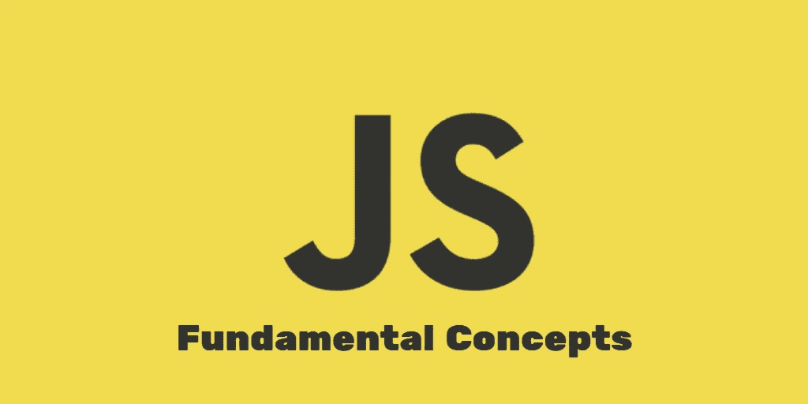

# 一些 JavaScript 基本概念

> 原文：<https://medium.com/geekculture/some-javascript-fundamental-concepts-408e07070218?source=collection_archive---------29----------------------->

## 值的类型

在 Javascript 中，有两种类型的值。一种是原始值，如数字、字符串、未定义、空、符号、BigInts。对象和函数中的其他类型的值。这是 javascript 中存在的两类值。

## 试着…接住

当我们开始编码时，我们总是犯错误来写代码，由于这个原因，我们的代码立即停止工作。为了处理这种类型的错误，javascript 有“try…catch”语法。在“尝试”中，所有代码都将继续运行。如果代码中出现任何错误，那么“try”将停止工作，而 catch 开始工作。catch 将用详细信息包装对象中的所有错误。“尝试…捕捉”让工作流程更简单。

## 风险值申报和提升

当我们在函数中声明一个带有“var”的变量时，可以从函数中的任何地方访问它。因为，无论你在哪里用 var 关键字声明一个变量，它都被当作是在函数的顶部声明的。在“else”中的代码示例中，如果您使用 console.log，您将获得变量“dummyText”的未定义值。这叫吊装。

## 块级声明

块级声明意味着当变量在块范围外不可访问时。当用“let”声明一个变量时，该变量只能在提供的块范围内访问。这里是一个代码示例，在“else”中的 dummyText 是不可访问的。

## 循环中的块绑定

在 JavaScript 中，当我们使用“for”循环时，大多数情况下我们使用“var”声明 I(或任何)变量。但是在 for 循环之外，我可以被访问，这是一个不好的做法。因此，我们应该使用“let”而不是“var”。“let”只能在循环内部访问。它永远不会被举起来。这是一个代码示例，I 可以在循环之外访问，但是 j 不能在循环之外访问。这称为循环中的块绑定。

## 全局块绑定

“var”和“let”、“const”还有一个区别。当我们使用“var”作为全局作用域时，它会创建一个全局对象属性(window)作为新的全局变量。它允许覆盖现有的全局变量。因此，如果我们在全局范围内使用 let，const，就会创建一个全局绑定。它防止在全局范围内覆盖，但允许在全局范围内隐藏。

## 具有默认参数值的函数

一般来说，函数如果有 2 个参数，当函数调用时绕过其中一个参数，其他参数的值将是未定义的。为了解决这个问题，缺省参数是有用的。当函数被调用时，默认参数值是允许的，如果缺少一个参数值，它将采用默认参数值。

## 传播算子

当我们需要将一个数组或对象中的所有数据相加时，我们使用 spread 运算符。扩展运算符允许通过简单地使用(…)三个点来存储数据。这里有一个例子。

## 箭头功能

在 2015 年，ES6 或 ECMAScript 提供了箭头功能。如果你想从函数中返回一个语句，它会变得更短。不使用括号也可以返回值。以下是一些例子:

## JavaScript 中的注释

代码中有两种注释方式。一种是单行注释，另一种是多行注释。一些开发人员编写了不必要的注释，这使得代码更加复杂。去理解。要解决这个问题，请尝试在函数或变量中使用有意义的名称。因为函数或变量的有意义的名称可以增加对代码的更好理解。