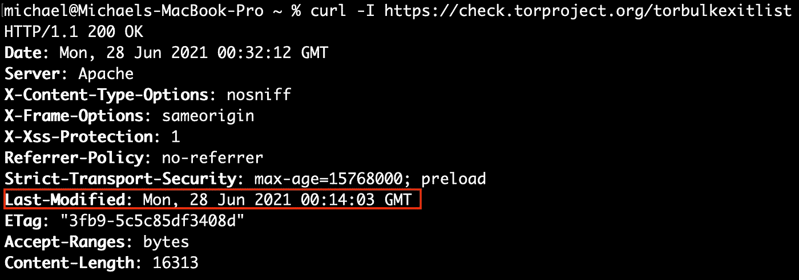
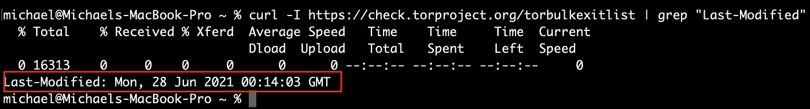

# HTTP 头的一些用例

> 原文：<https://medium.com/geekculture/some-use-cases-for-http-head-5a8126ef98b6?source=collection_archive---------32----------------------->

HTTP HEAD 是一个有趣而强大的 HTTP 方法。

Photo by [Ümit Yıldırım](https://unsplash.com/@umityildirim?utm_source=medium&utm_medium=referral) on [Unsplash](https://unsplash.com?utm_source=medium&utm_medium=referral)

HTTP 是目前最有效、最大、最复杂的系统。

正如乔恩·弗兰德斯在他的书《宁静》中解释的那样。Net *“网络的成功可以部分归功于运气和时机，但它的成功也可以归功于它的架构。Web 的架构基于一些基本原则，这些原则使它从最初的小规模发展到今天的大量信息和功能。”*

# HTTP 头方法到底是什么？

好奇心让我们成为更好的工程师是如此陈词滥调，它必须是真实的。如果您是软件工程师，对 HTTP 协议的本质细节有很好的理解是一项资产，如果您是安全工程师，这一点甚至更重要，因为您可以根据应用程序(或服务)的设计方式来定义威胁模型。

然而，一个好的起点应该是[超文本传输协议 RFC 2616](https://datatracker.ietf.org/doc/html/rfc2616) 。让我们看看 HTTP Head 的定义，它在规范的第 [9.4](https://datatracker.ietf.org/doc/html/rfc2616#section-9.4) 节中定义:

除了服务器不能在响应中返回消息体之外，HEAD 方法与 GET 完全相同。响应 HEAD 请求的 HTTP 头中包含的元信息应该与响应 GET 请求发送的信息相同。该方法可用于获取请求所隐含的实体的元信息，而无需传输实体体本身。这种方法通常用于测试超文本链接的有效性、可访问性、最近的修改。

*在响应中包含的
信息可用于从该资源更新
先前缓存的实体的意义上，对 HEAD 请求的响应是可缓存的。如果新的字段值
指示缓存的实体不同于当前实体(因为
将由内容长度、内容 MD5、ETag
或最后修改的改变来指示)，则缓存必须将缓存条目视为
陈旧*。

*这很有意思，头脑的表现和它不归任何人的差别一模一样。从这个定义中，我们可以看到一组性能用例。*

# *用例:依靠 HTTP 头下载提要*

*为了说明 HTT Head 的强大功能，让我们假设我们想要丰富我们的安全解决方案来监控网络流量，并且我们想要实现一个警报，当有到 tor 出口节点的连接时触发该警报。*

*有几个地方跟踪 tor 出口节点的 IP 地址，但是，对于这个用例，我们将使用来自[https://check.torproject.org/torbulkexitlist](https://check.torproject.org/torbulkexitlist)的官方列表。*

*以下 cURL 命令执行 HTTP head 以获取 tor 出口节点头:*

*https://check.torproject.org/torbulkexitlist 的 curl -I*

**

*HTTP Head*

*顾名思义，HEAD 从服务器返回关于头部的信息，但不返回主体。请注意，通过这种方法，我们还可以对 HTTP 服务器进行指纹识别，这可以用来最大化 Web 应用程序渗透测试的有效性。*

*如果我们想自动下载这个提要，而不知道这个提要更新的频率(和时间)(以保证保持缓存列表最新),那么我们可以依赖 Last-Modified 响应头。*

*这样，我们将最后修改的响应头的值缓存在磁盘中，然后我们可以配置脚本每小时运行一次，对资源执行 HTTP 头，然后将缓存的日期与响应头进行比较。*

*如果响应头值比缓存值新，我们需要运行 HTTP GET 来下载最新的提要并更新缓存。*

*https://check.torproject.org/torbulkexitlist curl-I| grep“最后修改”*

**

*Last-Modified header*

*这样做可以极大地提高性能，想象一下你要下载的资源有多大，如果只有几个 GB 的话！*