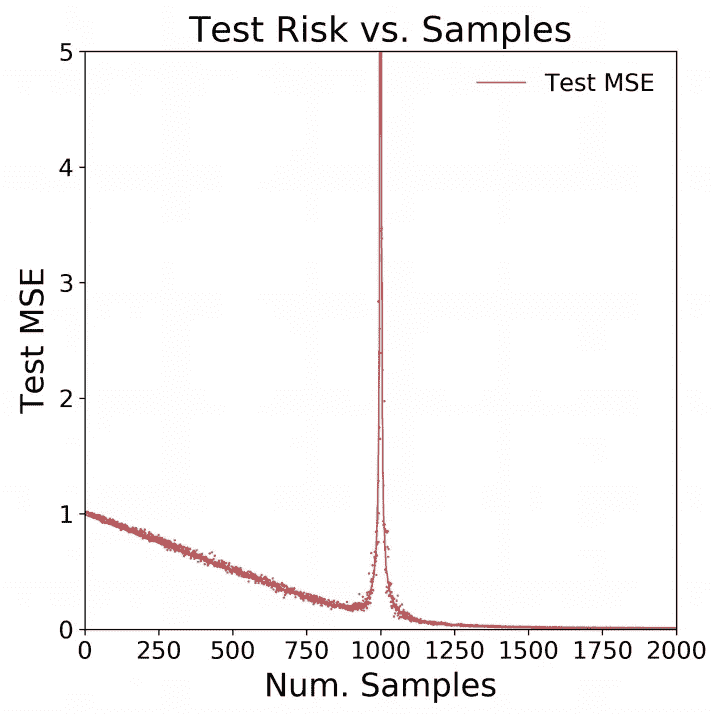

# 有时候，更多的数据会造成伤害

> 原文：<https://medium.com/geekculture/sometimes-more-data-can-hurt-992331559d4f?source=collection_archive---------46----------------------->

## 不信？我也没有！


本·怀特在 [Unsplash](https://unsplash.com/s/photos/wow?utm_source=unsplash&utm_medium=referral&utm_content=creditCopyText) 上的照片

这里有一个提示:在某些情况下，更多的样本实际上会降低模型的性能。不信？我也没有！请继续阅读，看看我是如何使用模拟研究来演示这一现象的。

# 一些背景

最近在我的个人博客上的[帖子](https://iyarlin.github.io/2021/03/09/sparse_matrix_representation_for_ml_in_scale/)中，我讨论了我在工作中开发的一个可扩展的稀疏线性回归模型。它的一个有趣的特性是，它是一个插值模型，这意味着它的训练误差为 0。这是因为它是过度参数化的，因此可以完美地拟合训练数据。

虽然 0-训练错误通常与过度拟合相关联，但是该模型在测试集上表现得相当好。近年来，关于似乎不会遭受过度拟合(特别是在深度学习中)的巨大参数化模型的报告一直在积累，因此关于该主题的文献也在积累。

例如，我自己的模型在没有任何调整的情况下表现最佳。被这种不寻常的行为所吸引，我开始更好地理解发生了什么。在这篇[中期文章](https://towardsdatascience.com/something-every-data-scientist-should-know-but-probably-doesnt-the-bias-variance-trade-off-25d97a17329d)中，我很好地介绍了这个主题。

由于人工神经网络是非常复杂的算法，所以在一个简单的环境中研究这个主题并建立直觉是一个好主意。Preetum Nakkiran 的伟大论文[“更多的数据会对线性回归造成伤害:基于样本的双重下降”](https://arxiv.org/pdf/1912.07242.pdf)对此进行了阐述。

我将简要总结一下问题设置:假设我们有从一个有 1000 个协变量(没有截距)的线性模型中生成的数据。对于每一个样本量 *n* ，我们拟合一个线性回归，并在一个支持测试集上测量 MSE。

在 *n* ≥1000 的情况下，我们采用常规回归模型。在 *n* < 1000 的情况下，我们有 *p* > *n* 并且没有封闭形式的解，因为设计矩阵的逆不存在。

方程 *Y* =X\beta 在这种情况下有无穷多个解。在这些解决方案中，最小化系数 L2 范数||\beta||的解决方案具有最低的方差，因此应该在测试集上具有最佳的性能(在 Nakkiran 的论文中对此有更多描述)。我们可以使用质量包中实现的矩阵 X 的摩尔-彭罗斯广义逆来找到最小范数 L2 解。

下面我们可以看到论文中的模拟结果:我们可以看到 Num 附近的某个地方。样本= 900 当样本数量增加到 1000 时，测试误差实际上增大了:



我发现这个结果有点难以置信！担心这可能是另一个[复制危机](https://en.wikipedia.org/wiki/Replication_crisis)的案例，我决定我必须亲眼看看。因此，在下面我将复制论文的结果。

# 结果复制

首先，我们设置模拟参数:

```
beta <- runif(1000) # real coefficients 
beta <- beta/sqrt(sum(beta^2)) ## convert to a unit vector 
M <- 50 ## number of simulations 
N <- c(2, seq(100, 800, 100), seq(900, 990, 10), seq(991,1000,1), seq(1001, 1009, 1), seq(1010, 1100, 10), seq(1200, 2000, 100)) ## number of observations 
test_MSE <- matrix(nrow = length(N), ncol = M)
```

下面我们进行实际模拟:

```
library(MASS)for (i in 1:length(N)){ 
  for (m in 1:M){ 
    print(paste0("n=", N[i], ", m=", m)) 
    # generate training data 
    X <- replicate(1000, rnorm(N[i])) 
    e <- rnorm(N[i], sd = 0.1) 
    y <- X %*% beta + e 
    if (N[i] < 1000){ 
      # Moore-penrose generalized matrix inverse
      beta_hat <- ginv(X) %*% y 
    } else { 
      dat <- as.data.frame(cbind(y, X)) 
      names(dat)[1] <- "y" 
      lm_model <- lm(y ~ .-1, data = dat) # regular fit 
      beta_hat <- matrix(lm_model$coefficients, ncol = 1) 
    }     # generate test set 
    X_test <- replicate(1000, rnorm(10000)) 
    e_test <- rnorm(10000, sd = 0.1) 
    y_test <- X_test %*% beta + e_test     # measure model accuracy
    preds_test <- X_test %*% beta_hat 
    test_MSE[i, m] <- sqrt(mean((y_test - preds_test)^2)) 
  } 
}
```

让我们画出结果:

```
matplot(N, test_MSE, type = "p", pch = ".", ylim = c(0,5), 
xaxt = "n", xlim = c(0,2000), ylab = "Test MSE", xlab = "Num. Samples") 
axis(1, at = seq(0,2000,250)) 
lines(N, apply(test_MSE, 1, mean), col = "red")
```


令人惊讶的是，我们得到了完全相同的结果！

如果你想了解这背后的理论，去看看这篇论文。

*原载于 2021 年 5 月 23 日*[*https://iyarlin . github . io*](https://iyarlin.github.io/2021/05/23/sample_wise_double_descent_results_reproduction/)*。*