# 不同 ide 的声纳线头

> 原文：<https://medium.com/geekculture/sonar-lint-with-different-ides-f7c926edaea5?source=collection_archive---------15----------------------->

获得编写更好代码的能力

**什么是声纳线头？**

Sonar Lint 是一个对代码进行静态分析的开源工具。使用这个工具，我们可以在开发过程中获得关于代码质量问题的即时反馈。这允许我们在潜在的错误和漏洞被提交到代码库之前解决它们。

Sonar Lint 支持的语言包括 C、C++、HTML、Java、JavaScript、PHP、Python 和 TypeScript。

让我们看看如何将 sonar lint 添加到智能智能中。

1.  打开 IDE 并选择`File -> Settings`

2.选择**设置**后，将出现以下窗口。在搜索栏中选择**插件**并输入**声纳**，点击**安装**。

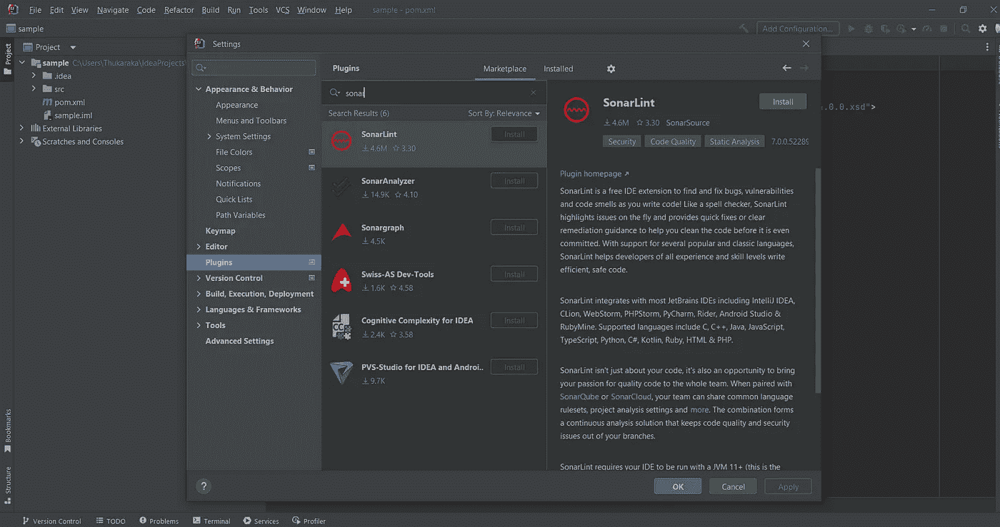

3.然后点击**重启 IDE** 。

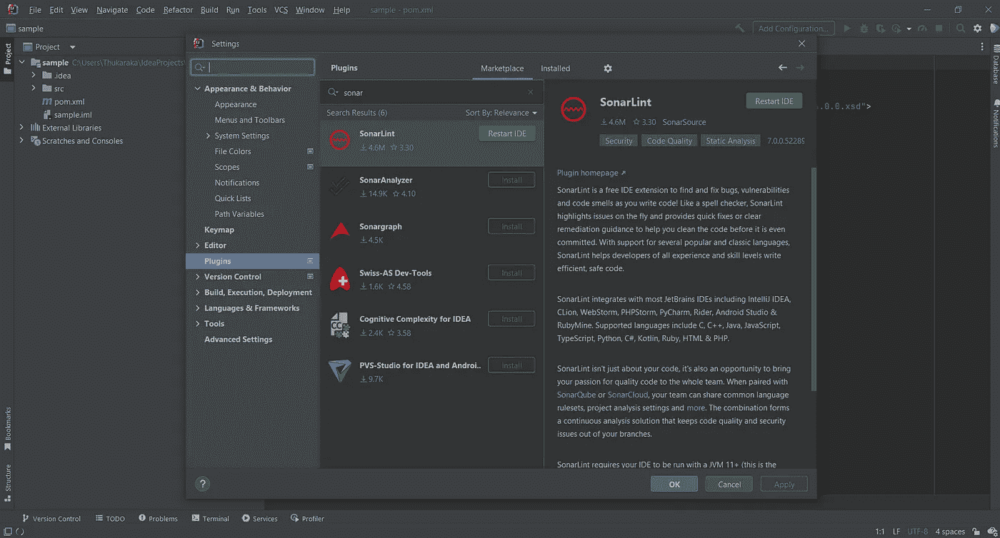

4.之后，如下图所示，你将能够在任务栏中看到 S**on print**。

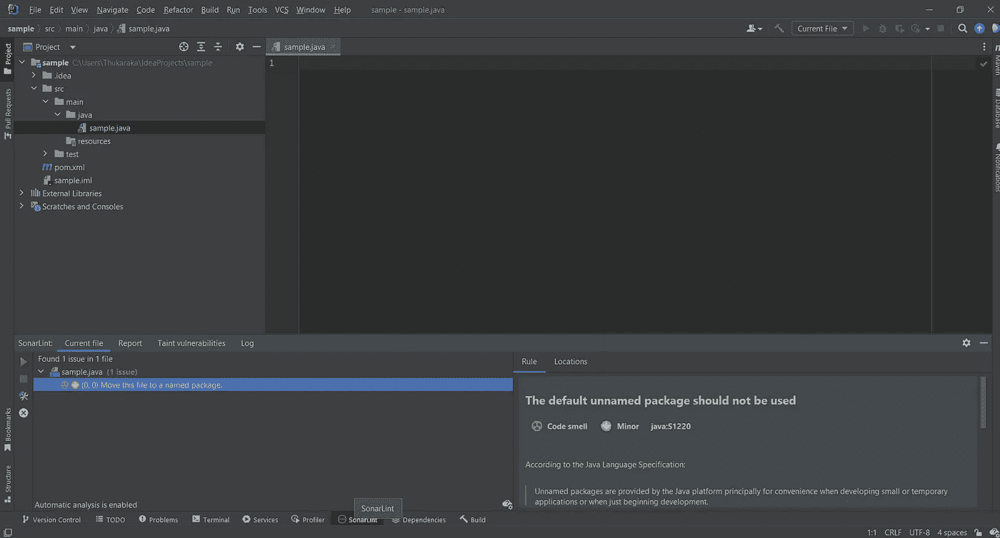

**让我们看看如何将 sonar lint 添加到 NetBeans IDE 中。**

1.  打开 IDE 并选择顶部菜单中的工具。

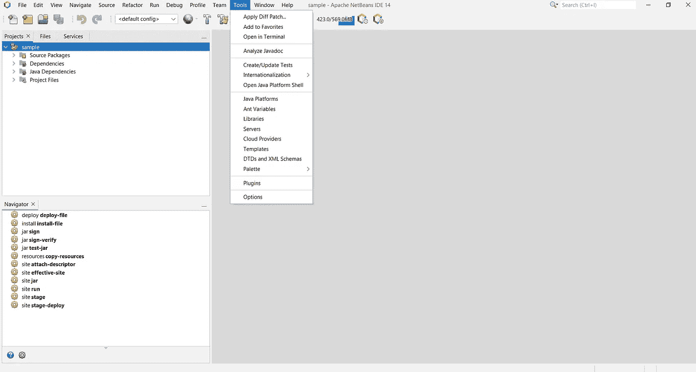

2.然后在下拉列表中选择**插件**。

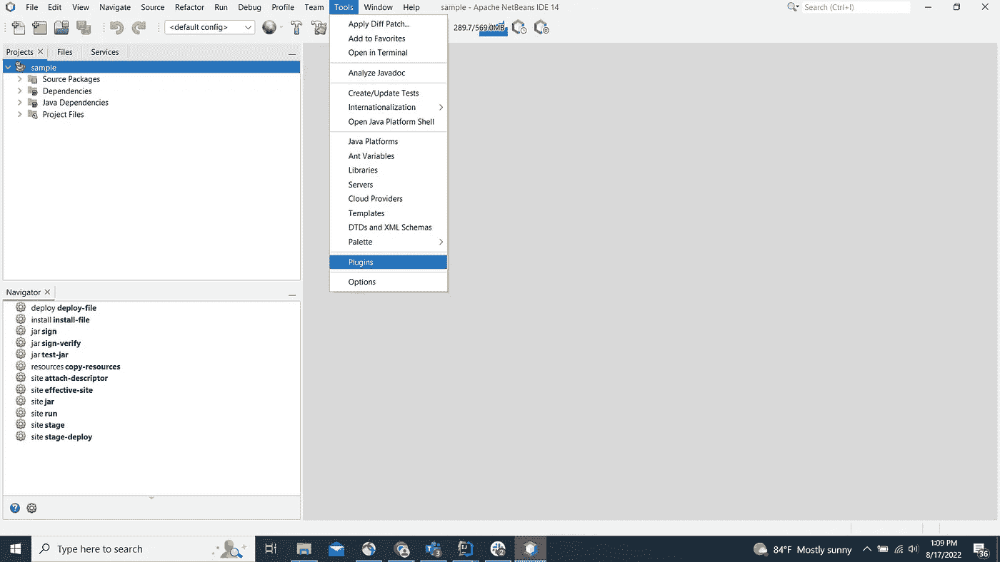

3.然后这个插件弹出窗口会出现，你可以在搜索栏中选择**可用插件**和**T30**声纳**。如果您使用 13.0 或更高版本的 netbeans 版本和 11 或更高版本的 Java，您将能够看到 **sonarlint4netbeans** 。**

4.如果出现，选择复选框，点击**安装**，然后点击**下一步。**

**注意:**如果您在安装时遇到任何代理问题。点击`General`选项卡中的`Tools -> Options` ，选择`No Proxy`单选按钮。

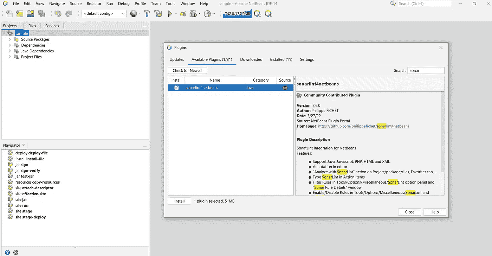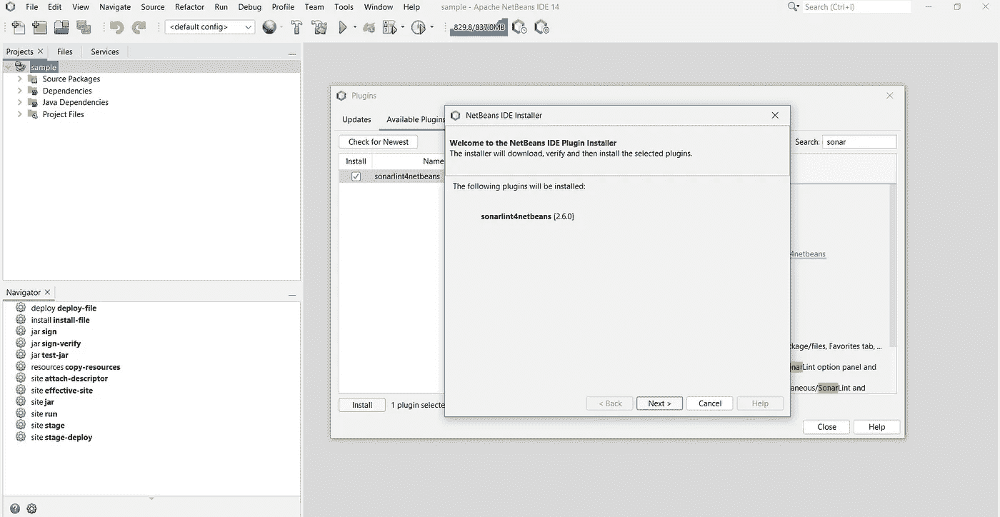

连续点击**下一个**后，会出现如下窗口。根据需要选择重启选项，然后点击**完成**。

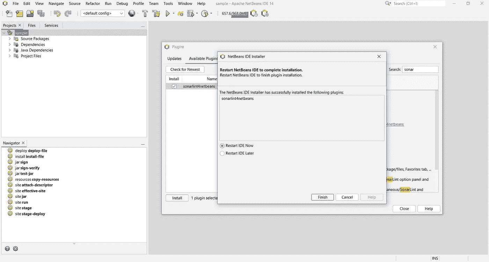

毕竟，您可以通过选择项目，右键单击并选择选项“ **Analyze with SonarLint** ”来分析您的项目。

**让我们看看如何在 Visual Studio 代码中添加 sonar lint。**

1.  打开 IDE 并选择`View -> Extensions`

2.选择**扩展**后，将出现以下窗口。在搜索栏中输入**声纳**并点击**安装**。

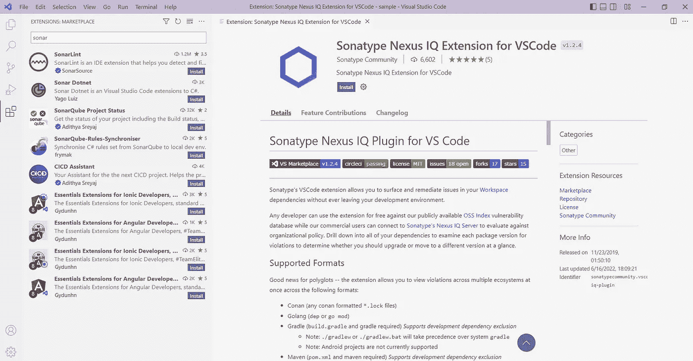

**让我们来看看如何给 Eclipse 添加 sonar lint。**

1.  打开 IDE 并选择`Help -> Eclipse Marketplace`

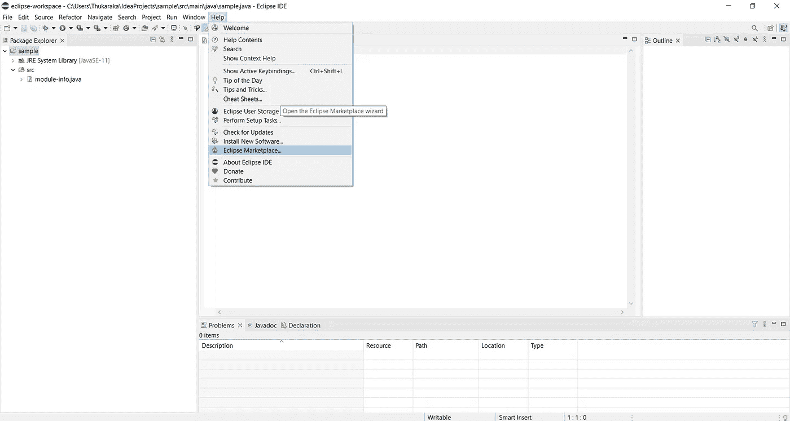

2.选择 **Eclipse Marketplace…** 后，将出现以下窗口。在搜索栏中输入**声纳**，点击**安装**。

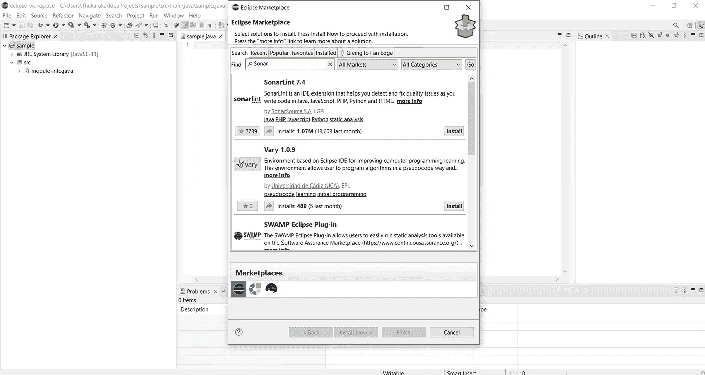

3.**重启**IDE。

感谢您的阅读！希望文章有帮助。

**参考文献**

[1][https://www.sonarlint.org/](https://www.sonarlint.org/)

[2][https://dev blogs . Microsoft . com/premier-developer/real-time-code-quality-with-sonarlint-in-visual-studio/](https://devblogs.microsoft.com/premier-developer/real-time-code-quality-with-sonarlint-in-visual-studio/)