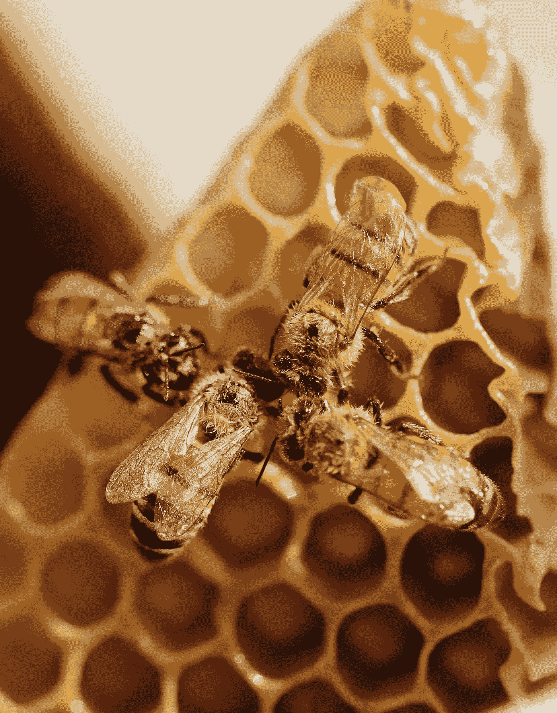
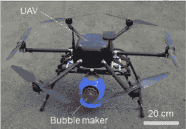
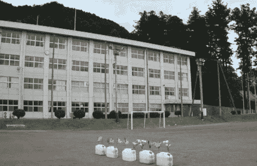
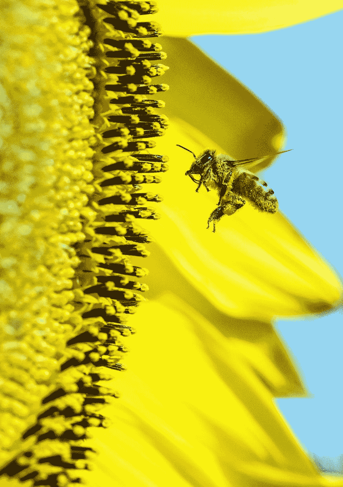
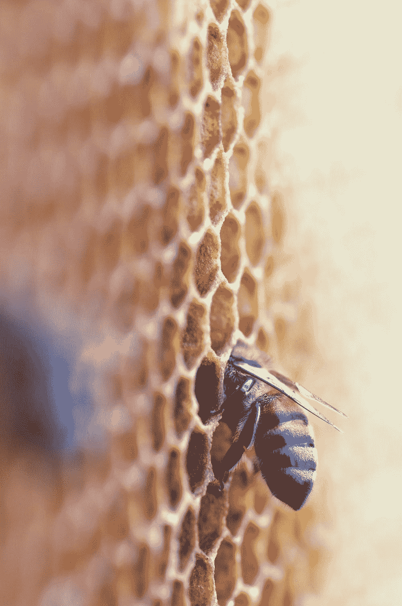

# 抱歉科学，肥皂泡不能代替蜜蜂

> 原文：<https://medium.com/geekculture/sorry-science-soap-bubbles-cant-replace-bees-4c5c64e1d25d?source=collection_archive---------53----------------------->

随着蜜蜂数量的减少，一名日本研究人员发现了一种使用肥皂泡为花朵授粉的方法，但这是蜜蜂的可行替代品吗？

Photo: [Shelby Cohron](https://unsplash.com/@scohron) on [Unsplash](http://www.unsplash.com)

> "如果蜜蜂从地球表面消失，人类最多只能再活四年。"
> 
> ——阿尔伯特·爱因斯坦(据说)

虽然[爱因斯坦不太可能真的说过这句话](https://bees.caes.uga.edu/bees-beekeeping-pollination/other-topics/on-einstein--bees--and-survival-of-the-human-race.html)，但这个观点仍然有效:我们严重依赖蜜蜂。大约[我们三分之一的饮食依赖于由蜜蜂授粉的作物品种](https://www.thebalance.com/bee-colony-collapse-disorder-facts-and-economic-impact-3305815)。蜜蜂为美国农业贡献了近 200 亿美元，帮助农民提高作物产量和质量。虽然包括樱桃和蓝莓在内的一些作物主要依靠蜜蜂授粉，但其他作物则完全依赖蜜蜂，如杏仁。蜜蜂也为草类植物授粉，如三叶草和干草。蜜蜂的减少意味着这些作物的授粉减少，这增加了饲养奶牛的成本，使你的牛奶和牛肉更加昂贵。当然，亲爱的。

不幸的是，蜜蜂的数量在下降。2019 年，[美国养蜂人因](https://www.thebalance.com/bee-colony-collapse-disorder-facts-and-economic-impact-3305815)[蜂群衰竭失调](https://en.wikipedia.org/wiki/Colony_collapse_disorder)损失了近 36%的蜜蜂。这种疾病是由病毒、杀虫剂和杀真菌剂引起的，它们会削弱蜜蜂的免疫功能，使它们容易感染疾病。然而，这并不是蜜蜂损失的唯一原因。其他原因还包括[栖息地变化、营养不良、害虫入侵等等](https://www.epa.gov/pollinator-protection/colony-collapse-disorder)。在过去的六年里，养蜂业已经花费了 20 亿美元来替换蜂箱。

Dr. Miyako’s experimental set-up: [Yes, that’s a kids’ bubble maker tied to a drone](https://www.cell.com/iscience/fulltext/S2589-0042(20)30373-4).

日本研究人员宫古英次郎博士可能发现了植物授粉的另一种方式。在看儿子玩肥皂泡的时候，宫古博士突发灵感。他决定创造一种“化学功能化”的气泡，这种气泡可以将 2000 个花粉粒运送到计划中。该结果的成功率类似于通常在没有蜜蜂的情况下进行的手工授粉(手工使用羽毛刷将花粉从一株植物转移到另一株植物)。

[Dr. Miyako’s experimental set-up of a drone spreading pollen-filled soap bubbles over flowers](https://www.cell.com/iscience/fulltext/S2589-0042(20)30373-4).

在开始评论之前，我想承认这个解决方案是多么的异想天开和梦幻。).不难想象一个自然和技术协同工作的未来社会:毛茸茸的小蜜蜂在彩虹色的泡泡中飘荡，在花间嗡嗡作响，而我在嚼加州杏仁。不幸的是，现实远没有这么乐观。

像大多数技术解决方案一样，宫古博士的泡沫提供了一个临时的、治标不治本的解决方案，解决不了蜜蜂损失背后的根本原因。雷丁大学的西蒙·波茨博士(咯咯地笑)赞同我的观点:

> “这是另一项被强行推出来解决问题的智能工程，而这个问题可以通过许多更有效、更可持续的方式来解决。”
> 
> -西蒙·波茨博士，农业生态学家

在[他关于为什么无人机不能取代生物多样性的论文](https://pubmed.ncbi.nlm.nih.gov/29909334/)中，Potts 博士和他的同事们概述了技术手段不能解决蜜蜂问题的几个原因。尽管他特别提到了机器蜜蜂的使用(这可能比肥皂泡蜜蜂更酷)，但许多相同的论点仍然适用。

Photo: [Stefano Ghezzi](https://unsplash.com/@steghe) on [Unsplash](http://www.unsplash.com)

**1。泡泡不能取代蜜蜂最擅长的**

世界上有超过 350，000 种花卉植物需要授粉，每一种都有其复杂而独特的授粉需求。Potts 博士说，反过来，这些植物依靠传粉者的几种物种来帮助它们以我们尚不了解的方式繁殖。假设泡沫可以复制一个复杂的过程是一百万年进化的结果是天真的。

Photo: [David Clode](https://unsplash.com/@davidclode) on [Unsplash](http://www.unsplash.com)

**2。这对我们和环境来说都很昂贵**

让我们做一些快速的麦肯锡式的数学计算。我们知道已经花费了 20 亿美元来拯救 1000 万个蜂箱。与这种方法相比，Potts 博士估计，使用技术，拯救一只蜜蜂的成本最低为 10 美元。假设一个蜂箱平均有 60，000 只蜜蜂，使用技术拯救 1000 万个蜂箱将花费 6 万亿美元。我承认我的数学可能差得很远，但考虑到携带泡泡制造者的无人机所需的额外维护成本。此外，对于发展中国家以农业为生的 20 亿人来说，这种技术很可能过于昂贵；只有高收入国家才能从蜜蜂的电子替代品中受益。

与无人机和塑料泡泡发生器一起工作会对环境造成损害。Potts 博士认为，从原材料的提取到不断扩大的废弃机器最终将被填埋，环境成本是另一个需要考虑的因素。

Photo: [Wolfgang Hasselmann](https://unsplash.com/@wolfgang_hasselmann) on [Unsplash](http://www.unsplash.com)

**3。即使我们解决了蜜蜂授粉的问题，杀虫剂的其他负面影响呢？**

依靠肥皂泡，我们将允许人类继续从事已经被证明对蜜蜂具有毁灭性的相同行为。即使蜜蜂可以被泡沫取代，我们的做法仍然会以其他多种方式对生态系统产生破坏性影响。

杀虫剂的广泛使用与几个负面的健康和环境问题联系在一起[。栖息地的丧失会增加我们接触致命病原体的机会。解决蜜蜂的问题不会解决人类的问题。](https://www.ncbi.nlm.nih.gov/pmc/articles/PMC4947579/)

似乎其他研究人员也认为用技术手段完全取代蜜蜂不是一个好主意:

> “我们不希望取代蜜蜂或任何其他自然授粉者。我们试图做的是对它们进行补充。”
> 
> —机器人专家余去

虽然我完全支持使用技术来支持可持续解决方案，但我担心保护工作的资金问题。优秀的蜜蜂能比得上绑在无人机上的授粉泡泡的性感吗？无人机已经成为风险投资家的宠儿。即使我们设法拯救了可爱的毛茸茸的蜜蜂，那么其他不那么吸引人的授粉者呢？

我们倾向于快速解决问题，而不是处理丑陋的事实:我们的行为会对环境和我们共享的物种产生影响。在我对人类杀害地球过于情绪化之前，我想用女王本人的标志性话语对蜜蜂说几句话:

> “你是不可替代的。”
> 
> —贝伊女王