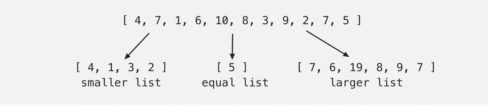
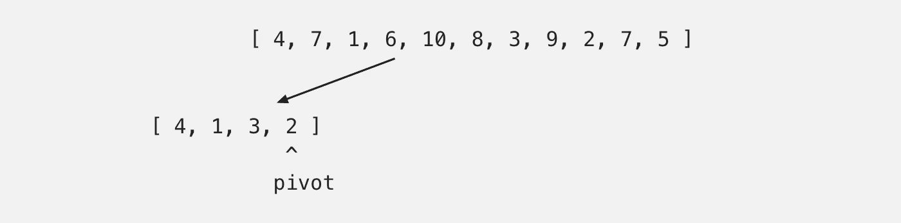
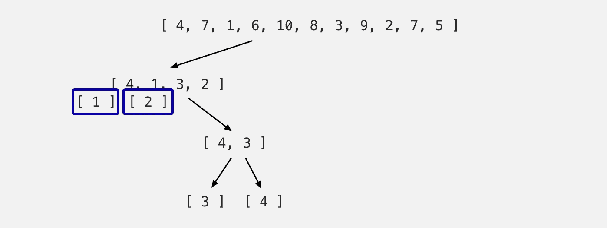
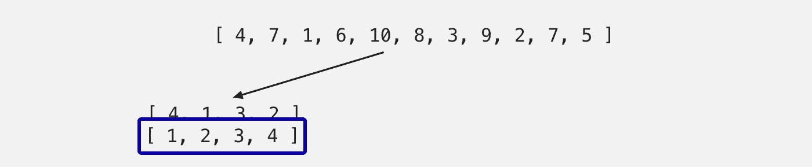
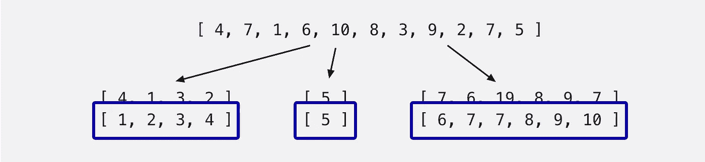

# 排序算法 101:快速排序

> 原文：<https://medium.com/geekculture/sorting-algorithms-101-quick-sort-9550aca7922e?source=collection_archive---------29----------------------->


Photo by [Robin Pierre](https://unsplash.com/@robinpierre?utm_source=medium&utm_medium=referral) on [Unsplash](https://unsplash.com?utm_source=medium&utm_medium=referral)

我们已经到达了我的五部分排序算法系列的最后一个主题！今天，我们终于讨论了快速排序——五种排序算法中最流行的一种。如果您还没有机会复习前四种排序算法，不要担心，我们可以从这里重新开始。你需要知道的就是递归的概念。

如果你想快速回顾一下我们到目前为止所做的一切，下面有一个:

1.  [冒泡排序](/codex/sorting-algorithms-101-bubble-sort-cfc7df8fb6aa)在其迭代中找到*最大的*未排序数，并将其移动到数组的末尾。它的时间复杂度为 O(n2)。
2.  [选择排序](/@freda.hon/sorting-algorithms-101-selection-sort-778c201e330a)在其迭代中找到*最小的*未排序数，并将其移动到数组的开头。这也具有 O(n2)的时间复杂度。
3.  [插入排序](/geekculture/sorting-algorithms-101-insertion-sort-ee585f6a62cf)使用一个键，并将其与该键左侧的数字进行比较。如果键左边的数字小于键上的数字，则发生交换。同样，它的时间复杂度也是 O(n2)。
4.  [归并排序](/nerd-for-tech/sorting-algorithms-101-merge-sort-d28e98a4080)取一个数组，把它分成两半，直到一个元素组成它自己的数组。然后，当每个元素合并回一个新的排序数组时，该算法对它们进行比较和排序。归并排序的时间复杂度为 O(nlog(n))。
5.  额外收获:[递归](/codex/a-quick-guide-to-recursion-b84fdaf6986d)是一种解决问题的方法，其解决方案依赖于同一问题的较小实例的解决方案。在递归中，*函数将调用自身，直到遇到一个基本情况*。

我希望这对你是一个很好的复习。如果你准备好了，让我们开始快速排序！

# 快速排序:工作原理

快速排序使用枢轴。枢纽通常是列表中的第一个或最后一个元素，但也可以是随机元素(由开发人员决定)。一旦指定了一个轴心，所有小于该轴心的元素将被排列到该轴心左侧的数组中。同时，所有大于轴心的元素将被放在右边的数组中。最后，等于枢轴的所有元素将被插入到中间数组中。

与合并排序类似，快速排序也使用分治策略。现在，我们的列表被分成三个独立的列表(较小的、相等的和较大的)，然后算法将调用自身(递归)，并对较小的和较大的列表重复这个过程(因为相等的列表将位于中间并包含相同的数字，所以它不再需要排序)。只有当每个单个元素组成一个自己的数组时，才满足基本情况。此时，单个元素被排序并返回给调用它的人(前一步)，并合并回一个列表。

让我们通过下面的例子来更好地了解这一点。我们将选择最后一个元素作为轴心:

```
list = [ 4, 7, 1, 6, 10, 8, 3, 9, 2, 7, 5 ]
                                        ^
                                      pivot
```

分配透视后，算法将从数组的开头开始比较。因为(4)小于(5)，所以(4)将被移到(5)左侧的较小列表中。相反，(7)大于(5)，将被移到(5)的右边。

```
 4, 7, 1, 6, 10, 8, 3, 9, 2, 7, 5 
                                                 ^
                                               pivot 4, 5, 7
```

继续讨论(1)。由于(1)小于(5)，它将被移到(5)左侧的较小列表中。

此时，我们的列表应该是这样的:

```
 4, 7, 1, 6, 10, 8, 3, 9, 2, 7, 5 
                                                 ^
                                               pivot
                            4, 1, 5, 7 
```

让我们快进一点。当我们遍历整个数组时，我们只剩下:

```
 4, 1, 3, 2, 5, 7, 6, 10, 8, 9, 7
```

这是:



如您所见，这些数字被附加到每个数组的末尾。所以在迭代结束时，我们的列表还没有完全排序。这就是为什么算法会调用自身来重复每个列表上的过程。

为了简单起见，让我们忽略相等的和较大的列表，先只看较小的列表。枢纽被分配给列表的最后一个元素，也就是(2)，我们重新开始比较。



由于(4)大于(2)，它将被放在一个更大的列表中，在(2)的右边。(1)将出现在(2)左侧的较小列表中，而(3)将被追加到(4)后面的较大列表中。


由于[1]和[2]是单个元素，不能拆分，因此到达基本情况并返回到上面的步骤。同时，[4，3]，以(3)为支点再拆分一次，由于(4)大于(3)，所以放在一个更大的列表中，在(3)的右边。



[3]和[4]现在到达基本情况，并返回到调用它的步骤，[4，3]，然后返回到[4，1，3，2]。



如你所见，这些数字现在已经按顺序排列了。

将此应用于原始的较大列表，我们得到以下结果:



记住，这个递归调用不需要在相等列表上调用，因为它已经被排序了。

将它们合并在一起，您会得到一个完全排序的列表:

```
[ 1, 2, 3, 4, 5, 6, 7, 7, 8, 9, 10 ]
```

# 算法

好了，现在你已经理解了快速排序是如何工作的，让我们来看看实现它的算法。下面的代码将用 python 编写，但是您应该能够将相同的逻辑应用于任何其他语言。

以下是我们需要在算法中完成的任务列表:

1.  指定一个轴心
2.  创建更小、相等和更大的子阵列
3.  遍历数组
4.  将每个元素附加到上面适当的子数组中
5.  将上述所有四个步骤应用于每个后续子阵列(在分而治之的过程中),并建立一个基础案例

列表中的前两个似乎很容易首先避开:

```
def quick_sort(arr):
    pivot = arr[-1]
    smaller, equal, larger = [], [], []
```

对于我的 pivot，我使用[-1]的索引来引用数组的最后一个元素。

为了划掉列表中的第三项，我们知道对应于*——循环非常适合遍历数组。所以，让我们包括这个:*

```
def quick_sort(arr):
    pivot = arr[-1]
    smaller, equal, larger = [], [], []

    for num in arr:
```

现在，当我们遍历数组时，我们希望发生什么呢？将每个元素附加到适当的子数组(更小、相等或更大)。因此，让我们为比较建立一个*if*-语句，并在必要的地方添加元素:

```
def quick_sort(arr):
    pivot = arr[-1]
    smaller, equal, larger = [], [], []

    for num in arr:
        if num < pivot:
            smaller.append(num)
        elif num == pivot:
            equal.append(num)
        else: 
            larger.append(num)
    return smaller + equal + larger
```

太棒了。到目前为止看起来很好，我们就快到了。让我们完成清单上的最后一项。

我们上面所做的只是将我们的原始数组分成更小、相等和更大的子数组。如果你没记错的话，我们需要这个过程来继续把数组分解成单元素数组。我们可以递归地这样做，并将每个元素返回到调用它的步骤。

```
def quick_sort(arr):
    pivot = arr[-1]
    smaller, equal, larger = [], [], []

    for num in arr:
        if num < pivot:
            smaller.append(num)
        elif num == pivot:
            equal.append(num)
        else: 
            larger.append(num)
    return quick_sort(smaller) + equal + quick_sort(larger)
```

最后，我们不要忘记基本情况，否则我们的算法将永远无法逃脱递归调用:

```
def quick_sort(arr):
    if len(arr) < 2:
        return arr
    else:
        pivot = arr[-1]
        smaller, equal, larger = [], [], []
        for num in arr:
            if num < pivot:
                smaller.append(num)
            elif num == pivot:
                equal.append(num)
            else: 
                larger.append(num)
        return quick_sort(smaller) + equal + quick_sort(larger)array = [ 4, 7, 1, 6, 10, 8, 3, 9, 2, 7, 5 ]
print(quick_sort(array))
```

就是这样！那还不算太糟，是吗？

# 时间复杂度

对于最佳和一般情况，快速排序的时间复杂度为 **O(nlog(n))** 。最坏情况下，时间复杂度为 O(n2)。

最坏的情况是什么？对于我们上面的策略，有三种最坏的情况，导致时间复杂度为 O(n2):

1.  数组已经排序，最后一个元素被选作轴心
2.  对数组进行反向排序，选择第一个元素作为枢纽
3.  数组中的所有元素都是相同的

记住，(n)代表数组中元素的数量。在上述所有三种情况下，算法都必须迭代*每个*元素 *(n)* 次。这使得(n) x (n)或 O(n2)。

那么，对于最佳情况或一般情况，我们如何得到 O(nlog(n))呢？

每个分离级或步骤代表(n)个操作，因此在每个步骤*具有 O(n)的时间复杂度。*由于我们在每一步将我们的列表一分为二以产生(n)个列表，这等同于 log(n) *总步骤*。

把*的每一步*和*的总步数*放在一起，我们得到(n×log(n))，一个时间复杂度为 **O(nlog(n))** 。

如果您还记得，合并排序的时间复杂度为 O(nlog(n))，包括最坏的情况。那么，为什么快速排序实际上具有最好的性能呢？简单地说，最坏的情况对于快速排序来说是极其罕见的，而且肯定有办法防止最坏的情况发生。此外，与合并排序相比，快速排序的运行时间通常更快。

好吧，那就结束了。希望这个由五部分组成的系列是对排序算法的一个很好的介绍和基础。这是一次相对较浅的潜水，但足以让你开始。

如果你对更流行的技术面试话题感兴趣，我将很快开始另一个关于数据结构的系列。敬请期待，快乐编码！