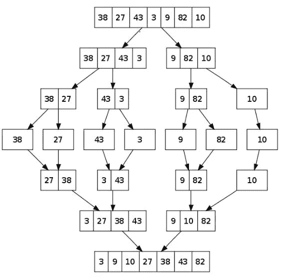

# 排序算法:Golang 中的合并排序

> 原文：<https://medium.com/geekculture/sorting-algorithms-merge-sort-in-golang-2ae73ff07906?source=collection_archive---------15----------------------->

合并排序是一种非常流行的排序算法。它基于分而治之的方法，也就是说，在这个算法中，你把数组分成相等的两半，直到每一半只有一个元素。分割数组后，开始递归合并它们，直到得到一个排序后的数组。

下面的示例展示了合并排序的工作方式:



Working of Merge Sort

**Go 中合并排序的实现:**

我们使用递归编写合并排序代码，我们称之为合并排序，直到每一半都包含一个元素。当每一半只有一个元素时，我们就调用 merge 操作来合并两个未排序的数组，直到我们得到完整排序的数组。在合并操作中，我们被给定两个未排序数组的开始、中间和最后的索引，我们创建两个数组命名为左和右子数组，并开始合并它们。合并操作的空间**复杂度是 O(n)** 因为我们需要用于左右子阵列的空间。当我们运行循环直到数组的长度时，合并操作的时间**复杂度也是 O(n)** 。

```
package main
import "fmt"
func Merge_sort(A *[]int,start int,last int){
    if start<last{
       mid :=(start+last)/2
       fmt.Printf("mid is:%d",mid)
       Merge_sort(A, start, mid)
       Merge_sort(A,mid+1,last)
       Merge(A,start,mid,last)
       PrintArr(A)
    }
}
func Merge(A *[]int,start,mid,last int){
   n1:=mid-start+1
   n2:=last-mid
   l:=make([]int,n1 )
   r:= make([]int, n2)
   for i:=0;i<n1;i++{
     l[i] = (*A)[start+i]
   }
   for j:=0;j<n2;j++{
     r[j] = (*A)[mid+1+j]
   }
   i:=0
   j:=0
   k:=start
   for i<n1 && j<n2{
     if l[i]<r[j]{
        (*A)[k] =l[i]
        i++
        k++
     }else{
        (*A)[k]=r[j]
         j++
         k++
     }
  }
  for i==n1 &&j<n2{
     (*A)[k] = r[j]
      j++
      k++
  }
  for j==n2 &&i<n1{
     (*A)[k] = l[i]
      i++
      k++
  }
}
func PrintArr(A *[] int){
    for i:=0; i<len(*A);i++{
       fmt.Printf("A[%d]:%d\n", i ,(*A)[i])
    }
}
func main(){
    A:=[]int{38,27,43,3,9,82,10}
    Merge_sort(&A, 0,(len(A)-1))
    fmt.Printf("Array after merge sort:\n")
    PrintArr(&A)
}
```

**合并排序是一种非位置算法**，因为它在合并操作中使用额外的内存空间来排序。**它是一个内部排序**算法，因为它不改变相似元素的顺序。**归并排序算法的时间复杂度为 O(n*log(n))** 因为归并操作称为 O(log(n))时间。**归并排序的空间复杂度为 O(n)** [(O(n)(由于归并操作)+O(log(n))(由于用于递归的堆栈空间)= O(n)]。

如果你喜欢这篇文章，那就鼓掌跟帖吧。