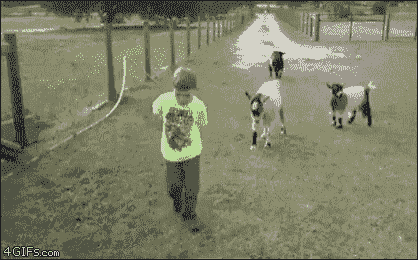
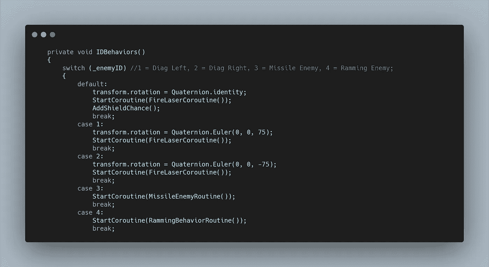
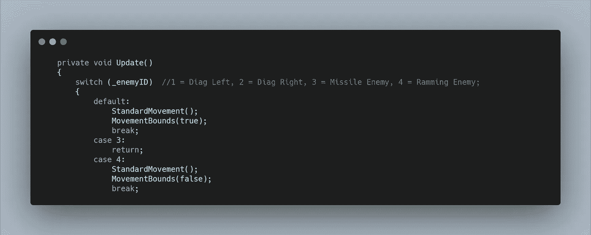
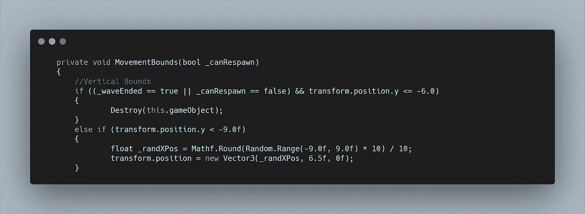
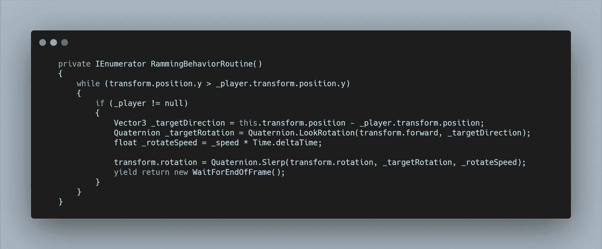
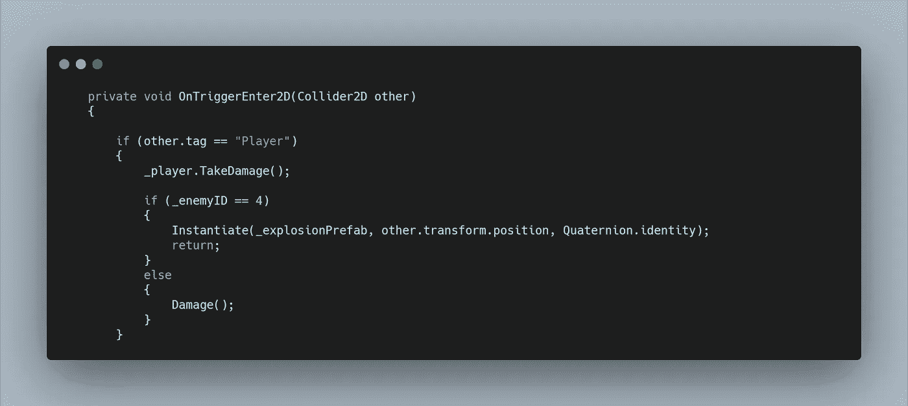
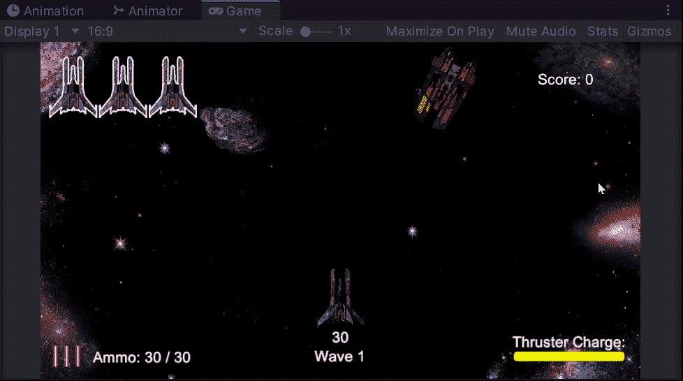

# 太空射击挑战:侵略性的敌人类型

> 原文：<https://medium.com/geekculture/space-shooter-challenge-aggressive-enemy-type-b3424ff5ccf9?source=collection_archive---------59----------------------->

是时候开始增加更多的敌人了！今天的挑战是增加一个试图冲撞玩家的攻击性敌人类型。我找到了一艘看起来合适的船，可以处理损害，并开始工作。

我用新精灵创建了一个新的**敌人预置**，然后通过它的 **ID 分配基本功能。**行为明智我想要一个新的**协程**我稍后会写。

然后在移动方面，我希望新的敌人一直向下移动，我会改变它在**协程**中的旋转，但我总是希望它继续向前移动。根据**移动边界方法**，我建立了一个要传入的**布尔值**。

这个**按钮**已经被设置为辨别**敌人类型**是否再次出现在屏幕顶部。

现在来看看**协程。**当**玩家**在**敌人面前时，我想要一个持续更新的旋转。**敌人总是在屏幕的顶部出现，所以我可以直接运行代码**而**这是真的，一旦它经过玩家，那么**协程**将会结束，但是**移动方法**将会继续。

在 **while 循环**中，我首先检查玩家是否为空，这样可以防止玩家在敌人出现时死亡的奇怪行为。然后我使用了一个与我的**导弹行为**类似的系统，其中我设置了一个**矢量 3 方向，**然后基于这个方向设置了一个**四元数**。在使用**球形线性插值(Slerp)** 在**当前旋转**和**目标旋转之间改变**敌人旋转**之前，我也为旋转过程创建一个步进速度。**每帧循环一次。

最后，我不希望这艘船充当神风特攻队飞行员，所以在**碰撞方法中，如果**敌人 ID**是侵略性敌人的 ID** ，它会产生爆炸，然后返回。

它可能看起来不太完美，但功能是到位的！

在写这篇文章的时候，我在考虑让玩家拖延时间，然后敌人可以停下来，后退，躲避。很想听听大家的意见！

