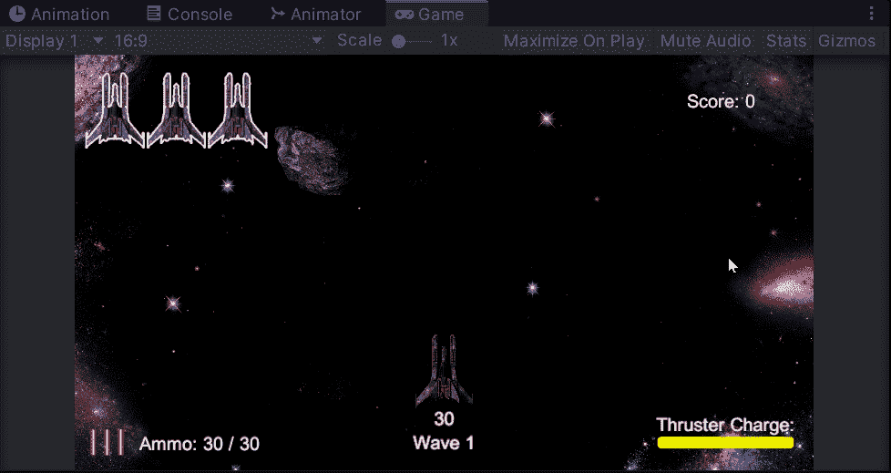
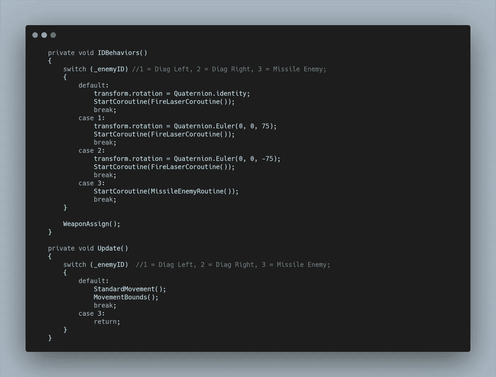
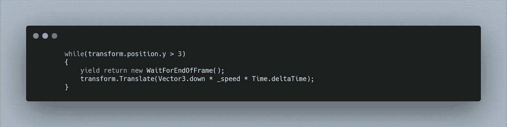
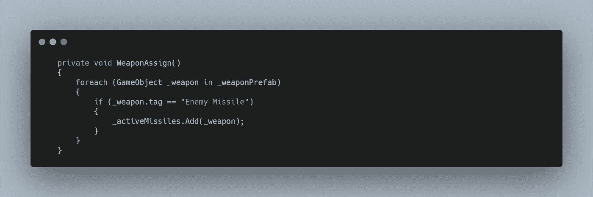
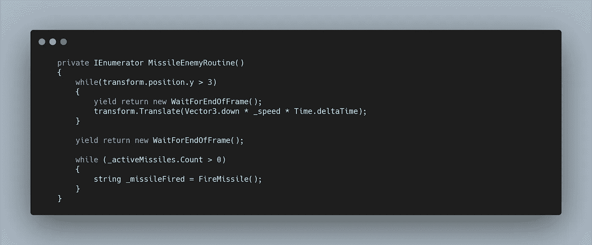
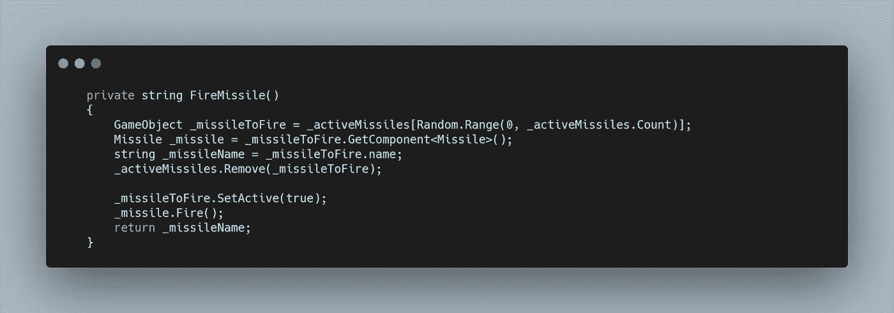
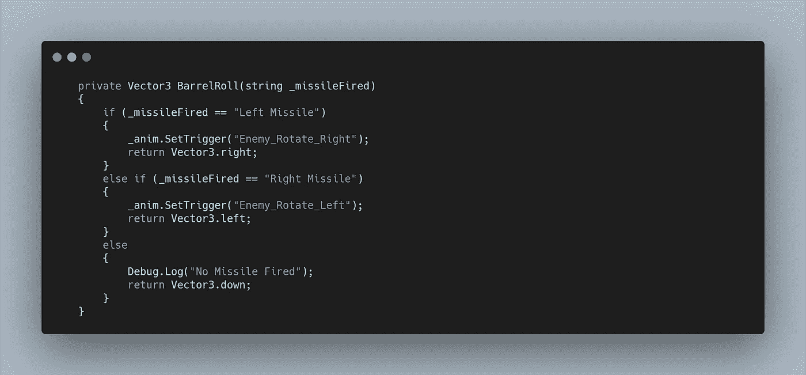
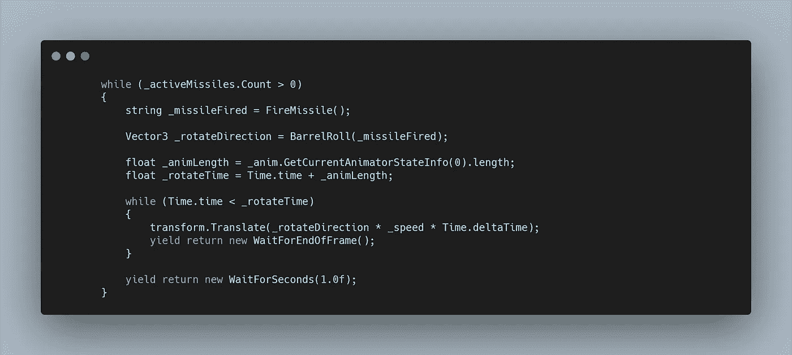
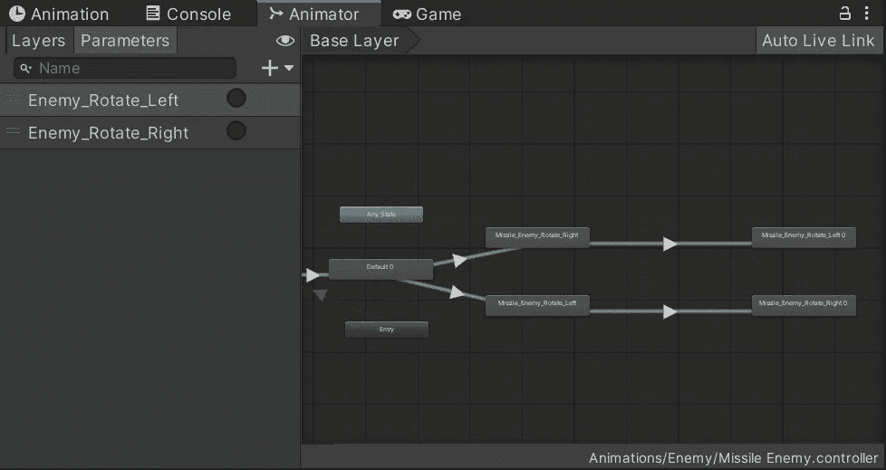

# 太空射击挑战:新的敌人类型

> 原文：<https://medium.com/geekculture/space-shooter-challenge-new-enemy-type-a7bf9013f396?source=collection_archive---------71----------------------->

我的下一个挑战是创造一个全新的敌人类型，具有独特的抛射和运动行为。当然，我给了自己最大的挑战，创造了你在上面看到的敌人。它需要各种不同的元素来拼凑，本文将尽最大努力展示每个元素的概况。

首先，我必须选择一个敌人。就像我的导弹一样，我发现的敌人是一个 3D 物体。所以我将它导入**搅拌机**并添加材料，这样它看起来就像我从**文件库**下载到 **Unity** 中的**预制品**一样。然后我移除了默认情况下在上面的导弹，并在**文件库**上找到了一个我可以使用的新导弹。

我想让**敌人**做桶滚，这意味着渲染各种旋转，这样我就可以在我的 **2D 游戏**中使用**动画精灵**。当每一枚导弹发射时，我也需要这些动画来跟随。所以我为机翼上的导弹数量的每次迭代渲染一个。

现在我可以从团结开始了。我复制了我的**敌人预置**，把**精灵**换成了我的新**敌人。我想利用我已经建立的许多行为，因此使用了相同的敌人脚本。**给**敌人分配一个新的 ID 3，**我可以给我的**ID behaviors Switch 语句添加一个新的 case。**我还将对 **Start** 和 **FireLaserCoroutine** 的调用移动到每个适当的情况，而不是 **Start 方法。然后在第三种情况下，我可以启动一个备用的**协程**来处理新的敌人行为。**

我还改变了我的**更新方法**，这样这个新的敌人类型就不会调用**移动方法**，使用另一个**开关语句。**

现在来说说**导弹。我想让敌人在产卵的时候移动到某个点，然后停下来发射导弹，做滚桶动作。所以我从一个 **while 语句**开始，允许**敌人**正常移动。**

一旦这个循环结束。我想发射一枚导弹，然后向相反的方向滚动枪管，重复发射。我将我的**武器预设游戏对象变量**转换成一个**数组，**将我设置的**左**和**右**导弹添加到**新敌人预设中。**然后我创建了一个名为 **WeaponAssign** 的新方法，如上面的 **IDBehaviors 中所见，**这个**方法**检查**数组**中每个对象的**标签**，如果是导弹，就将其添加到**列表中，类似于**玩家导弹的**。**

回到我的**协程，**我可以检查这个**列表**是否被填充，**当**被填充时，发射一枚导弹。我想再次像玩家一样随机选择一方开火，但是我也想向相反的方向滚动，所以我需要知道哪一方被开火了。因此，我的 **FireMissile 方法**将**返回一个字符串**，我可以用它来滚动桶。

**FireMissile 方法**与**玩家脚本**中的相同方法非常相似，只是增加了获取和返回名称作为**字符串。**

到目前为止，我有一个敌人，他会在屏幕上移动，停下来，然后发射两枚导弹。

为了创建桶滚，我创建了各种**动画**，然后在**协程中，**我可以将**字符串变量**传递到一个**桶滚方法**中，该方法返回一个**向量 3** ，稍后我将使用它在动画发生时水平移动敌人。

然后当**动画**发生时，回到**协程**中，我可以在适当的方向水平移动敌人。

为了让动画师工作，我必须创建两条独立的路径，触发器调用并设置这两条路径。这需要做大量的试验，比如淡入淡出时间和禁用循环等等，因为我对动画控制不是很精通。以后要多学习的东西！

最后，我需要敌人离开屏幕。因为它没有办法再战斗了，我想让它快点消失。所以在导弹计数达到 0 并且 **while 循环**结束后，我启动了一个新的**协程**叫做**endmissilenemyroutine。**

在这个例程中，我启用了**推进器、**和它的**音频。**然后**当**敌人 **Y 位置**还在屏幕上的时候，我以双倍的速度向下移动敌人，然后我可以**摧毁**目标**。**