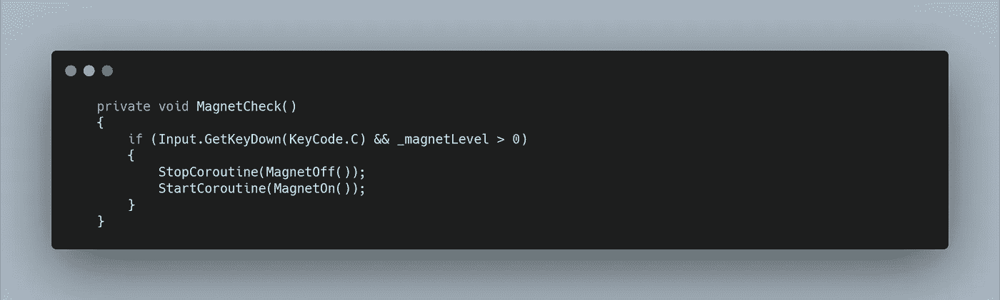
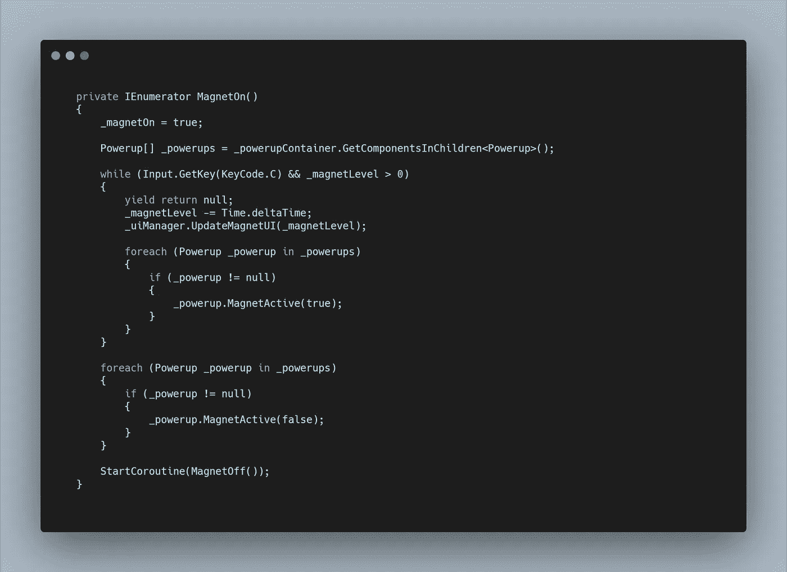
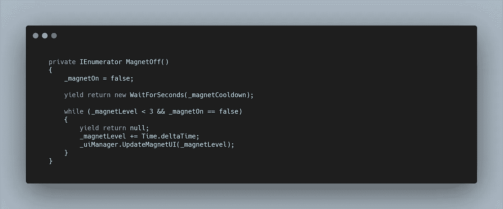
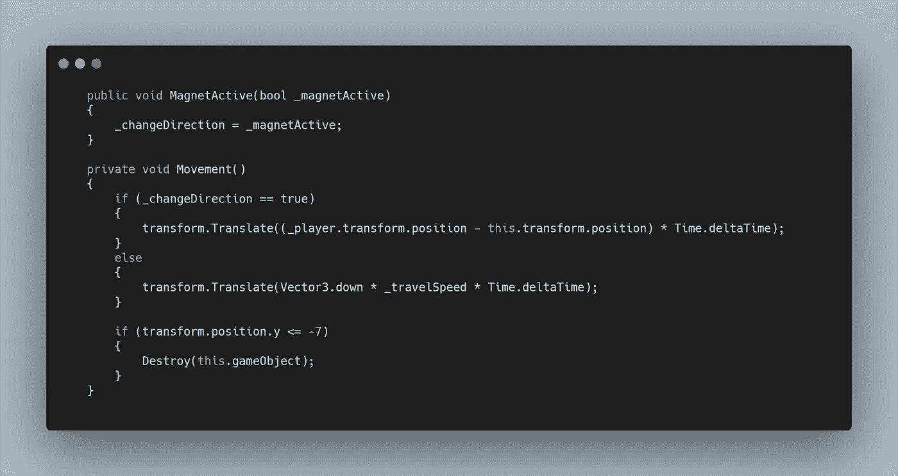
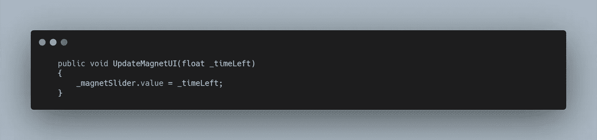
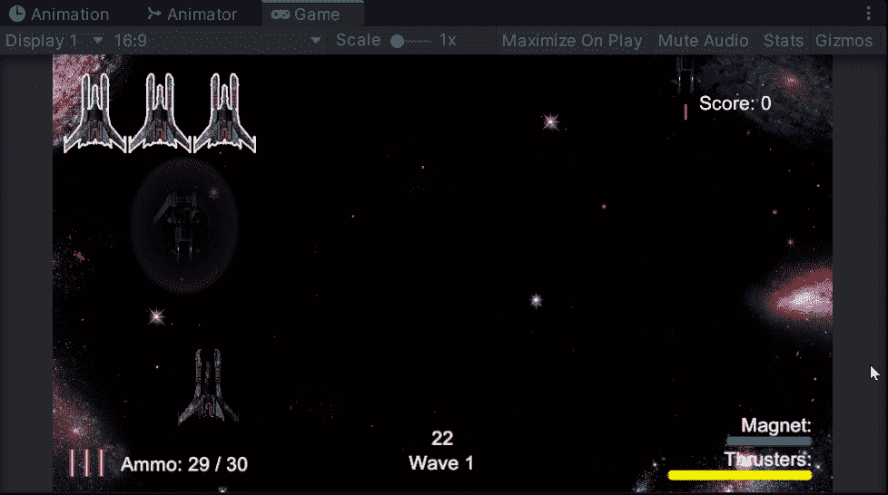

# 太空射击挑战:能量收集

> 原文：<https://medium.com/geekculture/space-shooter-challenge-powerup-collection-dcf93515b006?source=collection_archive---------62----------------------->

今天的挑战是创建功能，以便当按下“C”键时，电源向玩家移动。为了做到这一点，我会把这个特性伪装成一个磁铁技能，它将在冷却状态下工作，类似于推进器。

在我的**玩家脚本中，**我从**更新方法中运行了一个 **MagnetCheck 方法**。**在这里，我可以检查**输入、**然后运行一些**协程。**此外，我只想在磁铁电荷大于 0 的情况下运行。我的**磁关协程**开始冷却和充电，所以如果我再按一次‘C’，我想停止它。然后我可以运行我的**磁子协程**，它将处理耗尽**磁体电荷水平**。

让我们先来看看**磁子协程**的功能。首先我需要设置一个 **bool，**用于充值。

我已经有了一个空的游戏对象来保存所有产生的能量，所以我在我的**玩家脚本**中创建了一个对它的引用，并使用**GetComponentsInChildren**来填充一个**数组。**然后我可以运行一个 **while 循环**，当磁体等级大于 0，并且按住“C”键时，该循环返回 true。

在该循环中，磁体水平从上一帧开始减少，并更新 **UIManager。**使用 **yield return null** 表示该循环每帧运行一次，因此电平会实时降低。

为了改变加电的功能，我使用了一个 **foreach 循环**来获取之前存储在**数组中的子对象上的每个**加电脚本**。**然后我可以通过设置为**真**的**布尔值**调用一个公共方法。

在退出 while 循环时，使用相同的 **foreach 循环**，但是将 **bool** 设置为 **false** 。然后我启动 **MagnetOff 协程。**

**磁控关闭协程**将 **bool** 设置为 **false。**然后我等待一个我设置为 7 秒的冷却时间，然后运行一个 **while 循环**来给磁铁等级充电并更新 UI。

在我创建的**加电脚本**的**公共方法**中，简单地设置了一个**布尔值**，然后我在**移动方法中使用它。**

**移动方法**现在有一个 **if 语句**检查 **bool。**如果为真，我使用**变换。平移**使**上电**实时向**玩家**移动。否则，原来的向下运动发生。

最后，我复制了**推进器滑块**，并将其更改为适合我的**磁铁**，然后在 **UIManager 中，**我可以将**滑块**存储为一个变量，并附加上剩余的**时间。**

我现在有了一个功能性的磁铁能力。我用的**平移函数**离得越远移动越快，我不介意。它的作用更多的是帮助把事物拉近，而不是完全把它们带进来。我可能会考虑添加一个视觉特性来展示它的吸引力，当然也会为屏幕的右下角创建更好的 UI。

