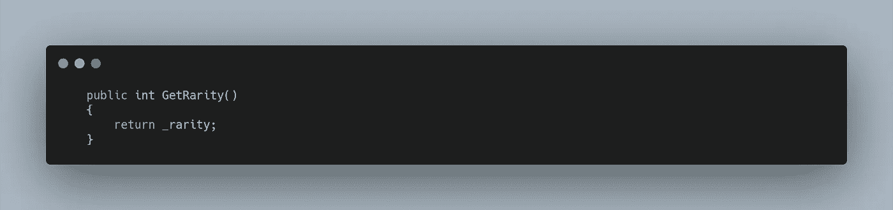
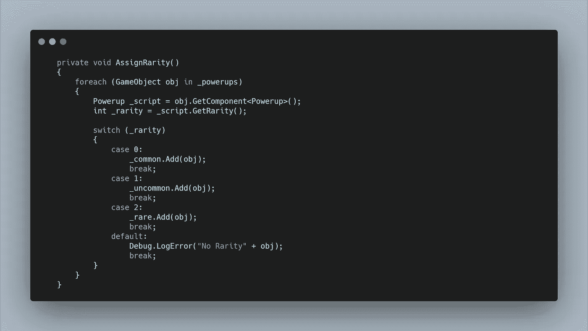
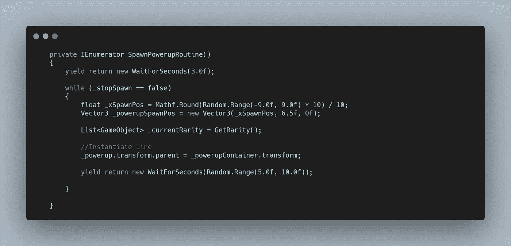
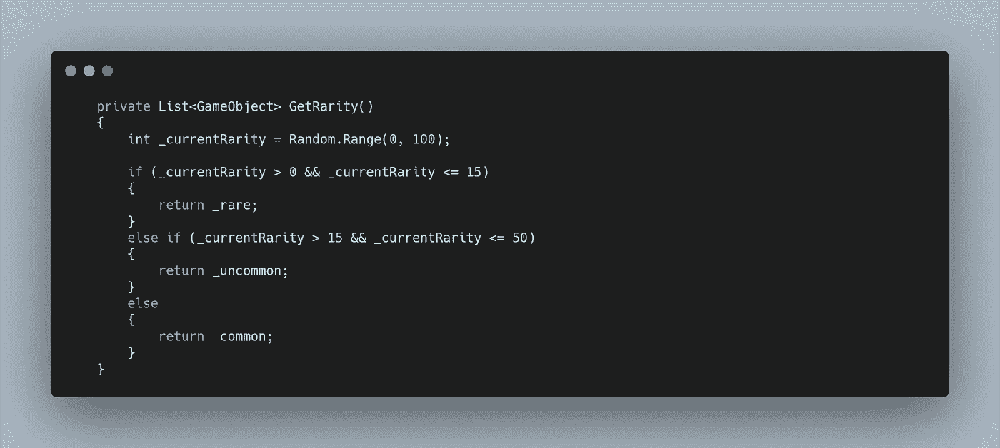
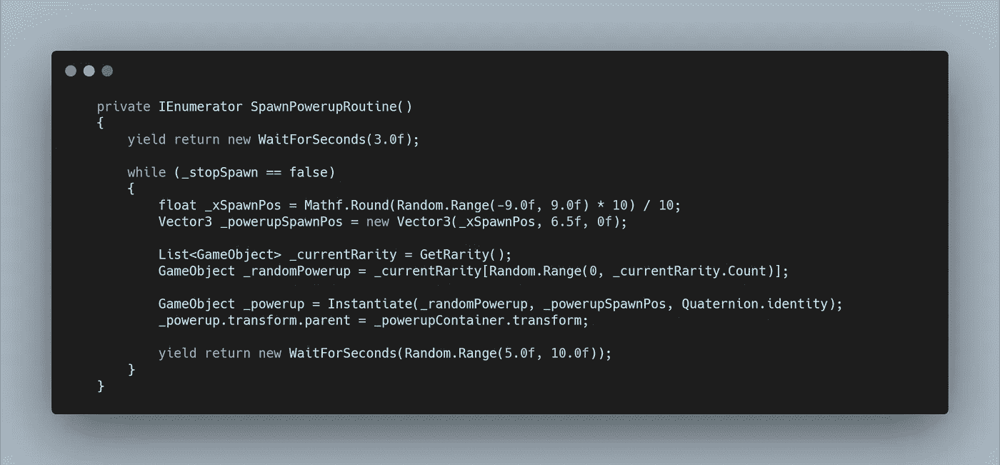

# 太空射击挑战:启动稀有和加权产卵系统

> 原文：<https://medium.com/geekculture/space-shooter-challenge-powerup-rarity-and-weighted-spawn-systems-13d439a5805e?source=collection_archive---------55----------------------->

我现在开始创造一些相当强大的力量。我不想让用户过得太容易，所以我创建了一个稀有系统，这样某些能力会更频繁地产生。

首先，我必须给每个能量分配一个稀有值。为此，我在**加电脚本**中创建了一个 **int 变量**，并为检查员创建了一个**标题**来显示值级别。

现在每个能量都可以在**检查器中分配一个稀有元素。**为了将这个传递给 **Spawn Manager** ，我创建了一个**返回类型方法**，当被调用时，它将传递回**稀有变量。**

对于 **Spawn 管理器的数组中的每次加电，**我可以调用这个方法并把它赋给一个变量。为此，首先需要使用 **Get 组件在每个对象上访问**加电脚本**。**

对于每次加电，我现在想根据稀有值将它们分配到组中。我可以在一个使用 **_rarity** 作为变量的 **switch 语句**中这样做。我想将它们分配到的组可以使用**数组，**但是如果每次添加东西时不重新创建数组，那么在运行时很难添加它们。

因此，我创建了三个**列表，每个列表代表一种稀有性，用来存储能量。**

现在对于 **switch 语句，在每种情况下**，存储加电的变量 **obj** 可以添加到正确的**列表中。**

该方法需要在 **Void Start、**中调用，为了测试功能，可以为每个循环创建额外的 **Debug。记录列表中的每个对象。**

有了这个工作，**产生的例程方法**现在可以开始实现新系统了。位置可以保持不变，但是从**加电数组**中获取**随机索引**的代码需要改变。相反，我想创建另一个**列表**，但是要填充它，我需要另一个**返回类型方法。**

在 **GetRarity 方法**中，我希望它返回一个**游戏对象列表变量。**

在这个**方法内。**我首先要创建一个随机值。我选择了 0 到 100 之间，这样我就可以将系统与百分比相关联。我希望**稀有异能**有 15%的几率产卵，**不常见**有 35%，而**常见**有 50%。

要将此转化为代码，可以使用 **if** 和 **else if 语句**来检查随机值的位置。在这些语句中，它们只是返回先前填充的相应的**列表**。

这个方法在 **SpawnPowerupRoutine，**中的 **while 循环**的每个周期都会被调用，所以它每次都会生成一个随机数，如果要运行 100 次，那么平均会返回 15 次稀有加电列表，依此类推。

随着**随机列表**的返回，我需要访问一个稀有的**随机游戏对象**。这样做，**随机。调用**列表中的**索引**时可以使用范围**。**与**阵列不同**使用了**。长度修饰符**，对于**列出了**、**。可以使用计数修改器**。

现在 **_randomPowerup** **游戏对象变量**可以被**实例化，**完成后的**方法**如下图所示。

有了这个，就产生了两个等级的随机能力，一个是基于稀有值的百分比，然后在特定稀有的物品中平均分配。使用 **GetRarity 返回方法**，允许**列表**在运行时动态改变，允许模块化系统扩展。

明天再来看一个例子，看看如何测试这个系统准确地产生稀有物种。