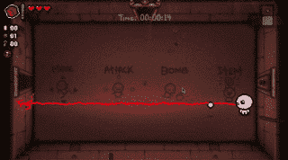
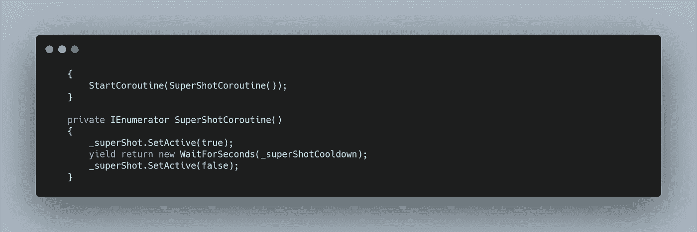
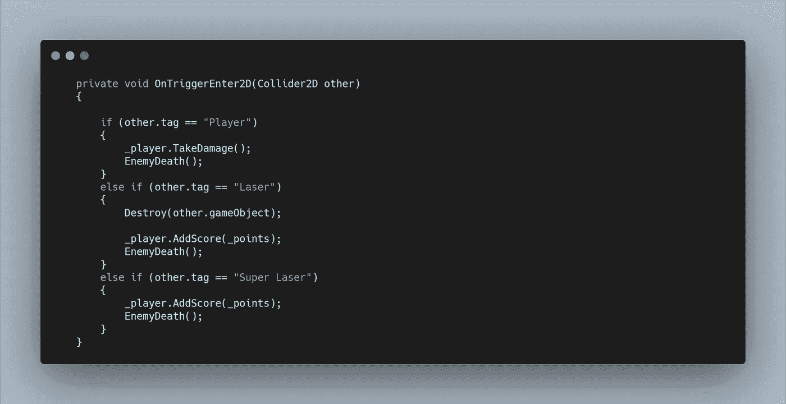
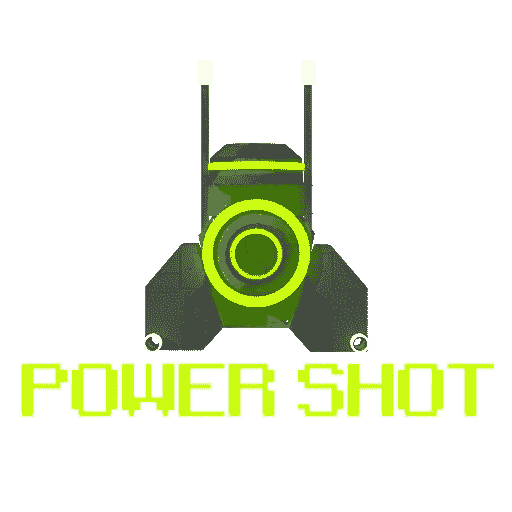
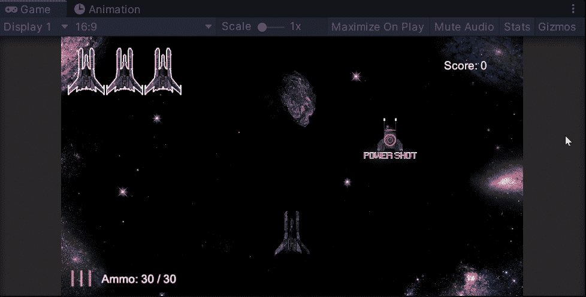

# 太空射击挑战:二次射击第一集

> 原文：<https://medium.com/geekculture/space-shooter-challenge-secondary-fire-pt-1-75d2de101383?source=collection_archive---------61----------------------->

我对于二次火力的主要意图是增加热寻的导弹。但是我儿子一直坚持要我在游戏里放一个大激光。

我只是简单地将现有的**激光精灵**添加为**玩家对象**的子对象。为了获得想要的视觉效果，我将它在 Y 轴上缩放了 8 倍，并将其正确定位在**播放器上。**

为了功能性，我做了一个**公共方法**供**加电脚本**调用。在这个方法中，我启动了一个**协程。**这个**协程**在等待之前将分配的游戏对象设置为活动，然后再次将其关闭。

最初，我只是添加了一个**箱式碰撞器 2D** 和**刚体 2D** ，然后将**标签**设置为**激光。**但是在与敌人相撞时，**上的激光叫做**上的摧毁。我想让这种激光坚不可摧，五秒钟内超功率，所以我改为添加了一个新的**标签**，并在**敌人碰撞方法**上检查了它。

再一次，我将我的**能量精灵**转换成一个合适的**超级射击能量精灵。**

然后，将其设置为模仿其他**加电预设**，添加一个新的 **ID** ，并**为其制作动画**。在**加电脚本**中，我简单地添加了**开关语句**，并调用了我在**播放器上创建的新的**公共方法**。**

