# 太空射手挑战:二次射击 pt3-导弹功能

> 原文：<https://medium.com/geekculture/space-shooter-challenge-secondary-fire-pt-3-missile-functionality-b9b4008761aa?source=collection_archive---------30----------------------->

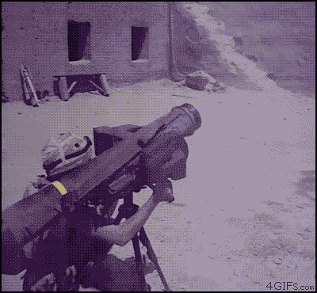

让我们从昨天开始，开始定义一些**旋转条件，**，然后实现可视化功能。

首先，我需要移除**导弹的**母体**。**否则，当**玩家移动时，**导弹**仍然相对跟随，同时向前移动。为此，在 **Fire 方法**中，我简单地将 **transform.parent** 设置为 **null。****

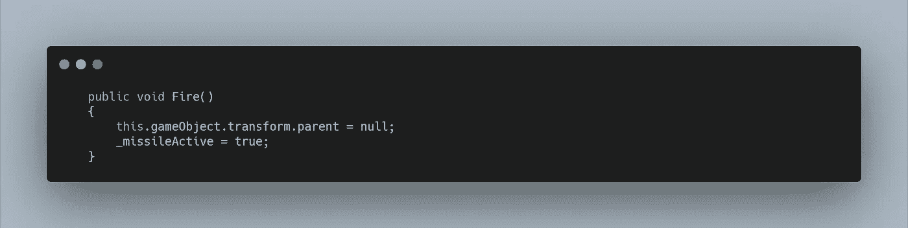

在旋转之前，导弹首先需要找到一个**目标。我只想在导弹发射后搜索目标，所以在锁定并转向敌人之前，偶尔会有一些标准动作。因此，这个新的**私有方法**将在**更新方法的 **if 语句**中被调用。****

为了创建 **PickTarget 方法，**我首先要找到带有**敌人标签、**的游戏对象，然后将它们存储到一个**游戏对象数组中。然后我可以使用一个 **foreach 循环**来遍历**数组。****

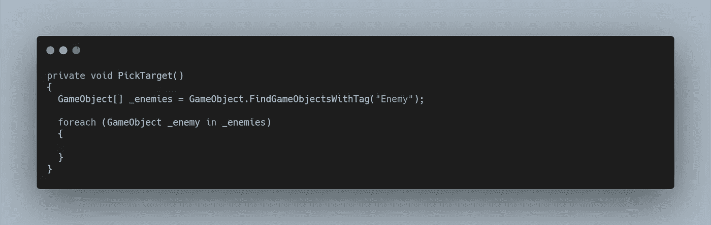

然后我想从这个**阵列**中选择一个随机目标，但是我也只希望在屏幕**上半部分**的**敌人**被提出来考虑，因为这将创建一个稍微更真实的前方射击行为，并且我们也不太关心**玩家后面的敌人。**

在创建了**数组**之后，我又创建了一个**新的** **列表**的**游戏对象**，如果在 **Y 轴上 **transform.position** 大于 0，我可以将它添加到 **foreach 循环**中。**

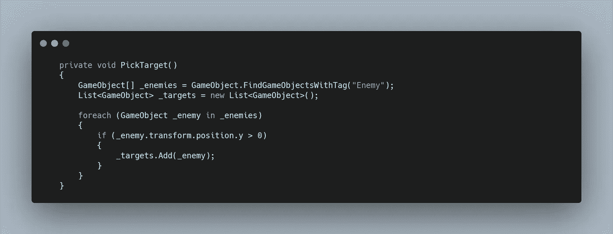

在这之后，我可以创建一个**游戏对象变量**来存储**目标敌人**，我将在多个方法中使用这个变量，所以我在代码的顶部创建了这个变量，并且最初将它赋给了 **null。**

在 **PickTarget 方法**中，我可以将**目标敌人变量**分配给 **_targets 列表的**随机索引**。**

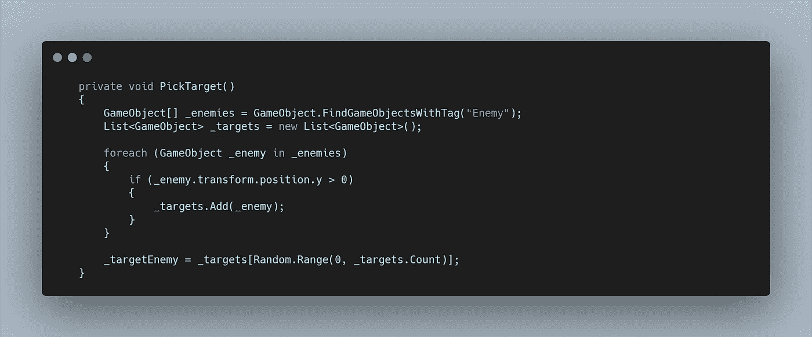

问题是，如果没有敌人满足这些条件，控制台会返回错误，为了解决这个问题，我创建了一个 **bool** 来检查是否发现了目标。然后在 **UpdateMethod** 中，只要 **Target Found** 为 **false，就可以调用 **PickTarget 方法**。**

当我们试图分配时，如果**列表**为空，目标敌人也会返回错误。因此，我只想在**列表计数**大于 0 时进行分配。

为了停止 **PickTarget 方法**再次运行，一旦**目标敌人**被分配，需要将**目标发现布尔**设置为真。

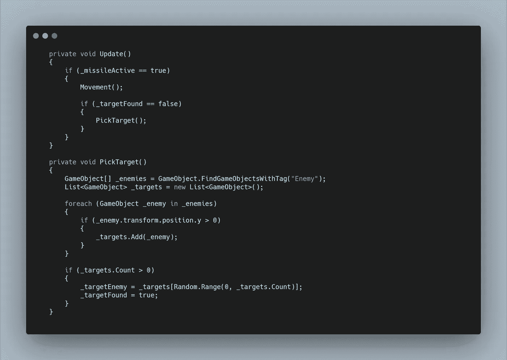

现在一个 **else if 语句**可以用来检查 **_targetFound 是否为真**。在这里我可以调用一个**旋转方法**，来处理对**目标的跟踪。**

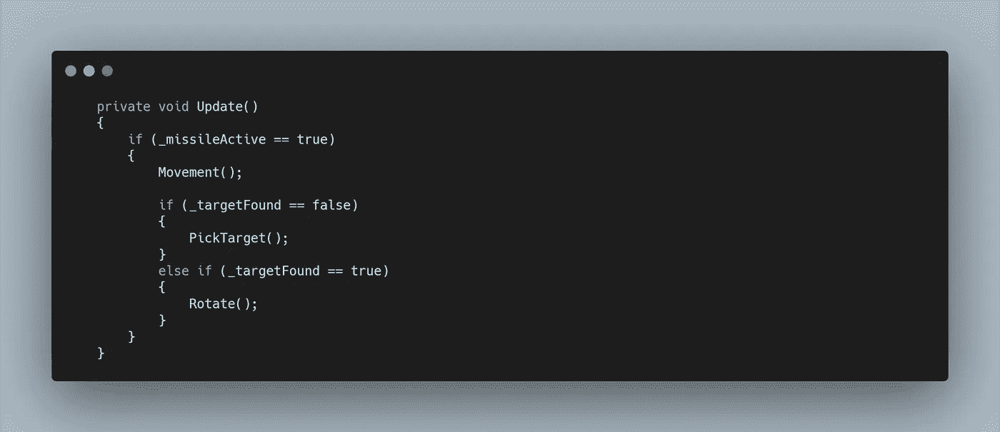

在**旋转方法中，**我首先需要设置**目标方向，**这将是一个**矢量 3，**并由**目标敌人位置**减去**导弹位置组成。**

然后我可以使用 **LookRotation 将这个**矢量 3 变量**转换成一个**四元数变量**。**这允许我在这种情况下比较 Z = 0 的前向方向和**目标方向**，然后返回一个变量，我可以使用比**矢量更深入的变量。**

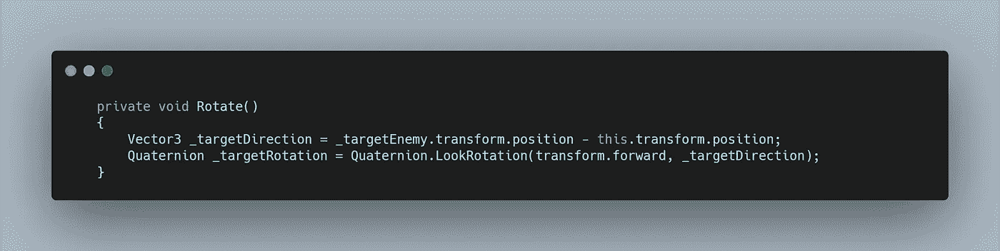

然后我可以将 **transform.rotation** 设置为 **_targetRotation。**

这一切都很好，但看起来有点不稳定，相反，我可以利用**四元数函数，在这种情况下**，**球面线性插值**，以特定的速度旋转。

我首先想创建一个**旋转速度浮动变量**，它是我的**速度变量**乘以**时间增量时间**

然后，我可以将 **transform.rotation** 设置为一个**四元数。在**当前旋转**和**目标旋转**之间旋转**，以**变速的**速度**移动。**

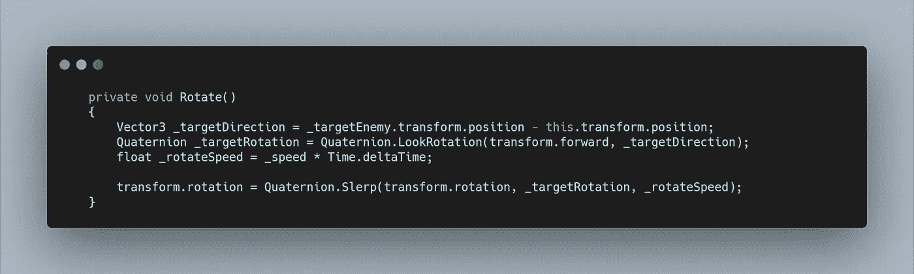

现在我基本上有了“热寻的”导弹功能。当然，为了让碰撞像上面 gif 中那样发生，我必须分配一个刚体 2D 和一个碰撞器 2D，我还必须进入**敌人脚本**并把**导弹标签**附加到 destroy 方法上。所有漂亮的冲洗和重复的东西在这一点上。但是我有一些额外的功能要实现。

首先，如果**敌人**在屏幕下方，它会重新出现在顶部，这会改变导弹的方向，看起来很奇怪。同样，如果我发射两枚导弹，它们锁定了同一个敌人，第一枚将摧毁它，但第二枚将寻找一个不再存在的敌人。

为了解决这个问题，我想让**导弹**沿着它当前的方向直线前进，直到它找到新的目标。我可以简单地将**目标发现布尔**设置为**假。**棘手的是在哪里。

为了更容易导航，我创建了一个 **TargetLost 方法**，将 **bool** 设置为 **false，**然后在需要的地方，我调用这个方法。

首先，在**移动方法**中我可以使用额外的 **if 语句**来设置边界，如果位置超过这些，调用 **TargetLost 方法。**

另外，在**旋转方法**中，我可以检查**目标敌人**是否为**空，**如果是，调用 **TargetLost，**否则，进行旋转。

我还增加了一个 5 秒后的**破坏调用**，以防导弹最终消失在屏幕外的某个地方，我仍然需要用这个方法做一些进一步的测试，并可能会改变它。

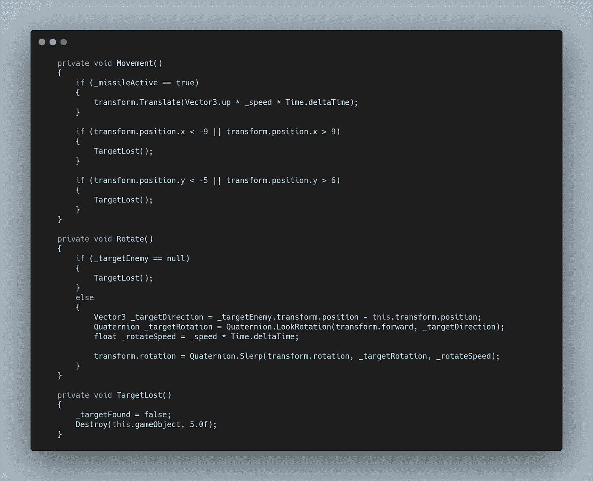

至于视觉效果，我首先要设置一个**默认动画状态**，由一个**空动画**组成。这样，当导弹仍然连接到**播放器**时，**旋转动画**将不会播放，然后我在**两种状态**之间创建了一个**过渡**，它需要一个名为 **MissileActive 的**触发器****

在**脚本中，**我需要使用 **GetComponent** 将 **Animator 组件**赋值给一个**变量，**然后在**移动方法**的调用下，我可以 **SetTrigger** ，允许**动画**在导弹开始向前移动时开始。

对于推进器，我可以创建一个**游戏对象变量**，并在**检查器中分配它。**在预设中，我可以让它保持非活动状态，所以当导弹**被实例化时，**推进器看不到。然后除了**动画触发器之外，**我可以简单地将**游戏对象**设置为活动。

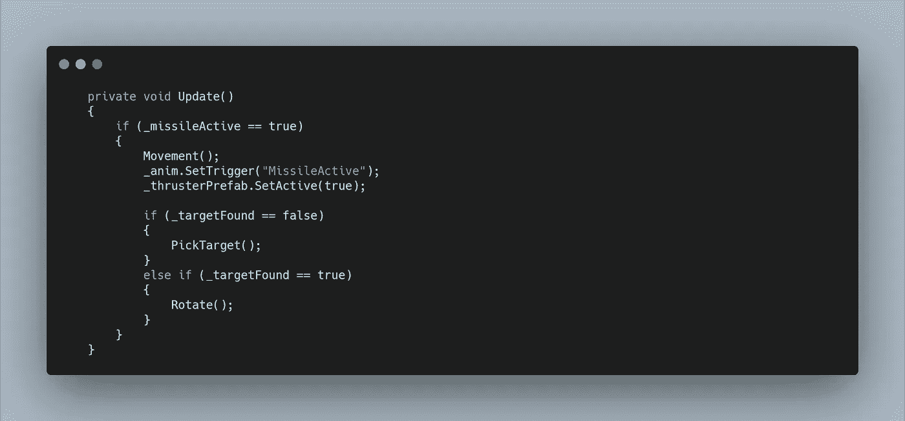

现在我在视觉上将闲置的导弹连接到**玩家船**上，然后当发射时，它开始旋转并有推进器。