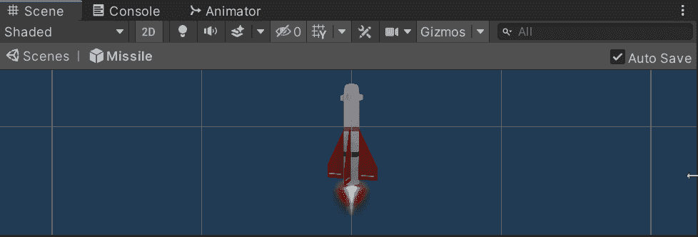
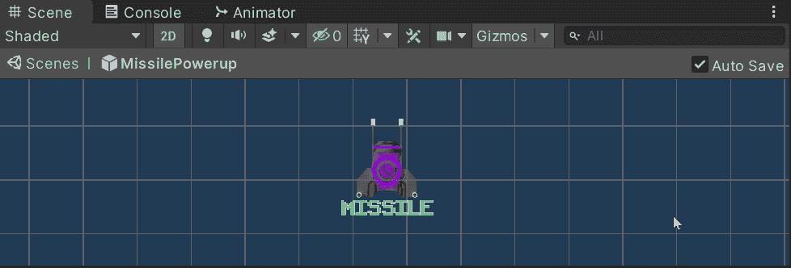
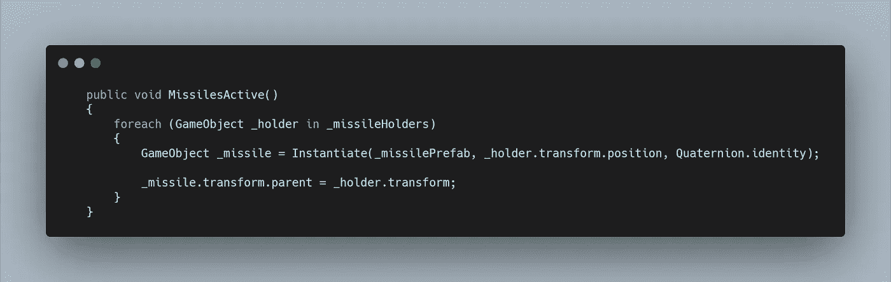
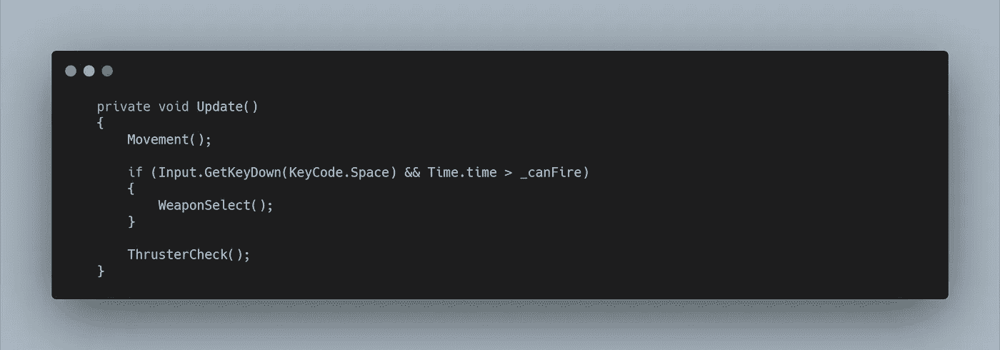
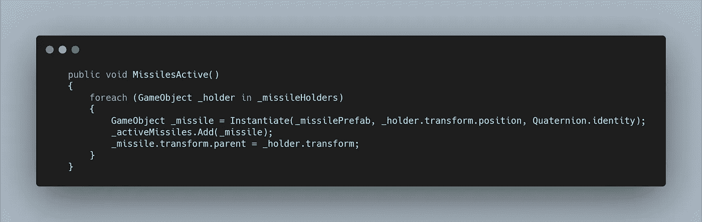
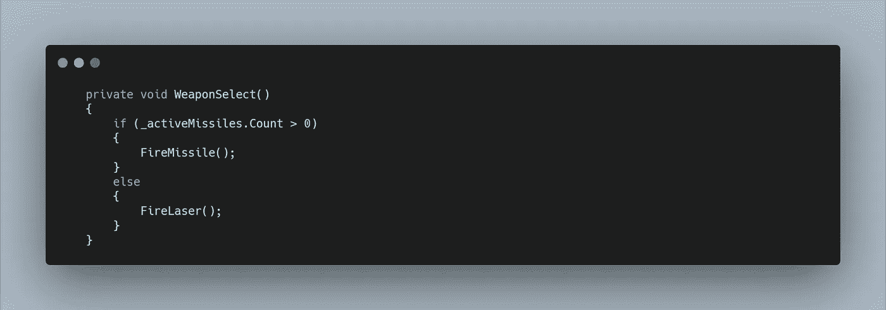
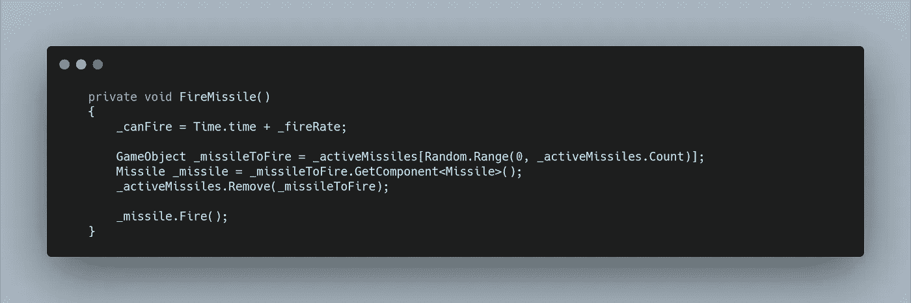
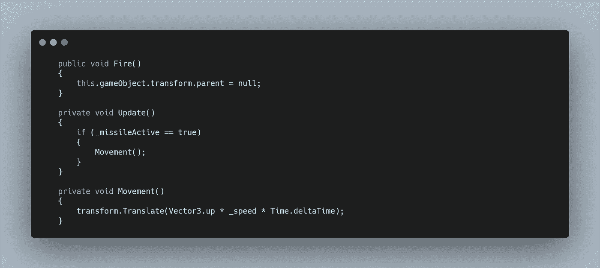
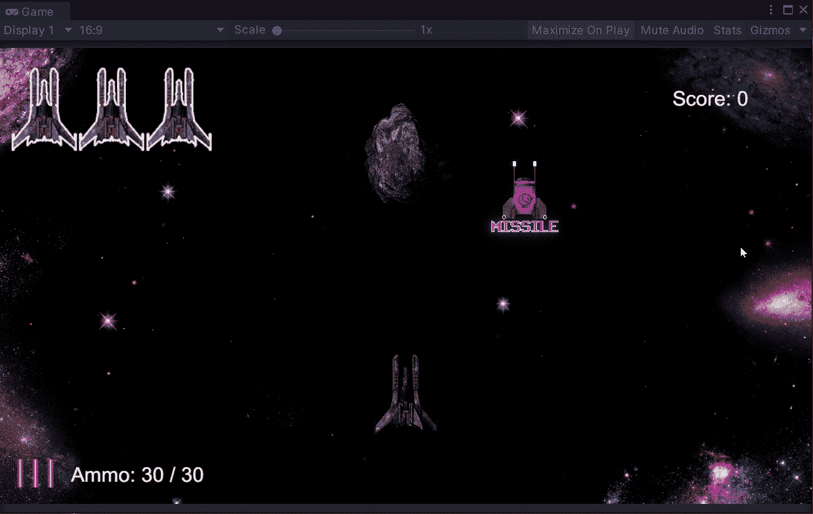

# 太空射击挑战:二次射击 pt2-创造一枚导弹

> 原文：<https://medium.com/geekculture/space-shooter-challenge-secondary-fire-pt2-creating-a-missile-b3b5952123b2?source=collection_archive---------33----------------------->

超级激光很容易实现，所以我想要一个额外的挑战来创造“热追踪”导弹。

我在**文件库**里找到了一些导弹包，并且喜欢上图中的视觉效果。不过有一个问题，它是一个 **3D 物体**，因此它不能很好地与我游戏中的其他物体一起工作。

为了解决这个问题，我下载了**搅拌机**，并导入了 **FBX。中的型号**。我快速搜索了一下如何附加材料，因为我不是艺术家，最后得到了我从 **Filebase 导入到 **Unity** 的复制模型。**

然后是一个简单的**渲染**和**透明背景**，然后在再次渲染之前给**旋转**增加 5 度，重复直到我有了一组循环的**精灵。**

现在我可以把它作为 **2D 动画精灵**添加回 Unity，并使它成为一个预设。我还从**播放器**复制了**推进器**并调整了大小。**导弹**和**推进器**的启用和动画将在稍后代码功能实现时介绍。

我还像以前一样重用了**加电精灵**，在 **GIMP** 中重新着色和重命名它们。

当收集**导弹启动**时，我想让它们在视觉上出现在**玩家**上，向**用户**展示它们是活跃的，而不是使用 **UI。**

在**播放器上，**我创建了一个名为**导弹的空游戏对象，**然后创建了两个空游戏对象作为子对象，分别名为 **LeftMissileHolder** 和 **RightMissileHolder。**这两个物体被放置在机翼上，因为它们将被用于**实例化**导弹预置。

有了这个，我可以为**加电创建一些功能。**

首先我需要创建一些变量，我创建了一个**游戏对象数组**来保存两个**持有者**游戏对象，以及一个**游戏对象变量**来保存**导弹预设。**

现在我可以为**加电**创建一个公共方法来调用**加电 id**的**开关语句**。

在这个方法中，我使用一个 **foreach 循环**来访问**数组中的每个 **Holder 游戏对象**。**对于其中的每一个，我在**持有者**的位置实例化导弹，并将其分配给一个**游戏对象变量**，这样我就可以访问**实例化导弹**的**父**并将其分配给**持有者。**

这既允许一个干净的**层次**，也意味着**导弹物体**将在**玩家**在屏幕上移动时保持附着在他的翅膀上。

现在当**导弹启动**被拿起时，2 枚导弹出现在**玩家船的机翼上。我现在需要功能来解雇他们。**

我没有用我的**更新方法**来检查按下**空格键**时应该使用哪种武器，而是创建了一个新的**私有方法**，在现有的 **if 语句中调用。**

在**武器选择方法**中，我需要一种检查**导弹**的方法，有很多方法可以做到这一点，但是当涉及到发射**导弹**时，我希望能够随机选择一种。

我创建了一个**新的游戏对象列表**来存储**实例化的导弹，**然后在**导弹活动方法**中将**导弹**添加到**列表中。**

现在在**武器选择方法**中，我可以查看**列表**是否包含任何对象，如果是，就调用我要创建的 **FireMissile 方法**，否则，调用现有的 **FireLaser 方法。**

对于**火力导弹方法**，我首先需要重复使用**火力激光方法**的第一行，并重置 **_canFire 变量**以创建发射导弹之间的冷却时间。

然后我继续创建了一个**导弹脚本**来为**导弹**创建功能，并将它附加到**预设上。**现在我可以使用 **GetComponent、**访问**脚本**，但是首先我想选择一个**随机导弹。**这意味着我需要访问列表的一个**随机索引**，并将其分配给一个**游戏对象变量。**

在得到**脚本**后，我需要从**列表**中移除导弹，这样它就不能被再次访问，这将简单地在**列表中留下一个对象**，当再次调用 **FireMissile 方法**时，随机索引将只能返回最后一个可用的导弹。

最后，我可以调用**导弹脚本的**发射方法**，**，这将是我启动导弹所有跟踪和移动功能的地方。

现在，我简单地在**导弹脚本**上创建了**射击公共方法**，并让它调用一个**移动方法**，它简单地复制了**激光功能**，并让它向上移动。

这就产生了一个问题，这个方法只被调用一次，所以导弹实际上不会移动很远，相反，我使用了 **Fire 方法**来设置 **MissileActive bool** 为 **true。**然后在**更新方法中，**我可以检查 **bool** ，如果导弹是活动的，那么就可以调用**移动方法**

我现在有了功能正常的**导弹**，但我想进一步扩展它们，让它们像“热追踪”一样追逐敌人。明天回来查看解决这个问题的文章！